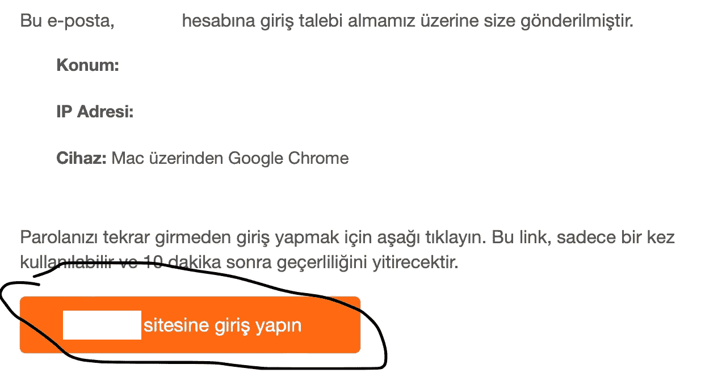
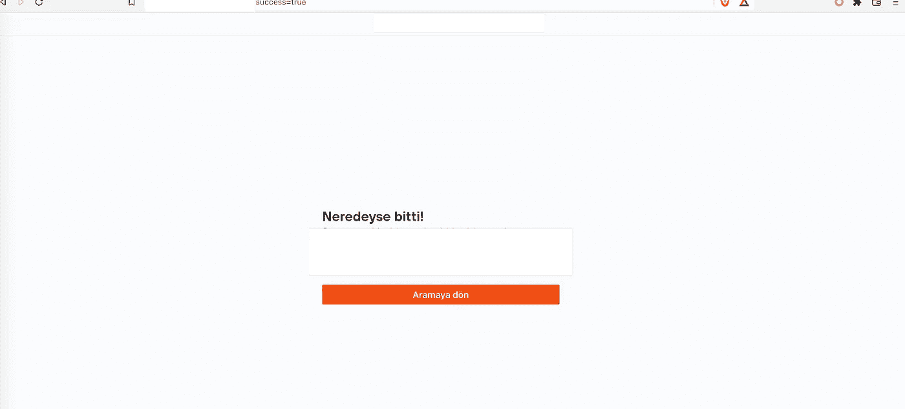
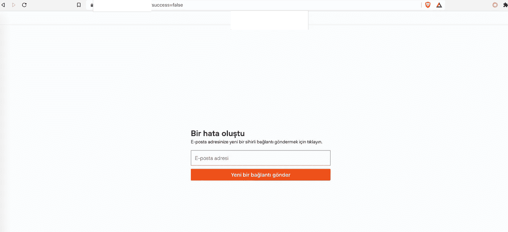
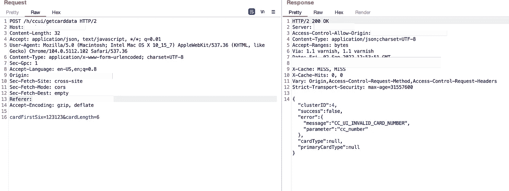
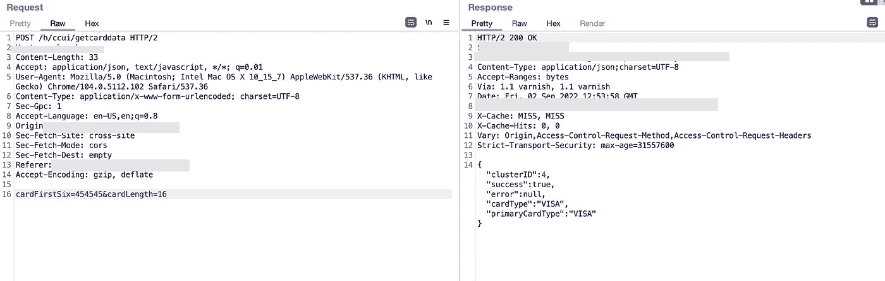
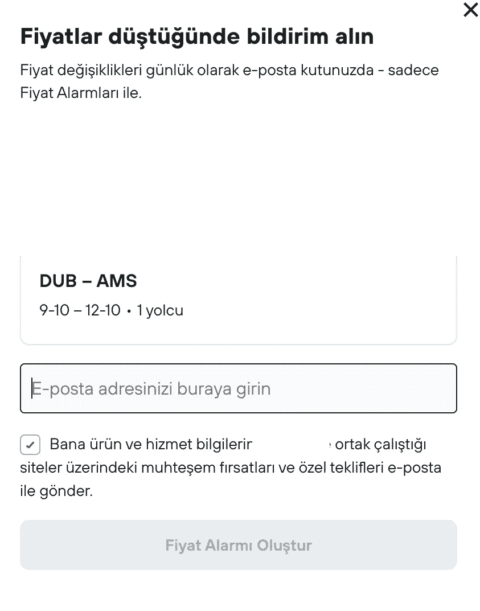
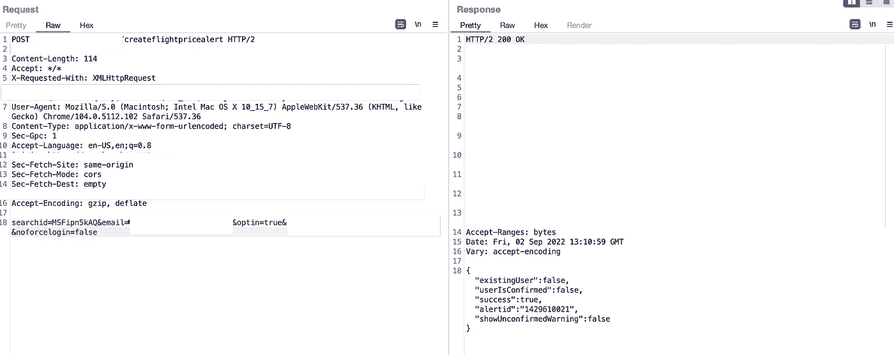

# 我如何在一天内发现 3 个罕见的安全漏洞

> 原文：<https://infosecwriteups.com/how-i-found-3-bug-bounties-in-a-day-c82fe023716e?source=collection_archive---------0----------------------->

大家好，

上周，我在等待测试账户来测试一个移动应用程序。所以这个时候，我决定去找一个 bug 赏金。我从 Hackerone 上选了一个程序，开始黑它。这是关于旅游和旅行网站。我发现了 3 个漏洞。即使其中一个是重复的，两个被认为是有用的，我还是决定向你解释它们，因为它们是不寻常的漏洞。即使这些漏洞没有帮助我获得奖金，它们可能会帮助你找到新的漏洞。

**1-绕过登录链接的一次性使用:**

当我查看网站登录逻辑时，如果我选择电子邮件登录，它会像预期的那样要求您发送电子邮件。:D

当我输入电子邮件时，它会给我发一封带有登录链接的电子邮件。

上面说这个链接只能用一次，10 分钟后就过期了。于是，我点击链接，成功登录。

之后那个链接应该就过期了吧？但是，是吗？我已经复制了链接，并打开了一个私人标签来检查它。

它说有一个错误，你可以发送一个新的链接到你的电子邮件。然而，当我们检查 URL 时，我们看到有一个参数“success=false”

如果我们对这个输入写 true 会发生什么？

嘣！☠️

因此，我们可以永远使用同一个登录链接来登录。

**2-信用卡检查器旁路:**

我很快会解释，即使你绕过公司的一些安全功能，他们也可以说它是信息性的。

网站上有一个信用卡检查功能，因此客户不能输入随机数作为信用卡号。

其功能是:

所以它在检查卡的长度和前六位数字。

我尝试使用 454545 作为 VISA 卡的前六位数字，并通过 burp proxy 更改了请求的长度。

所以它接受 454545 作为卡。

**3-电子邮件轰炸和速率限制**

网站上有一个按钮，是关于“如果有便宜的旅行，你想要通知吗？”。我点击它，它要求一封电子邮件。

然后我输入我的电子邮件。它给我发了一封申请邮件，以确保这是我的电子邮件，如果我真的想要通知。然而，即使我没有应用它，它开始发送通知。然后，我开始审查请求，我意识到，如果你输入不同的邮件，没有速度限制。

因此，如果攻击者拥有电子邮件数据库，顺便提一下，所有黑客都拥有:)，攻击者可以从网站向所有人发送通知，而无需他们的批准。首先，它发送申请邮件，但没有申请，它开始发送廉价的旅游邮件…

这是最后一个弱点。希望你在阅读的时候喜欢它。下次漏洞前再见。

## 来自 Infosec 的报道:Infosec 每天都有很多内容，很难跟上。[加入我们的每周简讯](https://weekly.infosecwriteups.com/)以 5 篇文章、4 条线索、3 个视频、2 个 Github Repos 和工具以及 1 个工作提醒的形式免费获取所有最新的 Infosec 趋势！