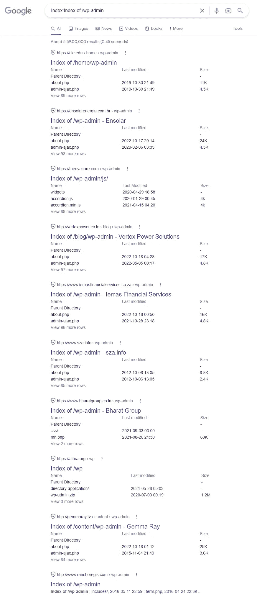
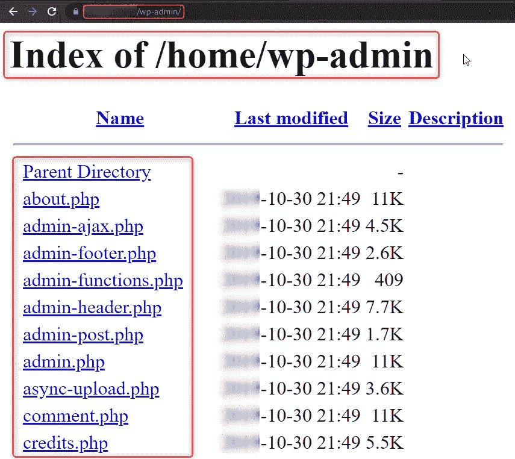
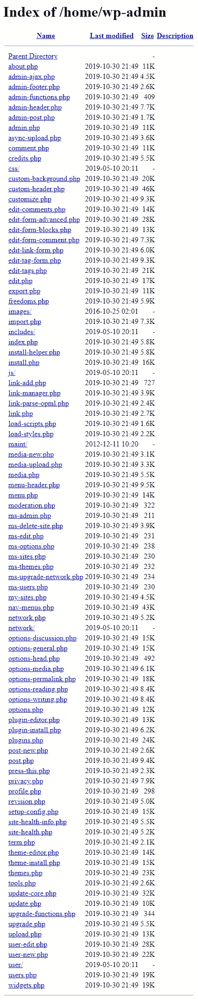
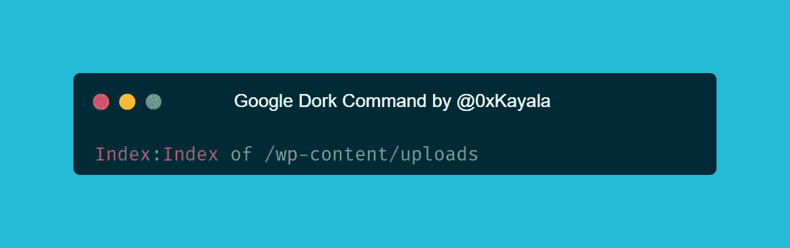
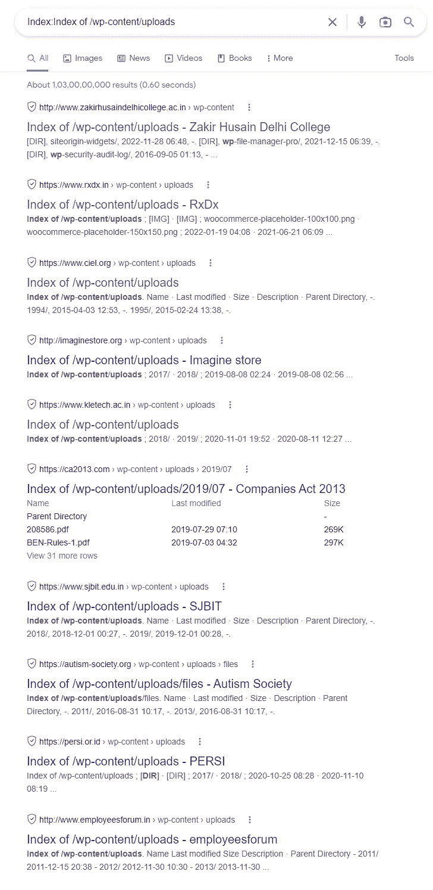
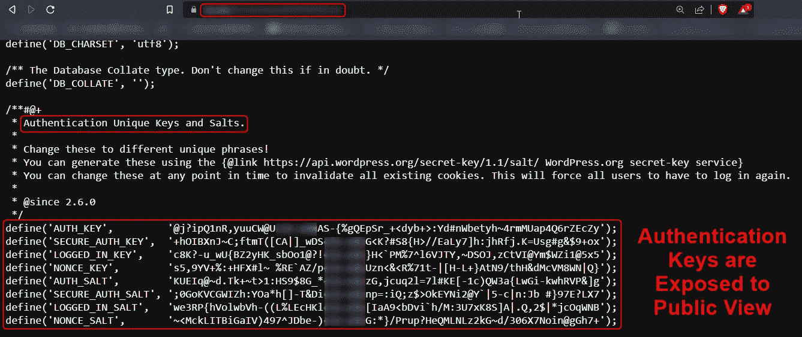

# 我是如何发现 40 多个目录，列出了使用 Google Dorks 通过暴露的 WordPress 文件夹泄露源代码的漏洞

> 原文：<https://infosecwriteups.com/how-i-found-40-websites-source-code-disclosure-via-exposed-wordpress-folders-wp-admin-using-5273ff2ae53d?source=collection_archive---------0----------------------->

我发现超过 40 个目录列出了漏洞，这些漏洞包含通过暴露的 WordPress 文件夹(/wp-admin & Others)的源代码泄露，只是通过使用 Google Dorks，如下所示👇

[**图片来源**](https://carbon.now.sh/m0OHFchltLrqBhhvOpsG)

> ***谷歌呆瓜:***
> 
> 索引:/wp-admin 的索引

**多克结果**

**来源:谷歌呆子**

**来源:谷歌呆子**

[**图像来源**](https://carbon.now.sh/jvvtmnjmjjagvYThU5Qi)

> ***谷歌呆子:***
> 
> 索引:/wp-content/uploads 的索引

**来源:谷歌呆子**

一些网站的机密信息，如数据库用户名/密码和其他配置数据直接暴露在公众面前。例如，我们可以在网站的“wp-config.php”文件夹中找到数据库凭证，如下所示

**认证密钥和 Salt**

**注意事项及建议:**

1.应用程序应该对敏感目录和内容拥有适当的权限。

2.要修复此漏洞，请从您的 web 服务器上删除“/wp-content/uploads/”或任何其他包含机密信息的文件夹，或者确保您拒绝公众访问服务器上的“/wp-content/uploads/”文件夹

3.请阅读以下参考文章，详细了解问题并解决问题。

**参考文献:**

1.  [https://secure.wphackedhelp.com/blog/wp-content-uploads/](https://secure.wphackedhelp.com/blog/wp-content-uploads/)
2.  [https://www . acune tix . com/blog/articles/directory-listing-information-disclosure/](https://www.acunetix.com/blog/articles/directory-listing-information-disclosure/)

感谢你们阅读这篇文章——祝狩猎愉快🐞

如果你喜欢这篇文章，别忘了给我鼓掌👏

资源:谷歌

**支持我:**如果你喜欢支持我，给我买杯 [**咖啡**](https://www.buymeacoffee.com/satyakayala) ☕

**关注我:** [萨提亚·普拉卡什](https://medium.com/u/8f987881b66a?source=post_page-----5273ff2ae53d--------------------------------) | [领英](https://www.linkedin.com/in/0xkayala/) | [推特](https://twitter.com/0xKayala)