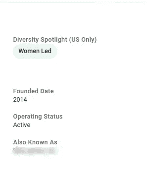
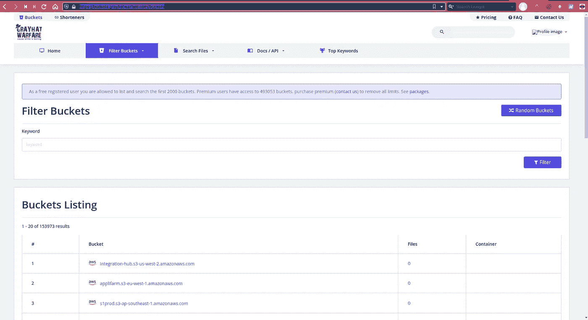
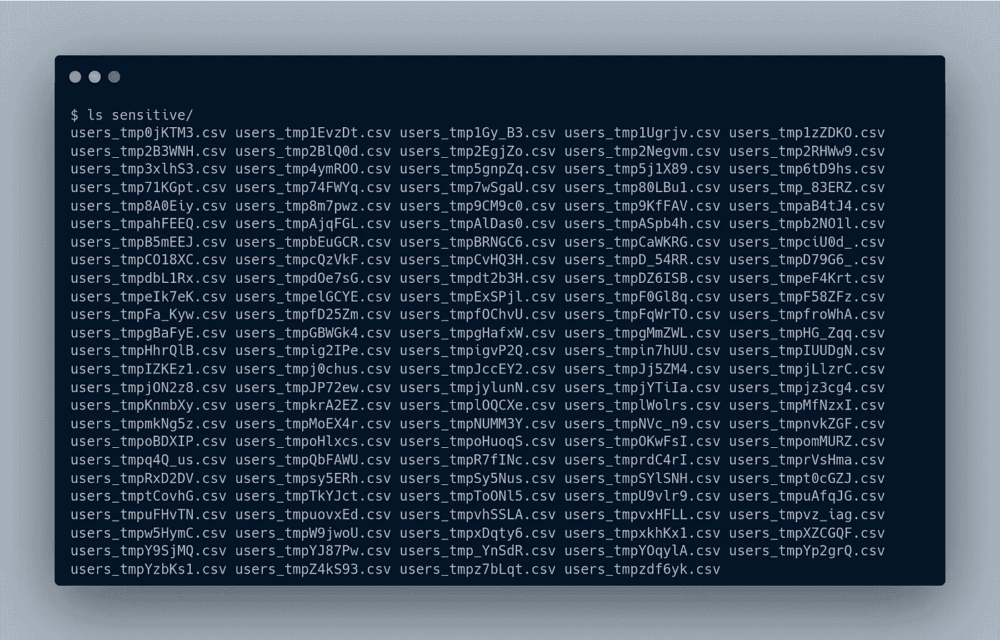

# 我如何找到一家公司的内部 S3 桶与 41k 文件

> 原文：<https://infosecwriteups.com/how-i-found-a-companys-internal-s3-bucket-with-41k-files-94b453e588b5?source=collection_archive---------0----------------------->

我发现一家公司的 S3 桶在内部使用，在 GitHub 或其域中没有被引用。这是我 7 个月前报告的第一个有效的漏洞，只有通过人工侦察才有可能。

**关于我—**

我是 Tarun，来自印度的安全研究员和 bug 猎人。你可能已经从我以前的一篇关于 [***编写自动化脚本而不痛击***](/create-your-ultimate-bug-bounty-automation-without-nerdy-bash-skills-part-1-a78c2b109731) ***脚本*** 的文章中了解了我。我寻找 bug 或者开发一些邪恶的软件。跟我来

> https://github.com/tarunKoyalwar
> 
> https://twitter.com/KoyalwarTarun
> 
> 中型=[https://medium.com/@zealousme](https://medium.com/@zealousme)
> 
> 获得新工具和文章的更新

**侦察—**

有许多方法可以找到特定程序的 S3 桶，最常见的方法是从 ***打嗝代理*** 、 ***hakrawler*** 、 **go *spider、*** 或 ***GitHub*** 。还有其他一些方法可以找到 s3 存储桶，也许我会写一篇关于这个的新文章。

作为一个新手，我遵循着[***JHaddix****v4 方法论*](https://drive.google.com/file/d/1aG_qqRvNW-s5_8vvPk5rJiMSMeNL2uY9/view) ，范围有限，做 ASN 或垂直枚举毫无意义，但我还是访问了[***Crunchbase***](https://www.crunchbase.com)并搜索了该程序的公司名称。在细节部分，我发现**也被称为**标题，带有***FooBar Inc .***(已编辑)。当我发现这个标题时，我检查了是否有一个 GitHub org 的名字类似于这个。我找到了，但是没有公开回复。



**灰色战争**

GrayHatWarfare 是一个很好的地方来搜索和过滤 S3 桶，但唯一糟糕的是他们的[](https://buckets.grayhatwarfare.com/packages)**定价，特别是对新手来说，因为很少有人找到一个开放的 S3 桶。在我找到另一个名字后，我搜索了它和其他一些名字的变体，如 foodev 等。通过访问以下网址。**

**[https://buckets.grayhatwarfare.com/buckets](https://buckets.grayhatwarfare.com/buckets)**

> **只有当您注册并且只能访问有限的存储桶时，此功能才可用。新桶定期更新，但该功能只对高级用户开放。**

****

**我搜索了一下，发现了一个名为 **foositedev** 的桶，里面有 41K 的文件。我决定使用 aws-cli。您可以参考[这里的](https://manishmshiva.medium.com/aws-cli-installation-and-configuration-d33a23980adf)进行设置和配置。**

****S3 桶枚举—****

**您可以使用 aws-cli 检查 S3 存储桶的权限。S3 存储桶有 5 个主要权限，您可以使用下面的命令测试每个权限。**

> **LIST =列出 S3 存储桶的所有文件**

```
**aws s3 ls s3://bucketName**
```

> **读取=读取特定对象(文件)**

```
**aws s3 cp s3://bucketName/PathtoFile  LocalFile**
```

> **写=写/覆盖/删除特定对象(文件)**

```
**aws s3 cp poc.txt s3://bucketName/poc.txt**
```

> **读取访问控制权限**

```
**aws s3api get-bucket-acl --bucket bucketName**
```

> **WRITE_ACP =写/修改访问控制权限**

```
**aws s3api put-bucket-acl --acl public-read-write --bucket bucketName**
```

*****续—*****

**使用上述命令后，我能够发现 bucket 启用了`READ_ACP,LIST,READ`权限。它有 41k 个文件，所以下载所有文件是不可行的。我遇到了下面的命令，它列出了桶中的所有对象**

```
**aws s3 ls --summarize --human-readable --recursive s3://bucketName**
```

**它列出了所有文件及其路径、文件总数以及桶的总大小(23.6 GB)。我决定在通过使用`grep`进行节点模块、HTML、gif、jpeg 等过滤来查看一些之后再看一看。所有这些都没用。**

**资料来源:Giphy**

**我将输出保存到文件中，并创建了一个 bash 脚本来输出不同的文件类型及其频率。**

**使用上述脚本后，在输出中有不同类型的文件，其中我找到了一些名为“users”的 CSV 文件，我用`wget -i urls.txt -P directory`下载了它们。**

****

**这些 CSV 文件是他们数据库的备份，包含用户名、电子邮件、电话号码、地址和许多其他 PII(总共 32 列)，其中许多电子邮件是员工电子邮件，并带有@companyname 电子邮件。我写了一份报告，详细描述了一下，提交了上去。它很快被接受，我得到了 250 美元的奖励，并且提交的内容被标记为高严重性。**

**尽管它是一家价值 100 万美元的公司，但它的奖金非常低，500 美元=关键，250 美元=高，100 美元=中等，0 美元=低，而且不接受任何 P4 或 P5。在这份报告之后，我只在同一个程序上搜寻了 4 个月，发现了大约 18 个漏洞，有重复的、中等的、高的和 6 个严重的，但没有低严重性的漏洞。**

> **在 medium & twitter 上关注我，这样你就不会错过我即将发表的文章**