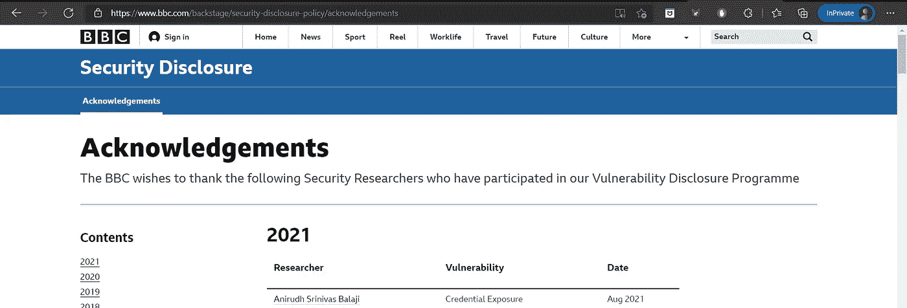

# 我是如何在 BBC 上发现一个身份暴露漏洞的？

> 原文：<https://infosecwriteups.com/how-i-found-a-credential-exposure-bug-on-bbc-513368c28cc8?source=collection_archive---------0----------------------->

嘿大家好，

我是昆虫赏金猎人的初学者。尽管我的学士学位是电子学，但当我在学士学位中阅读有关计算机网络的内容时，我对网络安全着迷了。随着兴趣的增长，通过阅读和实践，我对网络安全和 web 安全有了更多的了解。我通过阅读相关的文章了解到了 bug 奖金，但在开始时，如果给我一个目标，我没有足够的信心找到 bug。我对人们在社交媒体上发布的奖金不感兴趣，我始终坚信不断学习、坚持不懈和分享你所学到的一切在各行各业都很重要。想象一下，如果谷歌搜索仅限于谷歌的员工:P，我们就不会在这里 LOL。

学了一点之后，我想试一试，试了几次之后，我得到了很多 N/a &副本。我对自己很恼火，我决定适当提高我的技能，以后再做。过了一段时间，当我再次开始寻找 bug 时，我选择了一个按照他们负责任的公开政策接受 bug 的站点。我继续前进，并开始做侦察，因为我看到许多文章说“侦察是找到与目标相关的 bug 的第一步，也是最重要的一步”，这就是为什么可能有一个名为 ReconFTW :P 的工具(感谢该工具的作者)。经过几番努力和学习，我能够发现低/中等严重性的错误仅仅是因为适当的侦察(注意:根据目标范围和目标使用的技术，可以进行被动和主动侦察)。

一个晴朗的日子，我通过 LinkedIn 和 Twitter 了解了 BBC 的负责任的安全披露计划。我开始搜索目标，找到了他们的 GitHub 库。我使用 GitHub dorks 来检查是否有任何敏感信息在属于 BBC 的任何存储库中泄露，令我惊讶的是，我发现两个有效的敏感凭据被提交到他们的存储库中。我立即进行了报告(注意:请确保您发现的秘密是有效的，并且在报告之前对某个组织产生了重大风险影响)。

时间线:

2021 年 8 月 15 日-发现问题并向他们报告。

2021 年 8 月 18 日——问题被修复，我被列入他们的 HoF 网站。

BBC 名人堂报道了一个身份暴露漏洞

参考资料:

主 shifa123/githubdorks GitHub 的 githubdorks(向 shifa123 致谢)

[你的 Github 侦察和泄密的完整地图|由 Orwa Atyat | Medium](https://orwaatyat.medium.com/your-full-map-to-github-recon-and-leaks-exposure-860c37ca2c82) (归功于教父 Orwa)

非常尊重和感谢 infosec 社区通过分享您的经验来帮助我们。