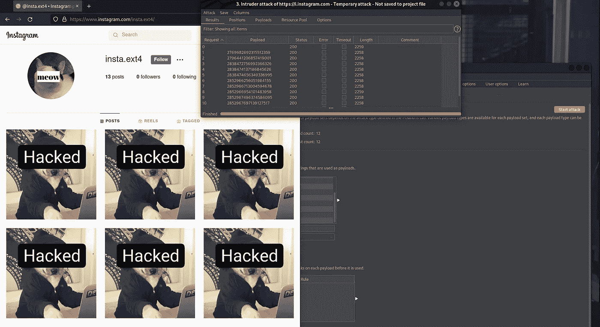
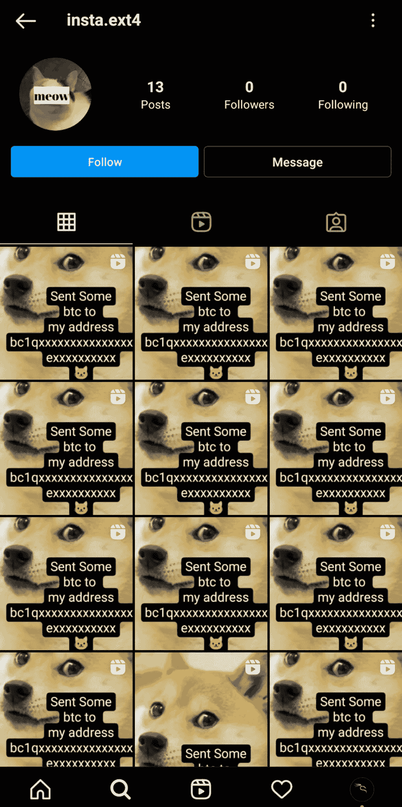
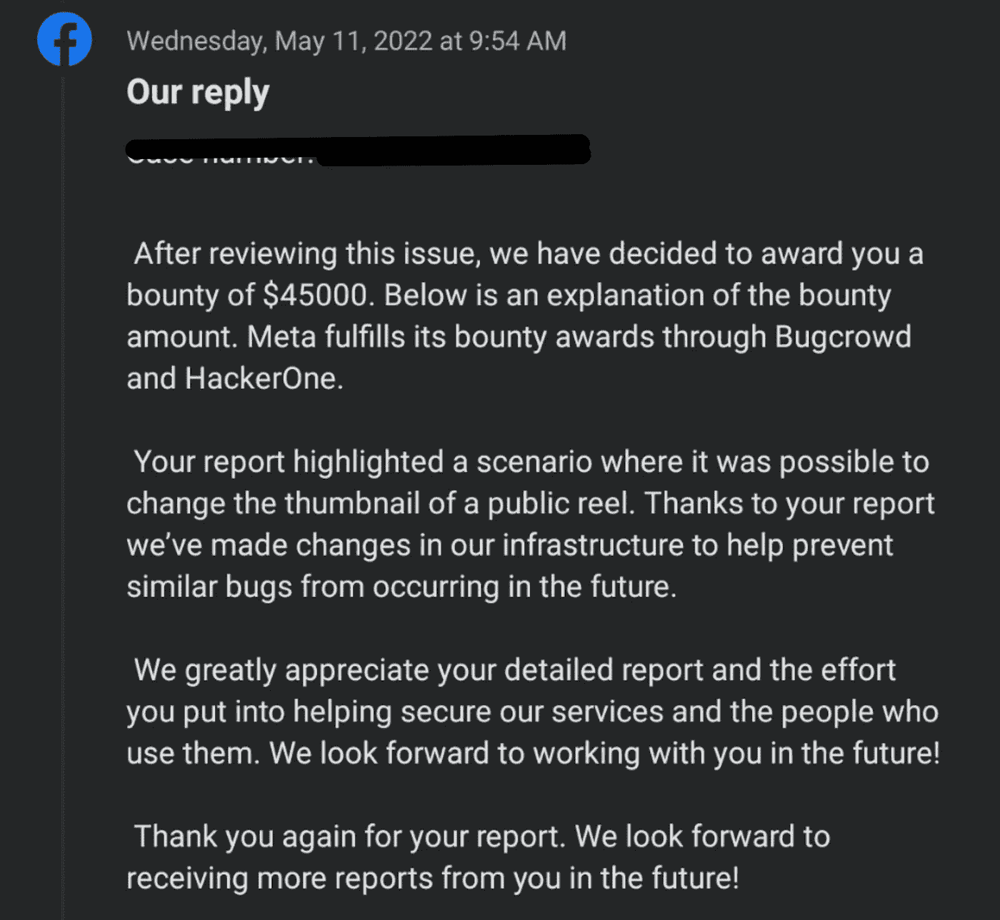

# 我是如何在 Instagram 中发现一个关键漏洞，并从脸书那里获得 49500 美元奖金的

> 原文：<https://infosecwriteups.com/how-i-found-a-critical-bug-in-instagram-and-got-49500-bounty-from-facebook-626ff2c6a853?source=collection_archive---------0----------------------->

大家好，我是 Neeraj Sharma，一个来自印度的 20 岁的安全爱好者。

## 描述

利用该漏洞，攻击者可以通过了解任何 Instagram 用户的 clips_media_id(卷的媒体 id)来更改该用户的卷缩略图。

## 所以我是如何发现这个 Bug 的——故事情节(没有技术细节)

我从 2021 年 12 月开始在 Instagram 应用上打猎。最初，我在 Instagram Ads GraphQL API 上测试，但经过长时间的搜索，当我在那里找不到任何错误时，我开始在 Instagram reels 部分搜索。在花了一些时间与目标，我来到了用户可以编辑他们的卷轴封面照片(缩略图)的点。为了测试，我改变了我的卷轴。我使用 burp 拦截了所有的 HTTP 请求，在转发了一些请求后，我看到了下面的 HTTP 请求。

## 易受攻击的端点:

> POST/API/v1/media/configure _ to _ clips _ cover _ image/HTTP/2
> 主机:i.instagram.com
> X-Ig-App-Locale:en _ US
> X-Ig-Device-Locale:en _ US
> X-Ig-Mapped-Locale:en _ US
> X-Pigeon-Session-Id:UFS-76e 15775–9d 76-xxxx-a9ff-9e 773 f 1434 f 3–0
> X-Pigeon-raw client time:16320dpi720x1184 未知/安卓；vbox86pvbox86en _ US356747126)
> 接受-语言:en-US
> 授权:无记名 IGT:2:<base 64 _ Encoded _ Token>
> X-Mid:ynja 7 aabaafbawyzna 1j 4 pu-Mf2e
> Ig-U-Ig-Direct-Region-Hint:ASH，446 xxxxxxxxx，168 xxxxxxxx:01 f7b 979 c 4246 d13 c 5918 e 1c 108d 4700charset = UTF-8
> Content-Length:100
> Accept-Encoding:gzip，deflate
> X-f b-Http-Engine:Liger
> X-f b-Client-Ip:True
> X-f b-Server-Cluster:True
> 
> clips _ media _ id = 2763122193610 xxxxxxxx & _ uuid = 8893 c680–7663–48 a4–95dc-DD 91 b 9 XXXXXX & upload _ id = 326264 xxxxx

**这里有两个主要参数:**

> *剪辑 _ 媒体 _id*
> 
> *上传 _id*

剪辑媒体 id 是卷轴 ID。

Upload_id 是我想在缩略图上插入的照片的 id。

将此请求发送到中继器，然后用我的测试卷的 *media_id* 替换我的 *clips_media_id* ，并将请求转发到浏览器。令我惊讶的是，未经授权的测试卷轴，用户将永远无法控制其缩略图被改变。

我用我的不同帐户再次尝试，并用我的第二个帐户卷轴媒体 id 替换了 *clips_media_id* 。而不是我的第一个帐户卷轴，第二个帐户的缩略图改变了。

**我很惊讶，因为我没有想到像 META 这样的巨头的子公司会如此脆弱。我立即向 Meta 安全团队报告了此事。**

## **冲击**:

这个 bug 允许恶意演员更改 Instagram 上任何卷轴的缩略图。要执行此攻击，只需要目标用户卷的媒体 ID。

在 C-I-A 三元组中，完整性被破坏，攻击者的行为完全无视受害者的可及性。从而考虑 0 交互和元安全操作的最终影响分析。元团队决定了这$$$$$的巨额奖励。换句话说，恶意行为者能够在没有任何授权或受害者互动的情况下，在任何档案中伪造缩略图。这种影响在 Instagram 用户中广泛传播。

## 概念证明:

PS:所有测试都是在我的测试账户上进行的:)

[**视频**](https://youtu.be/1X7I25-rSqE)

圣人

**我要感谢元安全团队给予我的巨额奖金😊**

也非常感谢我的朋友[**vats al vaish**](https://in.linkedin.com/in/vatsal-vaishy-479503141)在这篇文章中帮助了我:)

## 时间线:

2022 年 1 月 31 日:报告已发送

03-Feb-2022:收到元安全团队的回复以了解更多信息

2022 年 2 月 8 日:报告已分类

2022 年 5 月 11 日:获得 49500 美元奖金(45000 美元奖金+ 4500 美元红利)🥳