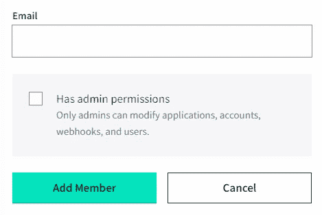
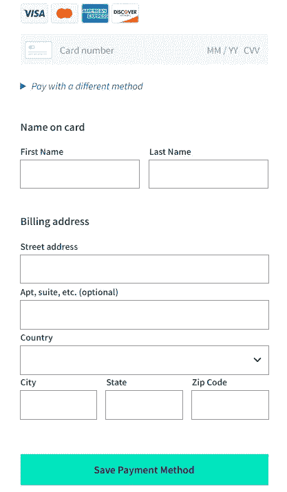
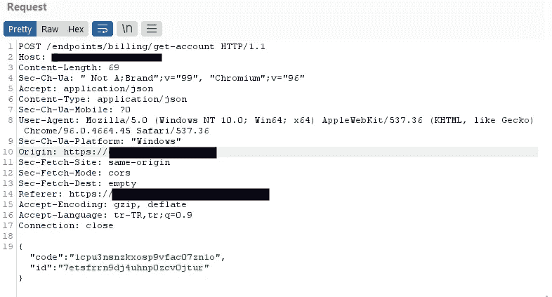
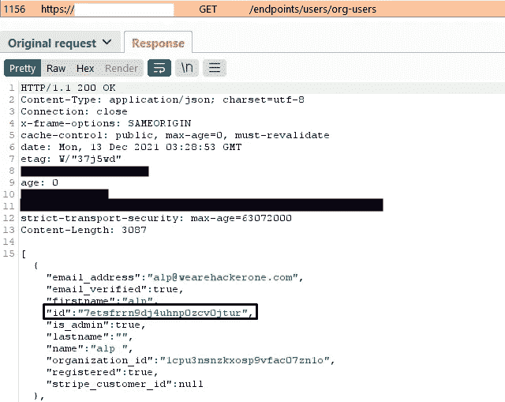
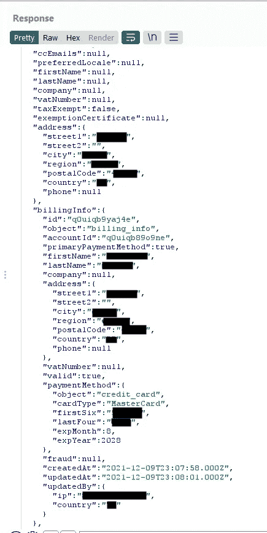
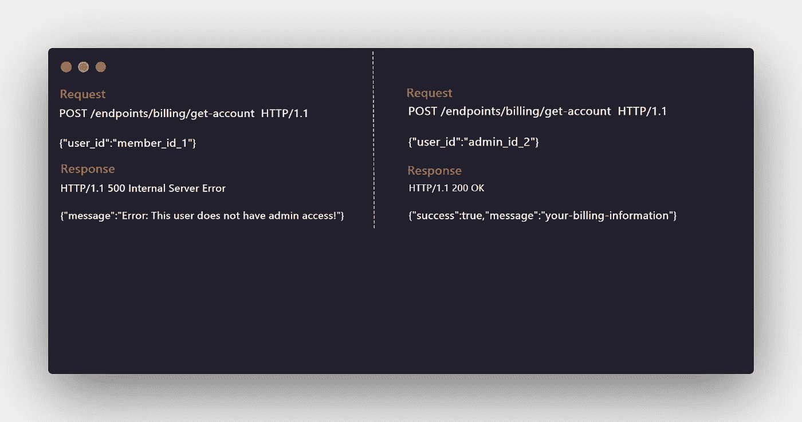

# 我如何在 5 分钟内发现 IDOR 问题？

> 原文：<https://infosecwriteups.com/how-i-found-a-idor-issue-in-5-mins-2c6a2805c08c?source=collection_archive---------0----------------------->

大家好！自从我的上一篇文章以来，我没有在 Medium 上活动过！我真的很想念写一些关于昆虫赏金的东西！

在今天的文章中，我将解释我是如何在 5 分钟内发现一个 IDOR 问题的，哈哈。继续看报道。

*   4 天前，当我准备睡觉时，我在 Hackerone 上收到了一个私人节目邀请。

私人节目邀请

然后我决定在睡觉前看一看主域是值得的。我注册了这个网站，我看到这里有一个组织和角色等级。

我通过授予成员角色邀请我的 alt 帐户加入我的组织。此外，我还在我组织的管理帐户中添加了一张信用卡。该网站需要帐单地址、电话号码等来添加帐单方法。我注意到了这一点，我将在我的 alt 帐户上观察:)

我登录到我的 alt 帐户，开始观察可能的易受攻击的端点。我直接看了账单页面。

如果你不是管理员，它似乎被阻止了-_-

我在我的 alt 帐户上看到一个 POST 请求，比如`/endpoints/billing/get-account `带有“code”和“id”参数。我了解到“代码”参数值是我们的组织 ID。但是我不知道“id”参数的值是什么意思。:/

您可以通过发送 POST 请求来获取账单信息

然后我模糊了“/端点/用户/ <here>”端点，在[https://redacted.co.uk/endpoints/users/org-users](https://dashboard.nylas.com/endpoints/users/org-users)页面找到了组织成员 id。我看到了管理帐户 id，现在我得到了它的“ID”参数是一个用户 ID，lol。</here>

然后，我复制了 id 值，并在“/endpoints/billing/get-account”参数中用我的 alt 帐户上的“id”参数值替换它。

*   反应

响应详细信息

它透露了一些私人信息，如 IP 地址，完整的地址，全名，信用卡的前六位数字，信用卡的后四位数字，信用卡的到期月份/年份。而且绝对有影响！

我立马举报了！

一些提示:总是给所有的端点一个变化，因为你有时会很幸运，可以找到一些东西。:)

感谢阅读我的评论，如果你喜欢，请鼓掌。如果你有任何关于 bug 赏金或信息安全的问题，请直接联系我！还有，我们有一个关于 bug bounty 的 Discord 服务器，infosec！不要犹豫，加入我们的不和谐服务器！我们在这里帮助初学者和其他臭虫猎人！^^

推特:[https://twitter.com/alp0x01](https://twitter.com/alp0x01)

祝你愉快，再见！