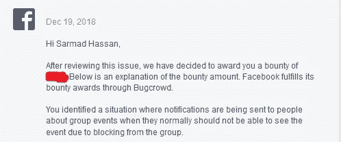

# 我是如何在没有任何测试的情况下在脸书发现一个简单的 bug 的

> 原文：<https://infosecwriteups.com/how-i-found-a-simple-bug-in-facebook-without-any-test-3bc8cf5e2ca2?source=collection_archive---------1----------------------->

大家好，今天我想谈谈我在脸书遇到的最简单的 bug，以及我是如何在没有任何测试的情况下发现它的，所以让我们开始吧:)

2018 年 8 月 28 日的**，我正在查看我的**新闻提要**，突然我收到了这个**奇怪的通知**，见下图:**

这只是一个已删除的封闭组的事件通知

为什么这个通知对我来说是**怪异**！好吧，让我给你解释一下:

*   上述事件的通知与 **a 封闭组**有关。
*   我是那个**封闭群**的**前成员**(离开了群)，也就是说我不能进入群，看不到群内容**。**
*   那么**为什么当我不再是那个组织的成员时，我会收到那个组织的通知呢？！！**

耶啊:)

几秒钟之内我就知道这是**一个安全漏洞**看到这个 [**链接**](https://www.facebook.com/help/220336891328465?helpref=about_content) ，同时**一些想法**浮现在我的脑海里如下:

*   被屏蔽的用户怎么办！！？？
*   如果事件名称更改并被删除了会怎样。可以看到活动名称的最后更新吗！！？？在用户被阻止或离开群组后！！？？

玩了**我的测试封闭组**之后，我注意到了下面的事情:

1- **被阻止的用户和离开群组的用户**可以收到事件名称最新更新的通知。

2-它在**所有类型的事件**(账户、页面、甚至工作场所)中工作，而不仅仅是在封闭的组中。

我直接向**脸书安全团队**报告了这一情况，他们认为这是一个有效的漏洞，谢谢你们的奖励:)

感谢[**IQDevs**](https://www.facebook.com/groups/geekerz/?ref=group_header)**组的管理员，不管你是谁，谢谢你删除了那个事件，因为你我发现了这个 bug)**

****

****时间表:**
2018 年 8 月 28 日—初次报告
2018 年 8 月 31 日—报告审判
2018 年 12 月 19 日—奖金发放
2019 年 1 月 31 日—错误修复
2019 年 1 月 31 日—修复确认**

****PoC 视频:****

****武艺:****

**1-有时你不需要工具或 F12 来找到有效的 bug:)**

**谢谢你**

**萨尔马德·哈桑 ( [朱巴巴格达](https://twitter.com/JubaBaghdad))**