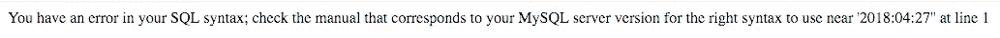
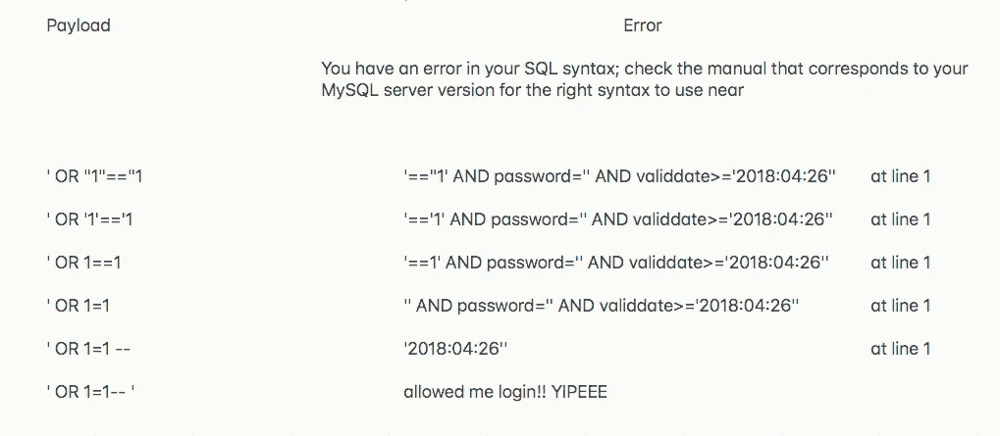
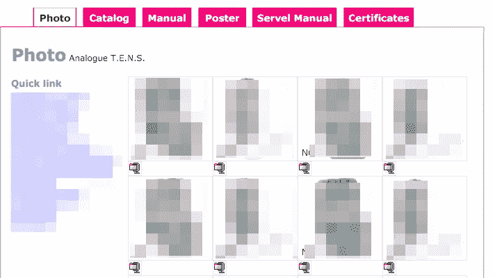

# 我是如何在一家在线医疗器械商店发现 SQL 漏洞的？

> 原文：<https://infosecwriteups.com/how-i-found-a-sql-flaw-on-an-online-medical-store-1edfc29fed91?source=collection_archive---------1----------------------->

《复仇者联盟:无限战争》上映的吉日，我激动得在电影的等待中睡不着觉。我疯狂地看着 youtube 上与《复仇者联盟》相关的视频，然后我有了一个绝妙的主意，为什么不在这段时间黑点东西。如果我不睡觉，为什么不利用这段时间做些坏事呢？

# **所以我们来黑吧！**

我想练习我的 SQL 注入技能，所以我做了一个谷歌搜索“inurl:login.php”，使用‘inurl’dork 给了我一个 php 登录页面列表，php 登录网站往往更容易受到 SQL 注入攻击。在那之后，我在新的选项卡中打开了一系列建议的登录页面，并开始检查有 SQL 漏洞的站点。

# **识别易受攻击的站点！**

在不同的选项卡中打开的不同登录页面我一个接一个地打开它们(这就是我有多空闲)，一旦我打开它们，我就通过在用户名字段中插入撇号(')并保留密码字段为空并尝试登录来尝试最基本的 SQL 漏洞检查，在几次尝试后，这个网站给了我一个类似这样的 SQL 错误。

# 用有效载荷测试！

现在，一旦我收到这个错误消息，我试图输入不同的有效载荷来评估用户名验证是如何工作的。我一个接一个地输入不同的有效载荷，这给了我一个更好的解释，什么有效载荷可以帮助我绕过登录认证。

# 道德的

尝试执行 SQL 注入，您必须尝试不同的有效负载组合，首先您可以尝试 BurpSuite 的内置 SQL 有效负载列表，以了解登录行为，然后检查超出通常消息长度的消息，并检查您收到的针对这些特定有效负载的响应。一旦您理解了什么样的有效负载会以一种不寻常的形式影响登录，从那里开始您就可以进行手动 SQL 攻击了。

所以，我就这样找到了绕过网上医药商店登录的方法。

**如果你喜欢，请鼓掌&让我们合作吧。获取、设置、破解！**

网址:[aditya12anand.com](https://www.aditya12anand.com/)|捐赠:[paypal.me/aditya12anand](https://paypal.me/aditya12anand)

电报:[https://t.me/aditya12anand](https://t.me/aditya12anand)

推特:[twitter.com/aditya12anand](https://twitter.com/aditya12anand?source=post_page---------------------------)

领英:[linkedin.com/in/aditya12anand/](https://www.linkedin.com/in/aditya12anand/?source=post_page---------------------------)

电子邮件:aditya12anand@protonmail.com