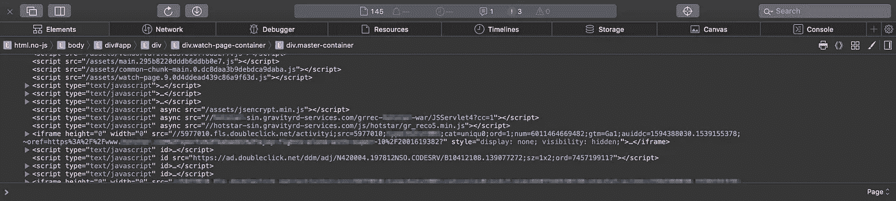

# 我是如何在在线流媒体网站上免费观看付费内容的？

> 原文：<https://infosecwriteups.com/how-i-found-a-way-to-view-paid-content-on-an-online-streaming-website-5454cbb742f4?source=collection_archive---------0----------------------->

你好，我知道距离我的上一篇文章已经过了很长时间，对于那些经常关注我的人来说，我很抱歉我最近没能写出很多文章，但我保证这篇文章会很有趣。

# 开始了。

我是那些喜欢免费东西的人之一，我不知道其他人，但作为一个破产的大学生，免费的东西像地狱一样吸引着我。这篇文章讲的是我如何找到一种快速肮脏的方法来免费访问在线流媒体网站上的付费内容。我打算用付费账户观看一场足球直播，但问题是这是我朋友的账户，网站的基本限制是只有一个人可以访问直播视频流。现在，问题是我的朋友在那个时间点也在使用这个帐户，所以如果我想看内容，我必须绕过这个限制。所以，让我告诉你我是如何找到克服这一挑战的方法并现场观看了整场比赛的。

# 让我们开始吧！

所以，首先我打开了网站，然后打开了元素检测。我想知道是否有一种方法可以弄清楚网站是如何检查在同一时间点有多少人在查看在线内容的。我浏览了整个代码，意识到他们使用 javascript 来检查网站是否在同一时间点被不同的浏览器打开。现在，我需要告诉你，那时我对 javascript 还不是很在行。因此，即使我知道流媒体服务正在客户端验证它，并且它使用 javascript 来完成这项工作，但我仍然对此无能为力。(心里注:-学习 Javascript)

inspect 元素中的 Javascript

等等，他们在客户端使用 javascript 进行验证，这是安全方面最糟糕的事情，所以我必须做些别的事情来危及网页的安全。所以，我缩小了一点来看看更大的图片，然后一个想法出现在我的脑海里，猜猜这是怎么回事。

# 客户端 Javascript 验证是个坏消息！

因此，到目前为止，当我访问流媒体网站，而我的朋友正在使用它时，我的屏幕上会显示一条消息，内容是“该帐户正在被其他人使用”。现在，快速加载网页的基本规则(几乎每个人都遵循)是首先加载 HTML，然后是 CSS，最后是 Javascript。所以，现在让我们说 Javascript 是安全卫士，所以除非 Javascript 加载，否则在一段短暂的时间内，网页上没有任何安全可言，在那个特定的瞬间，你可以做任何你想做的事情。

# 细节决定成败。

所以，这就是我的想法发挥作用的地方，如果我从来没有让安全警卫来，那么我的意思是，如果我找到一种方法来阻止 Javascript 加载到网页上。好了，接下来是你怎么做的部分？如何阻止 Javascript 在网页上加载？答案简单得可笑，我自己也不相信它会起作用。您只需刷新网页，并在主网页打开时(即当网页的 HTML 和 CSS 部分加载完毕时)手动停止刷新过程。这可能需要几次尝试(最多 3-4 次),因为网页加载的速度是以毫秒/秒为单位的(取决于网络连接),所以执行起来有点棘手，但这样你就停止了加载网页的安全措施。

一旦你能够做到这一点，那么万岁，你可以在不同的系统上同时观看网站的优质内容，你永远也不需要有不同的优质账户，每个人只需要一个就可以了。

# 道德的

如果你是一名开发人员，那么请记住你正在开发的应用程序或软件的安全性。如果应用程序关注的是快速服务而不是安全性，那么最后加载 Javascript 是没问题的，但是如果你正在编写一个方面安全性的代码，最好同时加载 Javascript。

如果你喜欢，请鼓掌让我们合作吧。获取、设置、破解！

网址:【aditya12anand.com】T2|捐赠:【paypal.me/aditya12anand】T4

电报:[https://t.me/aditya12anand](https://t.me/aditya12anand)

推特:[twitter.com/aditya12anand](https://twitter.com/aditya12anand?source=post_page---------------------------)

领英:[linkedin.com/in/aditya12anand/](https://www.linkedin.com/in/aditya12anand/?source=post_page---------------------------)

电子邮件:aditya12anand@protonmail.com