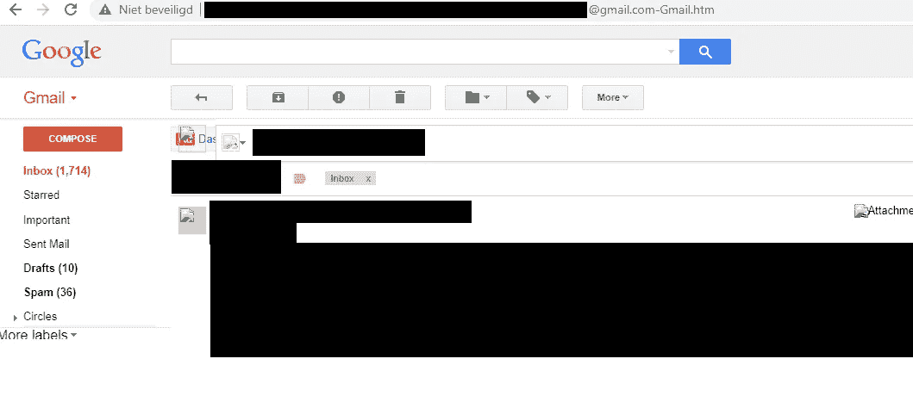
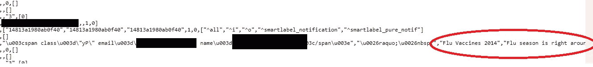

# 我是如何意外发现复制粘贴的 Gmail 收件箱的

> 原文：<https://infosecwriteups.com/how-i-found-accidentally-copy-pasted-gmail-inboxes-49fcb8da5b8a?source=collection_archive---------0----------------------->

## 这一切都是从我自己的 Gmail 中的这段文字开始的:

Gmail 中的标签

我读到过道德黑客根据已知内容(如登录页面)的信息用谷歌呆子搜索。上面的文字听起来确实承诺在谷歌上检查。令我惊讶的是，我在谷歌上找到了一些结果。谷歌搜索结果显示，搜索文本有 30 次点击。

在我点击其中一个链接后，我发现它看起来像一个人的 Gmail 收件箱。但它不是“实时”的 Gmail 收件箱。这是早先的一份拷贝。看起来这个人可能只是想复制一张图片或文本，却意外地复制粘贴了他们的 Gmail 页面。

我点击显示页面源代码来检查有趣的数据。我发现非常有趣的是，似乎该帐户的电子邮件文件夹中所有电子邮件的 JSON 都包含在 HTML 源代码中。

这些邮件可能包含个人和机密信息，如客户对话、个人数据和密码。

我已经通知了我找到的大多数电子邮件收件箱，这样他们就可以从他们的网站上删除包含复制粘贴的 Gmail 数据的文件。

用于查找复制粘贴的 Gmail 收件箱的 Google 呆子:

1.  "/wp-content/uploads 的索引" " gmail.htm "
2.  标题:Gmail —(无主题)
3.  inurl: [@gmail](http://twitter.com/gmail) 。com—Gmail.htm
4.  点击教 Gmail 这个对话不重要
5.  GM _ SUPPORTED _ GECKO _ VERSION = " 2 . 0 . 0 "；
6.  " Belangrijk volgens ons to vermiddel "

## 来自 Infosec 的报道:Infosec 每天都有很多内容，很难跟上。[加入我们的每周时事通讯](https://weekly.infosecwriteups.com/)以 5 篇文章、4 个线程、3 个视频、2 个 GitHub Repos 和工具以及 1 个工作提醒的形式免费获取所有最新的 Infosec 趋势！