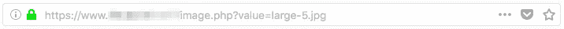
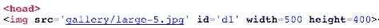
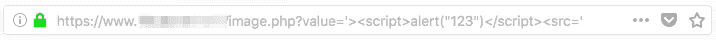
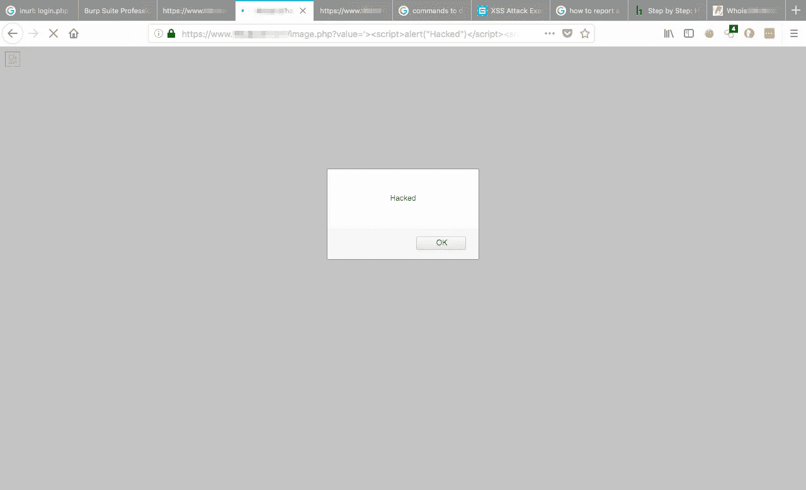

# 我是如何在印度最负盛名的工程大学发现 XSS 漏洞的？

> 原文：<https://infosecwriteups.com/how-i-found-an-xss-vulnerability-on-the-most-prestigious-engineering-university-of-india-bb133c4d0d82?source=collection_archive---------2----------------------->

你有没有过那种报复的感觉，当你想如果我进不了那所大学/公司，那我就打开他们的网站，向他们展示我更好？我从未有过那种感觉；).

所以，今天在我的实践考试后，我想发泄我的沮丧，因为我几乎没有在纸上写点什么，还有什么比黑客网站更好的发泄沮丧的方式。

我在网上随意浏览，当我看到一所印度最有声望的大学的登录页面时，它看起来很害羞，所以我开始四处寻找。

# 所以我们来黑吧！

我尝试的第一件事是检查我是否可以实现一个 SQL 漏洞来绕过身份验证和登录，但是没有成功。我开始访问不同的页面，联系我们页面(它们大多容易受到攻击)，然后是校友页面等等。当我访问画廊时，我记下了网址。

当我看到“value=large-5.jpg”时，我想检查 XSS 漏洞。

# 寻找漏洞

所以，我做的第一件事是查看文件的源，值被存储在那里，它看起来像这样。

> “large-5”在值中很常见，它也出现在 php 页面中

当我发现这一点时，我尝试插入撇号(')和小于()符号来检查编码是否到位，这本来可以阻止 XSS 攻击，但我想我很幸运编码没有到位。从那时起，我继续创造有效载荷。

# 有效载荷测试

现在，工作是在 php 页面中正确插入一个

> 

所以，我试着用下面的有效载荷

> >

The url looked like this

and voila! The lovely dialog box appeared on the screen.

# Moral

The url encoding of apostrophe(‘), less than ()不在允许我插入脚本标签的地方。这从一开始就不应该被允许。我想这是我的幸运日，顺便说一句，网站属于一个印度理工学院。

如果你喜欢，请鼓掌让我们合作。获取、设置、破解！

网址:[aditya12anand.com](https://www.aditya12anand.com/)|捐赠:[paypal.me/aditya12anand](https://paypal.me/aditya12anand)

电报:[https://t.me/aditya12anand](https://t.me/aditya12anand)

推特:[twitter.com/aditya12anand](https://twitter.com/aditya12anand?source=post_page---------------------------)

领英:[linkedin.com/in/aditya12anand/](https://www.linkedin.com/in/aditya12anand/?source=post_page---------------------------)

电子邮件:aditya12anand@protonmail.com