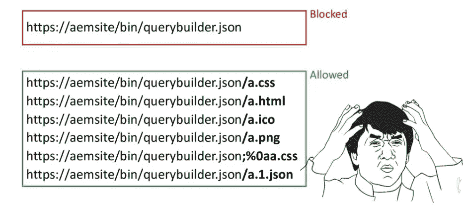
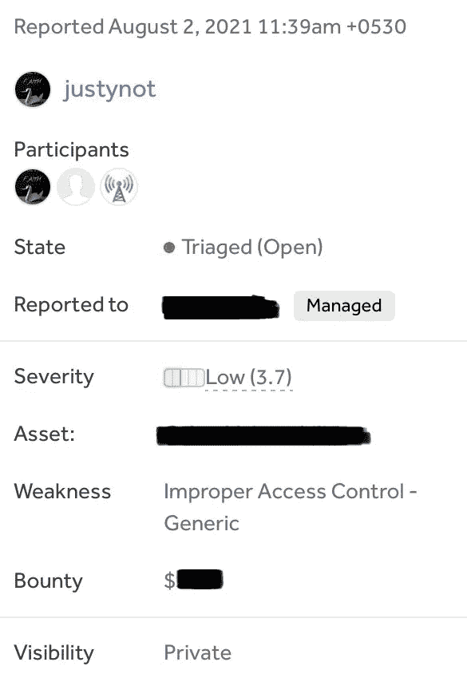

# 我如何发现我的第一个 AEM 相关的 bug。

> 原文：<https://infosecwriteups.com/how-i-found-my-first-aem-related-bug-5ea901aad3f4?source=collection_archive---------0----------------------->

大家好，所有了不起的黑客和网络安全爱好者。我叫韦丹特(在推特上也叫贝吉塔😁)而我是一个有抱负的 bug 赏金猎人，也是一个网络安全爱好者。今天我想和你分享一个关于我如何发现我的第一个 AEM 相关 bug 的故事:)首先，我想告诉你，我仍然在学习关于 AEM 的知识，我发现这个问题仅仅是通过应用我目前所学的知识。所以事不宜迟，让我们开始吧。

# **背景:-**

所以在理解真正的 bug 之前，你必须了解一些事情。一、AEM 是什么？*“Adobe Experience Manager(AEM)，是一个全面的内容管理解决方案，用于构建网站、移动应用程序和表单。它还能让您轻松管理营销内容和资产。”基本上 AEM 是一个 CMS，就像 Wordpress 和 Drupal 一样。*

接下来是 Querybuilder servlet， *"AEM Query Builder 是由 adobe 开发的一个框架，用于为查询引擎(OAK Query Engine)构建查询* *(下面是 JCR XPath)，这些查询很容易编写。查询可以被描述为一组简单的键值形式的谓词。*你可以在这里了解更多[。](https://experienceleague.adobe.com/docs/experience-manager-64/developing/platform/query-builder/querybuilder-api.html?lang=en)

最后但同样重要的是，调度员。*“Dispatcher”是****Adobe Experience Manager 的缓存和/或负载平衡工具*** *。使用 AEM 的 Dispatcher 还有助于保护 AEM 服务器免受攻击"*你可以把 AEM dispatcher 想象成一个 WAF。

# 漏洞:-

所以在 7 月份，我在 Hackerone 平台上发现了很多重复的和信息性的错误，对此我有点沮丧。每当我在寻找 bug 时感到气馁，我就会想起这句话，**“如果你的生活变得更艰难，你就变得更好了”**我决定学习一些新的 bug 类型，在搜索了一段时间后，我发现了[Mikhail ego ROV 的这个](https://www.youtube.com/watch?v=EQNBQCQMouk)精彩演讲，他谈到了 AEM 相关的 bug。这对我来说是全新的，所以我决定探索更多，阅读所有我能找到的关于 AEM 相关漏洞的文章。我对一些事情有了一个基本的想法，并决定应用我到目前为止学到的东西。所以我选择了一个程序来破解。我已经收集了子域名，并多次试图寻找其中的漏洞，但没有找到任何漏洞，但这一次不同。

我检查了每个子域，并用 wappalyzer 检查了一个使用 AEM 的子域，过了一会儿，我发现了一个使用 AEM 构建的子域。然后我开始模糊查找 querybuilder servlet，通过利用它，攻击者可以读取内部路径。我手动模糊是因为试图绕过调度员很有趣😁。我尝试了下面的有效负载，网站总是响应 404 错误，但我一直在尝试一些有效负载来绕过调度程序。

归功于米哈伊尔·叶戈罗夫。

如上图所示，我们可以使用/a.css、/a.png 等来迷惑 dispatcher，让我们访问 querybuilder servlet。所以在尝试了类似的有效载荷后，有一个成功了！最终的有效载荷看起来像这样，

**有效载荷:-**

**'/bin/query builder . JSON；%0aa.css？path =/etc&p . hits = full&p . limit =-1 '**

我可以读取/etc、/home、/content 等目录的内容。你也可以使用 automation 找到这样的 bug，有很多 AEM 相关 bug 的 nuclei 模板，你可以在这里查看[。我很快报告了这个问题，两天后问题得到了解决！一个星期后，我获得了 1000 美元的奖金:)](https://github.com/projectdiscovery/nuclei-templates/tree/master/misconfiguration/aem)

还有很多有趣的 AEM 相关漏洞，AEM 确实是一个庞大的主题，但探索起来非常有趣。我希望你在阅读这篇文章时学到了一些新东西，如果你有任何问题，你可以在这里联系我。如果你喜欢读这篇文章，请鼓掌并与你的朋友分享。谢谢大家！