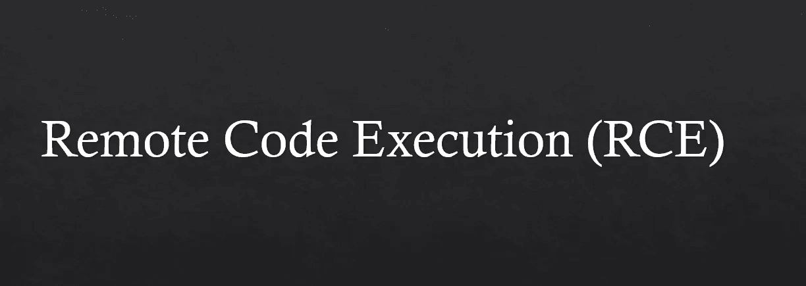
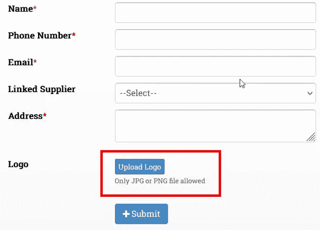
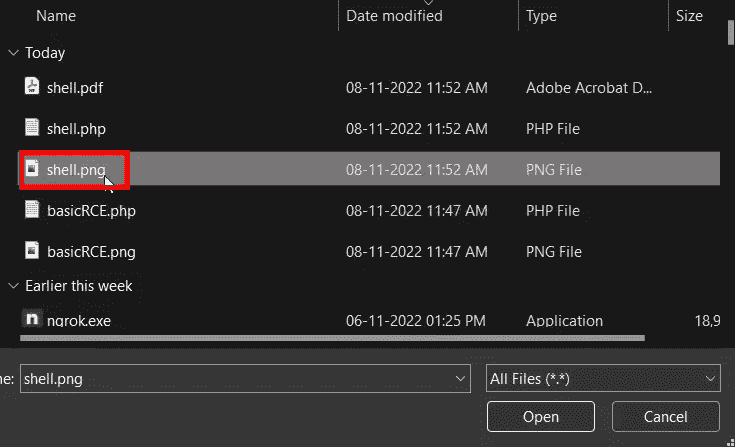
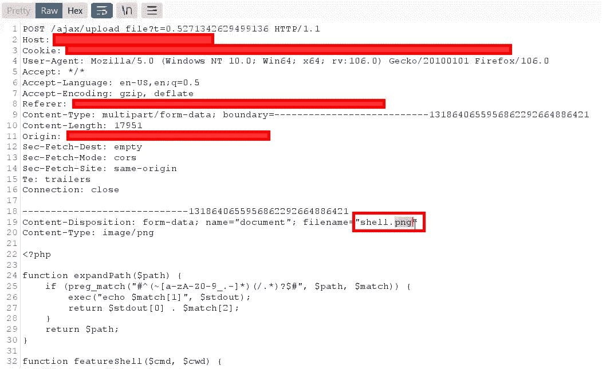
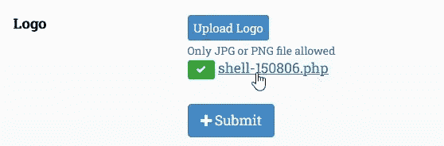
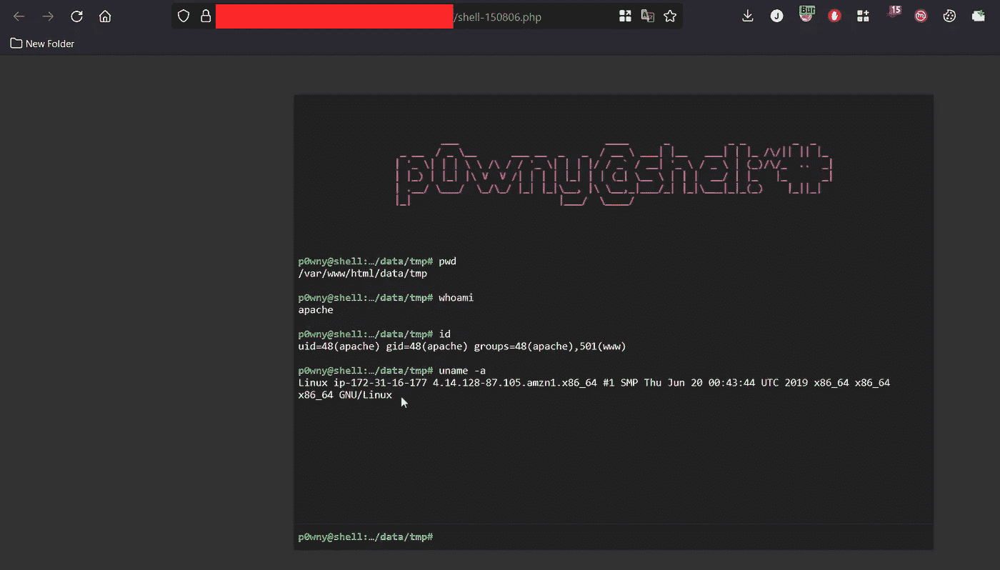

# 我是如何找到我的第一个 RCE 的？一个简单的…

> 原文：<https://infosecwriteups.com/how-i-found-my-first-rce-a-simple-one-4d7dc1444c4?source=collection_archive---------5----------------------->

大家好，

我叫 [Praveen Mali](https://www.linkedin.com/in/praveen-mali/) (PMMALI)，是一名网络安全分析师。

作为一名网络安全爱好者，我一直对漏洞搜寻的概念很着迷——这是一种主动搜索系统和软件漏洞以提高其安全性的过程。

我为公司的一个客户任务表演 VAPT，我发现了一个简单的 RCE，我想和大家分享一下。

我正在测试一个 web 应用程序，它是一个为船运公司开发的 ERP 和资产管理系统。有一个用于更新公司信息的表单，还有一个用于上传徽标的文件上传功能。

文件上传功能触发我上传一个外壳，但它只允许 JPG 和 PNG 格式。所以我从 GitHub 下载了一个 [web shell](https://github.com/flozz/p0wny-shell/blob/master/shell.php) ，保存为。png 并上传到 web 应用程序上，在上传时，我截获了进入 Burp 套件的请求，在那里我更改了。png 转. php。

web shell 上传成功，当我点击 logo 的链接时，php 文件被执行，我得到了服务器的 shell。

这就是我如何找到我的第一个 RCE。我希望你喜欢这篇文章，并学到一些东西。虽然是很简单的 RCE。

非常感谢您的阅读🙏

我的 LinkedIn ID:【https://www.linkedin.com/in/praveen-mali/】T4

我的推特 ID:[https://twitter.com/pmmali_](https://twitter.com/pmmali_)

## 来自 Infosec 的报道:Infosec 每天都有很多内容，很难跟上。[加入我们的每周简讯](https://weekly.infosecwriteups.com/)以 5 篇文章、4 个线程、3 个视频、2 个 GitHub Repos 和工具以及 1 个工作提醒的形式免费获取所有最新的 Infosec 趋势！