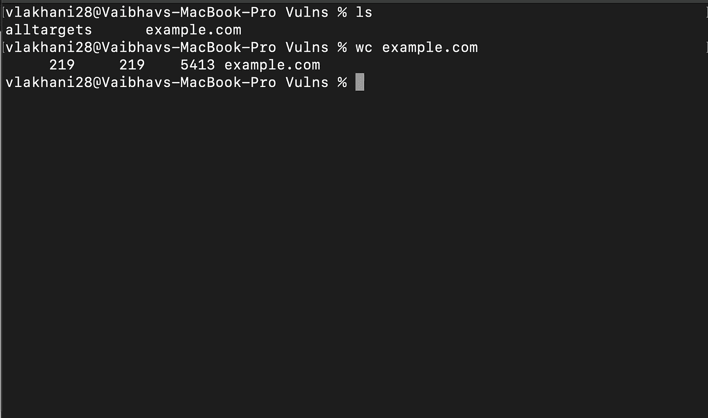
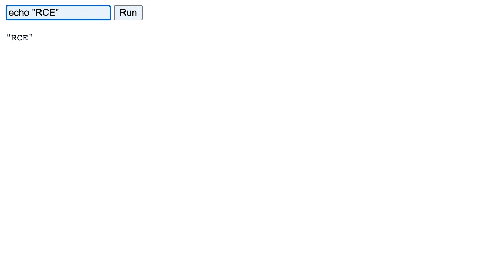
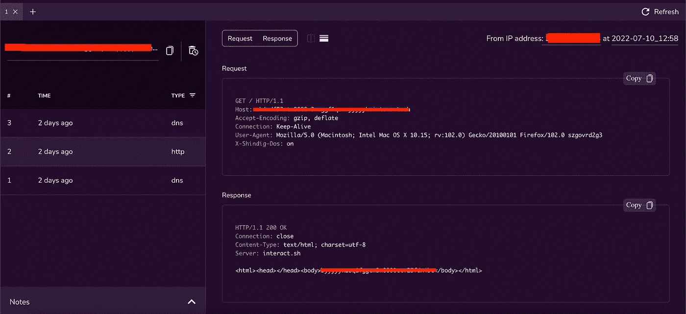

# 我是如何找到我的第一个 RCE 的！

> 原文：<https://infosecwriteups.com/how-i-found-my-first-rce-c063546114ef?source=collection_archive---------0----------------------->

远程代码执行(rce)是所有人的梦想，但只有一部分人找到了它。这个故事是关于我如何能够找到我的 RCE 使用简单的模糊技术和一点点侦察。所以我们开始吧…

**我的方法论:**

1.  已收集范围内的域。
2.  开始主动和被动子域枚举。用于被动子域枚举的工具: [subfinder](https://github.com/projectdiscovery/subfinder) (带有 Shodan、Chaos、GitHub、Sublist3r 等不同服务的 API Keys)。对于活动子域枚举，使用了来自[资产注释词表](https://wordlists.assetnote.io/)的[最佳 DNS 词表](https://wordlists-cdn.assetnote.io/data/manual/best-dns-wordlist.txt)。
3.  大约有 219 个子域名被发现

4.下一步是根据状态代码过滤掉实时域。

5.很快，我发现子域 accounts.example.com 与状态代码 403 禁止。

6.这是真正的旅程开始的地方。

所以我准备好了 [FFuF](https://github.com/ffuf/ffuf) 和著名的[seclist](https://github.com/danielmiessler/SecLists)中的单词表，开始了模糊扫描。发现一个似乎易受 CVE 攻击的端点*/file upload/tools any*-2022–29464。

[CVE-2022–29464](https://docs.wso2.com/display/Security/Security+Advisory+WSO2-2021-1738)是由[橙仔](https://twitter.com/orange_8361)发现的 WSO2 上的一个关键漏洞。该漏洞是一个未经验证的无限制的任意文件上传，使得未经验证的攻击者能够通过上传恶意 JSP 文件在 WSO2 服务器上获得 RCE。

易受攻击的端点是/fileupload，攻击者可以使用该端点上传。jsp 文件，这可能导致受害者机器的反向外壳。

一旦我确认了这个漏洞，下一个任务就是找到一个合适的漏洞。有两种方法可以做到这一点，要么在 Burp 中捕获请求并修改请求，要么使用开发的漏洞。让我们来了解一下这两者的步骤

**方法 1:使用打嗝**

1.  在 Burp Suite 中捕获端点请求
2.  将方法从 GET 更改为 POST
3.  在 Content-Disposition 头中，输入端点名以及文件名和文件名。例如:

内容-处置:形式-数据；name= "../../../../repository/deployment/server/web apps/authenticationendpoint/my shell . JSP "；filename="MyShell.jsp "

4.在 POST 主体中输入 file.jsp 应该执行的命令。例如:

5.导航到端点 accounts.example.com/authenticationendpoint/MyShell.jsp，您的命令将被执行

**方法二:利用漏洞**

1.  导航到[https://github.com/hakivvi/CVE-2022-29464](https://github.com/hakivvi/CVE-2022-29464)
2.  Git 将文件克隆到本地机器上
3.  使用 python 3 exploit . py https://accounts.example.com MyShell.jsp 运行漏洞
4.  请访问端点 https://accounts . example . com/authenticationendpoint/my shell . JSP
5.  您将能够运行任何命令

与此同时，我正在利用 RCE，我在同一个域名 accounts.example.com 上使用了 [waybackurls](https://github.com/tomnomnom/waybackurls) ，下面的端点吸引了我的眼球。https://accounts.example.com/shindig/gadgets/proxy?container = default&URL = https://Google . com

我迅速打开 [Interactsh 客户端](https://app.interactsh.com/#/)并粘贴有效载荷。

还有嘣 **SSRF** ！事实证明，同样的 WSO2 也容易受到 SSRF 的攻击。

**时间线**

发现的两个漏洞:2022 年 7 月 10 日

报告日期:2022 年 7 月 10 日

初次答复:2022 年 7 月 11 日

授予名人堂+推荐信:2022 年 7 月 13 日

*来自 Infosec 的报道:Infosec 上每天都会出现很多难以跟上的内容。* [***加入我们的每周简讯***](https://weekly.infosecwriteups.com/) *以 5 篇文章、4 个线程、3 个视频、2 个 Github Repos 和工具以及 1 个工作提醒的形式免费获取所有最新的 Infosec 趋势！*