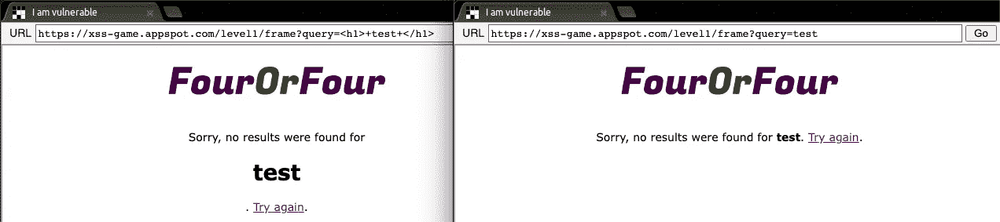
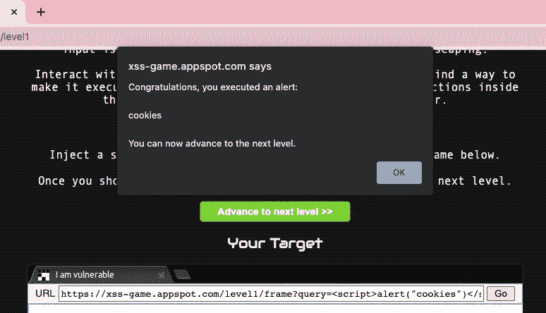
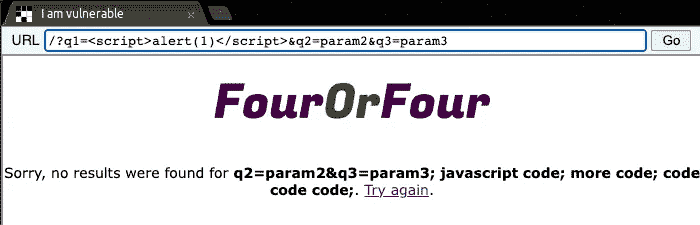
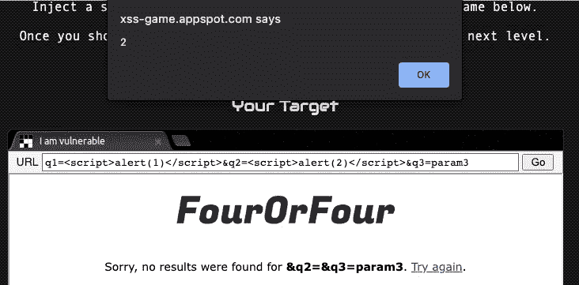

# 我如何发现我的第一个漏洞/Bug 奖励，你也可以:第 2 部分

> 原文：<https://infosecwriteups.com/how-i-found-my-first-vulnerability-bug-bounty-and-how-you-can-too-part-2-2e8681f4e3b7?source=collection_archive---------1----------------------->

## 简单的黑客！


DALL E AI 制作的艺术作品“在我的大脑中混合在一起的多种软件问题的数字艺术”

在第 2 部分中，我将回顾我是如何发现我的第一个真实世界的漏洞的。如果你没有读过第 1 部分，[一定要去看看](https://medium.com/p/f2dd0b7d7665)！由于我不想公开发现这些漏洞的网站，我将提到虚构的网站[www.victim.com](/www.victim.com)。

我是[www.victim.com](http://www.victim.com)的常客，他们对他们的一些功能进行了修改。我知道他们有一个昆虫赏金计划，所以我决定开始四处打探，看看我是否能找到什么。

他们有一些新的搜索栏，搜索栏因一个叫做 XSS 的常见漏洞而臭名昭著。我将转贴一些我在另一篇文章[上发布的关于 XSS 的信息，“这个简单的技巧将利用图片上传——2500 美元抖音虫赏金。](/this-simple-trick-will-exploit-image-uploads-2500-tiktok-bug-bounty-41fc01128ee)”:

> 跨站点脚本(XSS)是所有 web 应用程序开发人员头疼的安全问题。在这种类型的漏洞中，攻击者会以某种方式将恶意的 JavaScript 代码或“脚本”注入良性的 web 应用程序。如果攻击者能够成功嵌入该脚本，那么该脚本将拥有访问重要用户信息的权限。当受害者访问所述 web 应用时，恶意脚本可以窃取用户的 cookies 或其他帐户凭证。XSS 的传统示例是测试一个输入字段并添加以下有效负载:`<script> alert(“TEST”); </script>`。如果弹出一个警告框说“测试”，那么 XSS 是可能的。这个脚本可能会被一个更危险的脚本所取代，它会将访问者的 session [document.cookie](https://developer.mozilla.org/en-US/docs/Web/API/Document/cookie) 发送给黑客。许多现代 web 框架都有某种针对易于发现的 XSS 攻击的防御措施，但黑客们不断想出有趣的方法来绕过这些过滤器。Ismail Tasdelen 在 Github 上为 XSS 编译了一个非常棒的有效载荷列表，并且 [@XssPayloads](https://twitter.com/XssPayloads) 不断地在推特上发布新发现的有效载荷。([来源:me](/sometimes-times-the-best-hack-is-no-hack-at-all-2900-shopify-bug-bounty-38531b279c67) )

既然已经介绍了 XSS 的一些基础知识，我将深入介绍我发现的漏洞。为了保护网站的匿名性，我将使用谷歌的 XSS 游戏来展示结果。

# 第一个漏洞

在我找到的第一个输入上，我决定测试最基本的 XSS 有效载荷:`<h1> test </h1>`。我没有立即尝试一个`<script>`标签的原因是因为网站有时可以尝试防御`<script>`标签，但不能防御`<h1>`标签，因为`<h1>`标签没有恶意。然而，一旦我知道 HTML 上呈现了< h1 >标签，我就知道解析没有正确完成。



# 标签(左)和无

# 标签(右)的区别

以上并不一定意味着该网站是脆弱的，只是它没有正确地净化输入。相反，它接受任何用户输入并在 HTML 中显示它们。接下来，我尝试了最基本的恶意有效载荷:`<script> alert(1); </script>`。再次成功！现在我知道这个网站很容易受到 XSS 的攻击。因为[www.victim.com](http://www.victim.com)是一个经过认证的站点，所以我将警报的有效负载改为`document.cookie`的值。*注意:在下面的网站中，没有 cookie，所以我只添加了单词 cookie 而不是 document.cookie，这样它就不会是空白的。*



弹出警告(cookies)。XSS 进攻！

## 影响

证明这次攻击的重要性是很重要的。如上图所示，链接已经生成。如果您要访问该链接，那么在加载脚本时会立即弹出警告。同样的事情发生在[www.victim.com](http://www.victim.com.)上，尽管[www.victim.com](http://www.victim.com)有双因素认证。与其让`<script>`弹出警报，不如让<脚本>加载一段更复杂的 JavaScript，读取登录用户的`document.cookie`，然后将其发送到攻击者的服务器。攻击者将能够加载窃取的 cookies，并以用户身份登录和执行操作。

# 第二个漏洞

我在[www.victim.com](http://www.victim.com)的不同页面上发现了另一个新的输入框。我重复了上面同样的步骤。然而，当我尝试标准`<script> alert(1); </script>`时，不寻常的事情发生了。警告框没有弹出，但不知何故，网站开始在页面上呈现一些其他 URL 参数以及 HTML 文件的源代码。



不寻常的结果

尽管最初的脚本在技术上并没有恶意，但我意识到，因为该网站将 url 的一部分呈现为纯 HTML，所以可能会替换该 URL 以实际显示正在发生的事情。所以我从 URL 中删除了`param2`,用一个`<script> alert(2); </script>`标签代替了它。



答对了。

## 影响

与之前的撞击相同。

# 结论

这些都是简单的漏洞，只需很少的时间就可以调查，严重性为中等。它仍然需要受害者用户点击这些链接，但由于网站的域名是合法的，它更容易欺骗别人点击它。我很幸运地知道，该网站正在推出功能更新，以便能够首先找到这些，但网站不断更新，并有漏洞。

如果您尚未查看第 1 部分，请务必前往[查看](https://medium.com/p/f2dd0b7d7665)！希望这对您有所帮助！

```
**Want to Connect?**Please consider contacting me at roberto.cyberkid@gmail.com following me on Medium, [buying me a coffee](https://www.buymeacoffee.com/robertocyberkid), following me on [twitter](https://twitter.com/CyberKidLama), or connecting with me on [LinkedIn](https://www.linkedin.com/in/roberto-lama-9a126a123/)!
```

## 来自 Infosec 的报道:Infosec 每天都有很多内容，很难跟上。[加入我们的每周简讯](https://weekly.infosecwriteups.com/)以 5 篇文章、4 个线程、3 个视频、2 个 Github Repos 和工具以及 1 个工作提醒的形式免费获取所有最新的 Infosec 趋势！