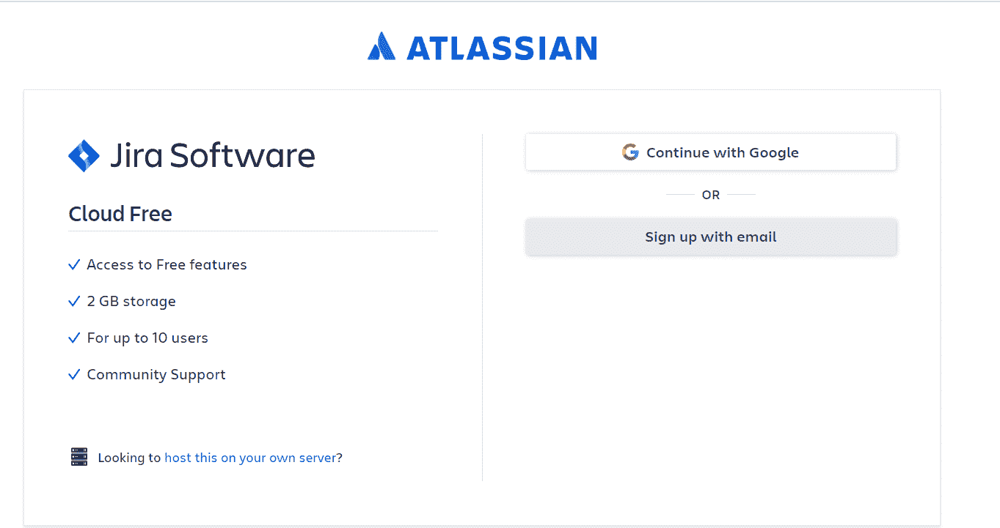
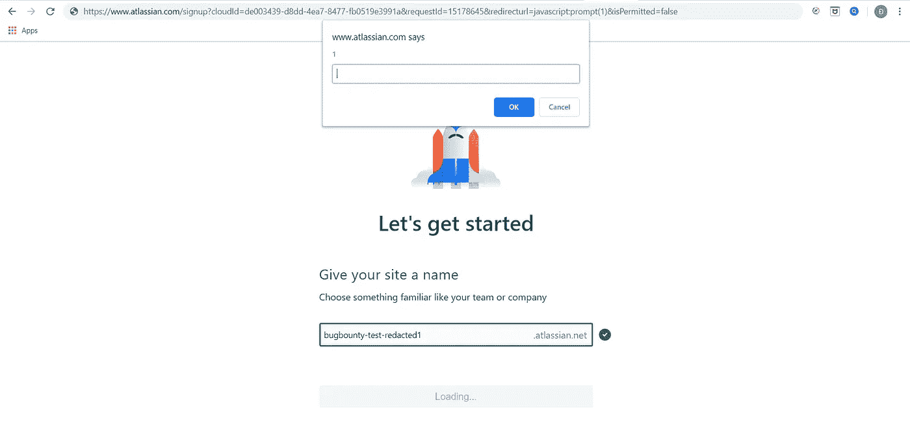
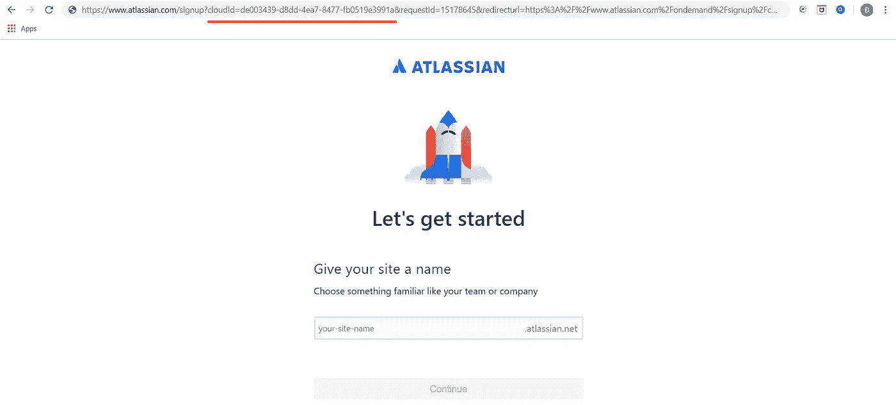
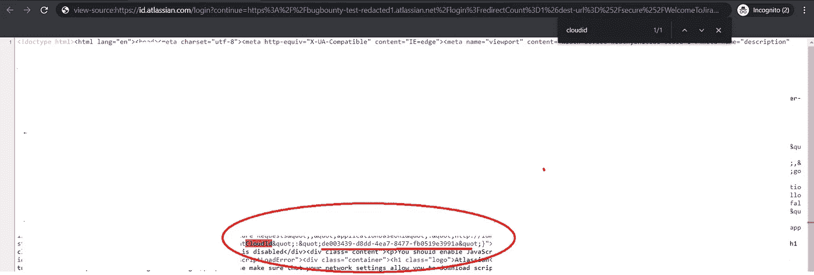
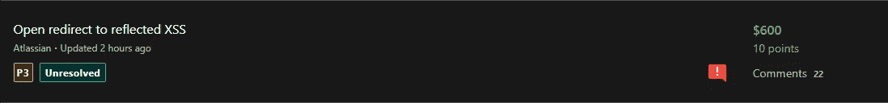

# 我是如何通过开放重定向找到我的第一个 XSS Bug 的

> 原文：<https://infosecwriteups.com/how-i-found-my-first-xss-bug-96fb8e85a24c?source=collection_archive---------0----------------------->

大家好，

我是@影子 _ 克莱。今天我要讲的是我在 [@Bugcrowd](http://twitter.com/Bugcrowd) 发现第一个 XSS bug 的过程。

# 总结:

故事发生在我收到一个节目的私人邀请时(*假设:redacted.com*)。这个项目隶属于 Atlassian，为了测试这个项目，我需要创建一个吉拉云账户。



登录 Google 帐户后，我将被重定向到用户名创建页面。


在我的脑海里，现在我能想到的就是“开放重定向”错误。我开始改域名，加字符绕过开放重定向过滤器，最后成功了。

我立即创建了一个报告，并将其发送到 Atlassian 程序。

然后我去了厕所。那一刻，我突然想到了一个想法。为什么我不试试 XSS？我什么也没想，立即跑到我的房间，打开了我的电脑。在 *" & redirecturl="* 参数中，我用 javascript payload 进行了尝试:*JavaScript:prompt(1)*->设置任意用户名并继续。**轰！XSS 被处决了。**



# 寻找剥削方式的困难时期:

但是等等。“好像是那个*？cloudId="* 参数对应每个账户。这意味着 XSS 将只对我个人执行死刑，因为*？cloudId="* 参数是专门为我创建的。所以如果我拿不到受害者的*”这就是自我 XSS 了？cloudId= "。*



我有点担心。虽然这个 XSS 搜索过程只需要大约 5 分钟，但如果这只是一个自我 XSS，一切都将失败。

**我开始继续剥削剥削。我终于找到了 2 种方法来获得这个参数:**

```
1\. The attacker needs to join the victim's Jira team. To do this, an attacker needs to trick the victim into inviting him to join his team.
```

**那么，攻击者如何不需要加入受害者的吉拉组，仍然能够窃取*“cloudId”*？**

```
2\. An attacker does not need to log in to his account nor join the victim's team. An attacker just needs to visit the victim's domain and view the ***"Source page"***. The parameter ***"cloudId"*** will appear there.
```



# 攻击时间:

现在在偷了*【cloudId】*的受害者之后。完整链接将包括:[https://www.atlassian.com/signup?cloudId =[victim-id]&request id = 15178645&redirecturl = JavaScript:prompt(1)&is permitted = false](https://www.atlassian.com/signup/rename/site?cloudId=de003439-d8dd-4ea7-8477-fb0519e3991a&requestId=15178645&redirecturl=javascript:prompt(document.cookie)&isPermitted=false)

**当受害者访问- >设置用户名并继续- > XSS 将被执行**

# 甜水果😁

同时，我提供了额外的信息来证明这是一个反射 XSS 错误。之后，亚特兰蒂斯团队接受并认为这是一个 P3



# 建议:

始终保持冷静，当你发现错误时，不要止步于此。有时候你发现的 bug 并不是最终结果。所以我的建议是，一定要想办法把你发现的 bug 串起来。你得到的结果会让你大吃一惊:>

谢谢大家的阅读！！！❤

黑客快乐:))

推特:[https://twitter.com/shadow_CLAY](https://twitter.com/shadow_CLAY)