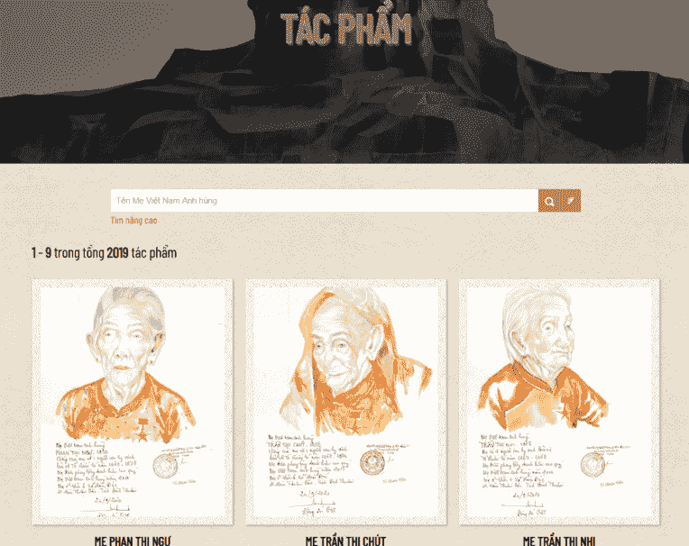
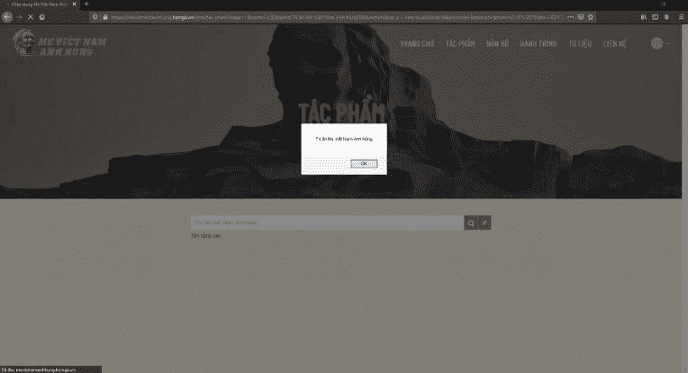
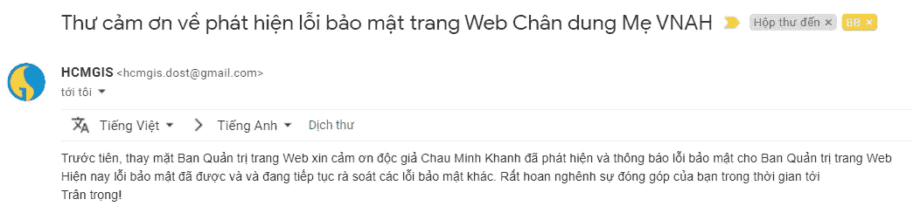
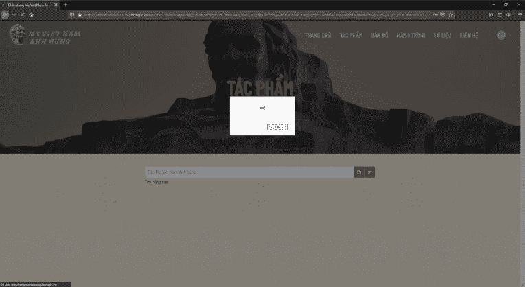
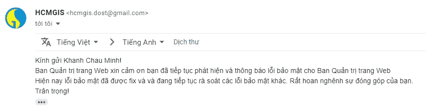
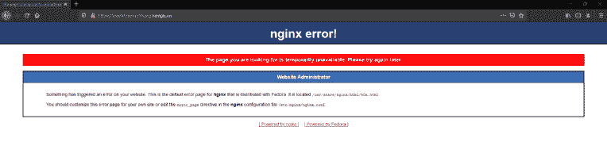

# 我是如何在网络地理信息系统上找到 XSS 的

> 原文：<https://infosecwriteups.com/how-i-found-reflected-xss-on-a-webgis-26030bf8f0a9?source=collection_archive---------1----------------------->

## **注意**:该漏洞已上报并已修复。

大家好，

在这篇文章中，我将分享我是如何在一个使用地理信息系统(WebGIS)的网站上发现一个 XSS 漏洞的。

在浏览脸书的新闻时，我看到了一个粉丝页面上的新帖子，介绍了一个新的 WebGIS，它刚刚在以下网站发布:

`[https://mevietnamanhhung.hcmgis.vn](https://mevietnamanhhung.hcmgis.vn)`


我在脸书上看到的关于 WebGIS 的帖子

带着一点好奇，我决定去看看这个网站。主页看起来是这样的:


主页

我在那里没有收集到太多信息，所以我切换到了**插图**页面:



艺术品页面

在这里，该网站展示了几幅属于越南英雄母亲(VHM)短篇故事的肖像。请注意，在这个页面的顶部，有一个搜索栏，允许按 VHM 的名字进行搜索。

我没有输入任何东西，只是点击了搜索按钮。现在，URL 出现了许多参数值对，如下所示:

```
[https://mevietnamanhhung.hcmgis.vn/cms/tac-pham?page=1&name=&province=&district=&from=01/01/2010&to=30/11/2020&storage=&on=&sort=lastest](https://mevietnamanhhung.hcmgis.vn/cms/tac-pham?page=1&name=&province=&district=&from=01/01/2010&to=30/11/2020&storage=&on=&sort=lastest)
```

查看页面源代码后，我意识到有一段 javascript 代码需要注意，包括函数中的参数值对，它们直接放在 URL 中，然后通过 GET 方法向服务器发送请求:

根据我的经验，这可能反映了 XSS 的脆弱性。由于这段代码已经在一个`<script>`标签中，所以我只需要从 string - > object - >函数中转义就可以插入恶意代码了。

我使用这个有效载荷在搜索栏中输入:

```
a'}}})});alert('Tri ân Mẹ Việt Nam Anh hùng');$(function(){var a = new Vue({b:{c:{d:'e
```

结果是:



反映了 XSS！

我立即向 HCM 地理信息系统(HCMGIS)的网站管理员报告了这个漏洞。3 天后收到胡志明市科技部 HCMGIS 中心技术开发部负责人的感谢邮件，确认 bug 已经修复。



感谢信证实了漏洞已经被修复

一周后，我回到网站，检查我之前报告的 XSS 漏洞是否已被修复。

然而，在更深入地查看 URL 以及上面的源代码之后，除了`**name**`参数之外，XSS 漏洞很可能也发生在`**page**`参数处。

由于管理员已经通过过滤`'`字符修复了 XSS 漏洞，我将通过使用以下有效负载来设置`**page**`参数的值，从而绕过该过滤器:

```
5}}})});alert(String.fromCharCode(88,83,83));$(function(){var a = new Vue({b:{c:{d:5
```

现在网址变成了:

```
[https://mevietnamanhhung.hcmgis.vn/cms/tac-pham?page=5}}})});alert(String.fromCharCode(88,83,83));$(function(){var%20a%20=%20new%20Vue({b:{c:{d:5name=&province=&district=&from=01/01/2010&to=30/11/2020&storage=&on=&sort=lastest](https://mevietnamanhhung.hcmgis.vn/cms/tac-pham?page=5%7D%7D%7D)%7D);alert(String.fromCharCode(88,83,83));%24(function()%7Bvar%20a%20=%20new%20Vue(%7Bb:%7Bc:%7Bd:5name=&province=&district=&from=01/01/2010&to=30/11/2020&storage=&on=&sort=lastest)
```

结果是:



反映了 XSS！

是时候向 HCMGIS 报告此事了。两周后，我收到了第二封感谢信，确认 bug 已经修复。



感谢信证实了漏洞已经被修复

# 共享时间

在向 HCMGIS 报告了第二个 XSS 漏洞大约一个半月后，我开始写这篇文章。但是，当时网站已经无法访问，只显示了如下所示的错误:



访问[https://mevietnamanhung . HCM GIS . VN](https://mevietnamanhhung.hcmgis.vn)网站时出现错误信息

为了让写上去更直观，我用了 Wayback 机器找到了这个网站的快照。幸运的是，在以下地址保存了一个快照:

```
[https://web.archive.org/web/20201031194708/https://mevietnamanhhung.hcmgis.vn/cms/tac-pham](https://web.archive.org/web/20201031194708/https://mevietnamanhhung.hcmgis.vn/cms/tac-pham)
```

# 2020 年 12 月 28 日更新:

越南英雄母亲网站现已开通，新地址:`[https://chandungme.vn](https://chandungme.vn)`

# 时间表

*   **2020 年 1 月 11 日:**首次向 HCMGIS 中心报告。
*   **2020 年 3 月 11 日:**网络管理员确认该漏洞已被修复。
*   **2020 年 10 月 11 日:**第二次向 HCMGIS 中心报告。
*   **2020 年 11 月 23 日:**网络管理员确认漏洞已被修复。

感谢您花时间阅读这篇文章！喜欢就给我**鼓掌**！👏

干杯！