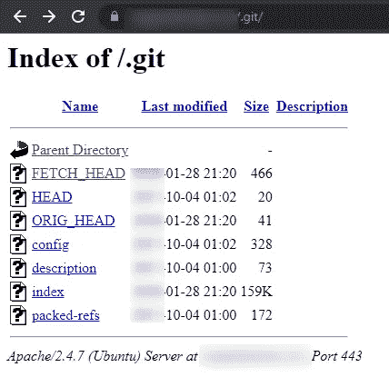
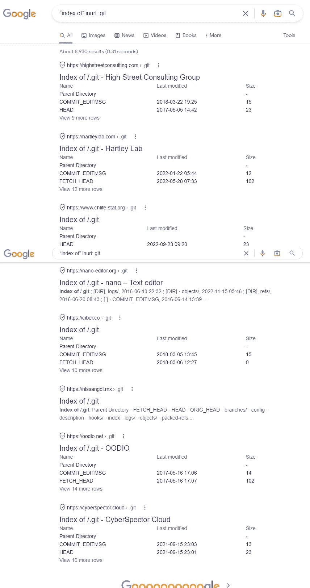
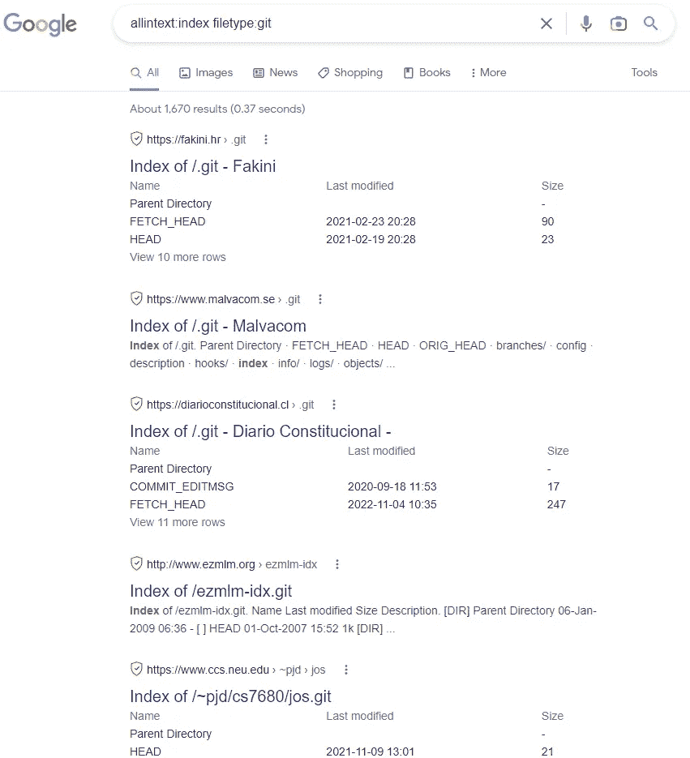
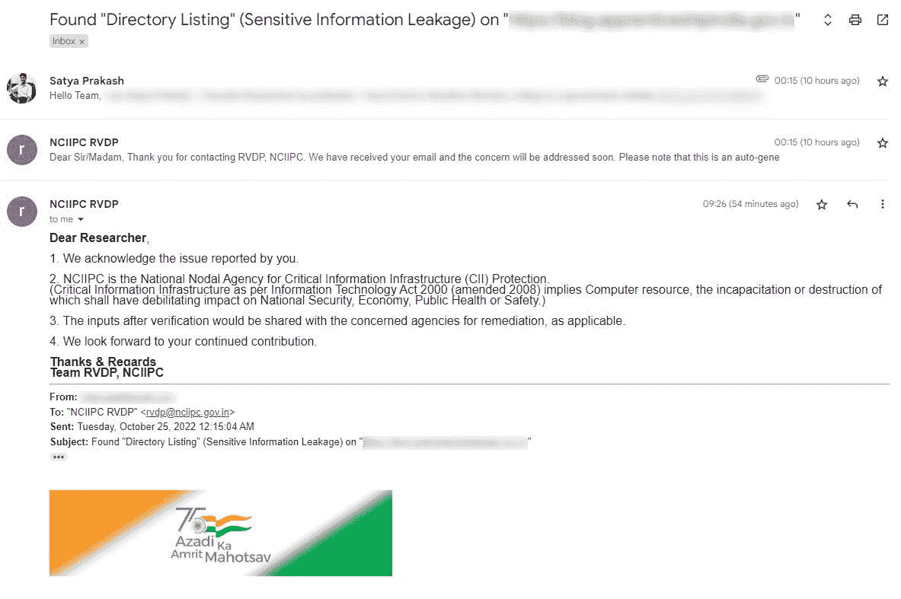

# 我是如何通过 Exposed 发现 30 多个网站源代码泄露的？git 文件夹使用谷歌呆子

> 原文：<https://infosecwriteups.com/how-i-found-source-code-disclosure-via-exposed-git-folder-using-google-dorks-b6c02af6009a?source=collection_archive---------0----------------------->

我已经通过 Exposed 找到了 30 多个源代码公开的网站。git 文件夹只需使用谷歌呆子如下所示

。git 文件夹

[**图片来源**](https://carbon.now.sh/jCsJPOrNsynPRRiZS4Fk)

> **谷歌呆子:**
> 
> inurl 的索引:。饭桶

**谷歌呆子**

[**图像来源**](https://carbon.now.sh/15WvsqDwFmvHnJQ7exrL)

> **谷歌呆子:**
> 
> allintext:索引文件类型:git

**谷歌呆子**

我发现了一个暴露的。git 在某个印度政府网站上发布了一些敏感的源代码，并将其报告给 [NCIIPC India](https://nciipc.gov.in/) (国家关键信息基础设施保护中心(NCIIPC)是印度政府根据 2000 年《信息技术法》(2008 年修订)第 70A 条成立的一个组织，通过 2014 年 1 月 16 日在印度新德里发布的公告，它被指定为关键信息基础设施保护方面的国家节点机构。)并收到他们的确认，如下所示。

影响:任何恶意用户都可以下载暴露的。使用 git dumper 工具将数据发送到他们的本地系统，并检索他们的 git 文件夹中最近发生的所有提交。

请参考以下文章，了解如何实现此过程以及攻击者如何使用此方法获取机密数据的更多详细信息。

**资源:**
1)[https://Jacob Riggs . io/blog/posts/source-code-disclosure-via-exposed-git-29 . html](https://jacobriggs.io/blog/posts/source-code-disclosure-via-exposed-git-29.html)
2)[https://iosentrix . com/blog/git-source-code-disclosure-vulnerability/](https://iosentrix.com/blog/git-source-code-disclosure-vulnerability/)
3)[https://captain noob . medium . com/source-code-disclosure-via-exposed-git-folder-d222](https://captainnoob.medium.com/source-code-disclosure-via-exposed-git-folder-d22919c590a2)

感谢你们阅读这篇文章——祝狩猎愉快🐞

如果你喜欢这篇文章，别忘了给我鼓掌👏

资源:谷歌

**支持我:**如果你喜欢支持我，请我喝杯 [**咖啡**](https://www.buymeacoffee.com/satyakayala) ☕

**关注我:** [萨提亚·普拉卡什](https://medium.com/u/8f987881b66a?source=post_page-----b6c02af6009a--------------------------------) | [领英](https://www.linkedin.com/in/0xkayala/) | [推特](https://twitter.com/0xKayala)