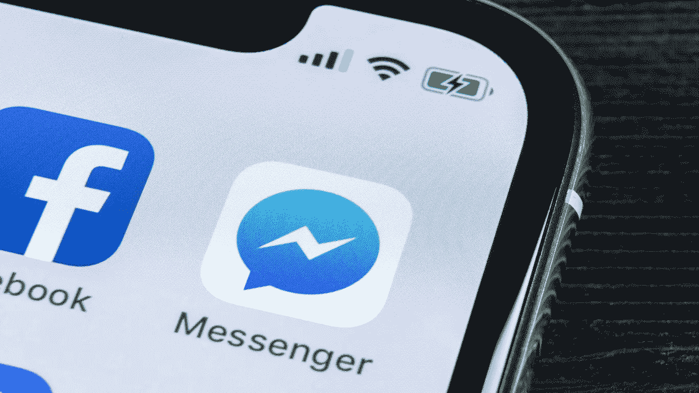
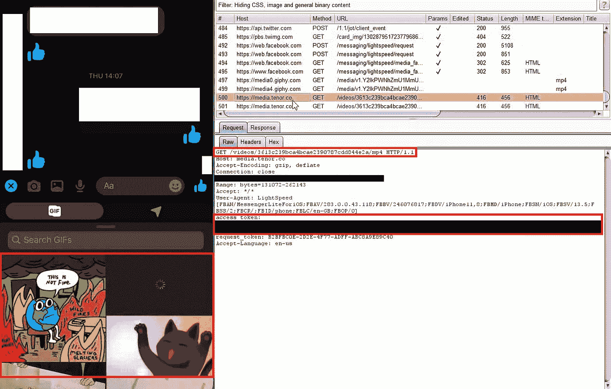
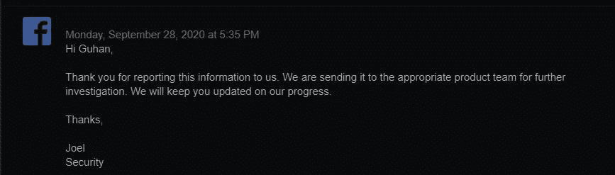
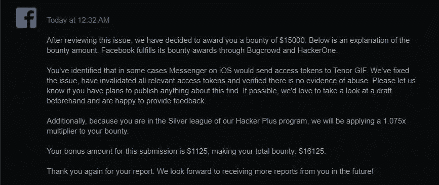

# 我是如何发现 Facebook Messenger 泄露百万用户的访问令牌的

> 原文：<https://infosecwriteups.com/how-i-found-the-facebook-messenger-leaking-access-token-of-million-users-8ee4b3f1e5e3?source=collection_archive---------0----------------------->

大家好，

这篇博客是关于我如何发现 **Facebook Messenger iOS 应用**向**第三方网站(GIF 搜索引擎)**泄露百万用户的访问令牌

我通过 Burp 拦截 API 请求来测试一个 iOS 应用程序。经过几个小时的测试，我一无所获。我只是关闭了 iPhone 中的应用程序，并在通知中滑动。

在那里，我看到我的一个大学同学用 Messenger 给我发了一条短信。点击之后，我进入了 Messenger 应用程序，我搜索了一张 GIF**T5 来回复她的信息。此刻我记起我正在使用打嗝代理**并且我已经查看了打嗝的历史。发送了许多**期限 GIF** 请求。我只是在查看所有的请求和响应。在注意到**“access _ token”**在所有 **Tenor GIF 请求**中泄漏后，我就像****

**什么是访问令牌？**
访问令牌是某种临时令牌或密钥，用于代表用户执行某些操作

我们能做些什么呢？
使用令牌我们可以不用密码就能访问用户的账户

我立即向脸书报告了这个问题。他们花了一天时间调查，第二天就发给了产品团队。不到 5 个小时，他们推出了一个带有临时补丁的更新

**概念验证视频:**

**时间表:**
2020 年 9 月 26 日:报告发送
2020 年 9 月 28 日:脸书进一步调查
2020 年 9 月 28 日:临时修复
2020 年 10 月 6 日:修复
2020 年 11 月 10 日:奖励 15k 美元

**结论:**
脸书已经确认没有滥用的证据，并且已经使所有相关的访问令牌失效

感谢 Priya Sarvesan(我的大学同学，他给我发了短信:p)和脸书安全团队。