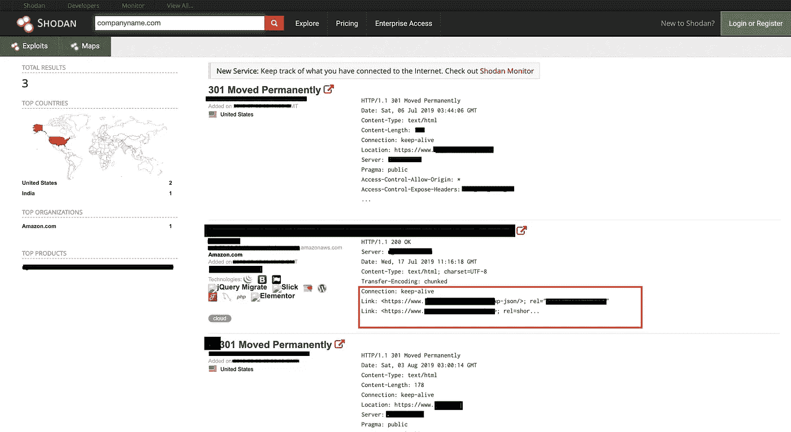
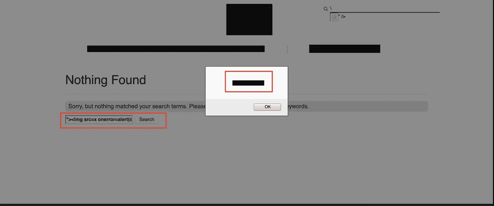

# 我是如何在庄丹找到 XSS 的

> 原文：<https://infosecwriteups.com/how-i-found-xss-by-searching-in-shodan-6943b799e648?source=collection_archive---------0----------------------->

> 这只是另一个 XSS 的博客。

不管怎样，我正在尝试一个私人项目，我从信息收集开始，同时在后台开始 dirbuster。我从谷歌和 shodan 开始。当下我搜索了*在搜索。shodan 查询中出现了一个带有响应的结果。我打开链接，它有一个未开发的带有搜索栏的 WordPress 页面。我输入 XSS 有效载荷，它弹出来了。然后，我将请求方法从 POST 改为 GET，效果非常好。我们将假设网站是 https://companyname.com 的 T4。*

# ***描述:***

*代码注入攻击要求攻击者在应用程序的数据字段中输入恶意代码(通常是 JavaScript 或 HTML ),该数据字段将显示给应用程序的另一个用户。当受害者用户查看该数据字段时，javaScript 将在受害者的浏览器中执行，并可能执行恶意操作。一种常见的攻击是 javaScript 或 HTML 代码将受害者的 cookies 发送给攻击者。*

# ***影响:***

*攻击者在易受攻击的参数/用户搜索字段中注入恶意的 javascript 代码或 Html 代码。这里是一个**反映 XSS** ，这是由 shodan 查询发现的。这可能被用来窃取会话令牌和 cookie，因为它是运行在同一服务器上的父网站的一部分。*

# *复制步骤:*

*在石家庄搜索***companyname.com***。*

**

*Shodan 查询结果*

1.  *访问网址:
    [*https://www.companyname.com/eiy/redacted?s=test*](http://companyname.com)*
2.  *在搜索栏输入有效载荷***">****
3.  *XSS 警报出现了。*
4.  *概念证明:[https://www.companyname.com/eiy/redacted?s = % 22% 3E % 3c img+src % 3Dx+on error % 3d alert % 28 document . domain % 29% 3E](http://comapanyname.com)*

**

*反映了 XSS*

# ***补救:***

*为了防止跨站点脚本之类的数据验证攻击，我推荐一种包括输入验证和输出净化的深度防御策略。*

*阻止任何数据验证攻击的第一步是验证输入，以防止接受任何可能在应用程序或数据的最终目的地(在本例中为浏览器)中有特殊含义的字符。处理输入验证的推荐方式是默认拒绝，只接受具有期望值的输入(即白名单)。输入验证例程应该总是检查数据的长度、范围、类型和格式(可能使用正则表达式)。*

*清除应用程序提供的 HTML 中的恶意字符是防止 XSS 的一个同样重要的措施。例如，字符< would be encoded as < and, although appearing to the user as the less-than character, would not be interpreted by the client browser as the start of an HTML tag.*

*The best way to prevent XSS is to enforce output encoding, precisely Hex or URL encoding on user-controlled parameters which prevent the code to execute in the HTML page.*

# ***引用:***

*[https://www . owasp . org/index . PHP/XSS _(Cross _ Site _ Scripting)_ Prevention _ Cheat _ Sheet](https://www.owasp.org/index.php/XSS_(Cross_Site_Scripting)_Prevention_Cheat_Sheet)
http://[www.softwaremag.com/L.cfm?Doc=1006-12/2006](http://www.softwaremag.com/L.cfm?Doc=1006-12/2006)
[https://www . acune tix . com/website security/Cross-Site-Scripting/](https://www.acunetix.com/websitesecurity/cross-site-scripting/)*

**

**关注* [*Infosec 报道*](https://medium.com/bugbountywriteup) *获取更多此类精彩报道。**

* [## 信息安全报道

### 收集了世界上最好的黑客的文章，主题从 bug 奖金和 CTF 到 vulnhub…

medium.com](https://medium.com/bugbountywriteup)*