# 我是如何获得数千家 Shopify 商店的收入和流量数据的

> 原文：<https://infosecwriteups.com/how-i-gained-access-to-revenue-and-traffic-data-of-thousands-of-shopify-stores-b6fe360cc369?source=collection_archive---------0----------------------->

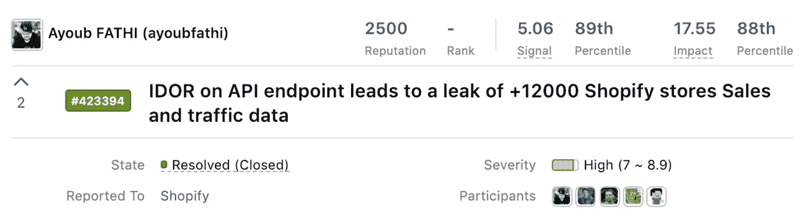

# 索引

1.  **简介**
2.  **几乎不堪一击**
3.  **获取 da 词表**
4.  **失败**
5.  **新方法**
6.  **漏洞利用**
7.  **时间线**
8.  **外卖**

*在此公开披露之前，Shopify 已给予撰写博客文章的许可*

# 1.介绍

答大约一年前，当我入侵 Shopify 程序时，我必须设置几个警报，以便每当一个新的 API 端点出现在子域和 URL 列表中时得到通知(这是我为跟踪新 API 而编写的自定义脚本)。

几个月后，我收到了一个关于我以前从未见过的新端点的通知，内容类似于:

> >/shops/REDACTED/traffic _ data . JSON
> >/shops/REDACTED/revenue _ data . JSON

老实说，我没有费心去检查这些端点，只是因为我已经收到了大量针对各种目标的新警报。另一个原因是，我没有积极地搜索任何程序，只是在周末花几个小时，并且主要依靠侦察自动化在每次我得到有趣的警报时快速获胜。

*回到故事…* 几个月后，我收到了另一个与相同端点相关的警报:

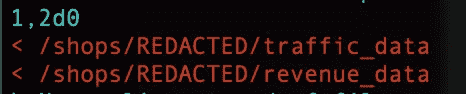

这意味着最后一个端点已经从子域名源中移除，这对于我来说确实是一个危险信号，我需要深入了解到底发生了什么，并调查它被移除的原因。

# 2.几乎不堪一击

经查，**删改的**基本上是一家 Shopify 店铺的名字(**删改的** .myshopify.com 是店铺的链接)。在[https://exchangemarketplace.com/shops/](https://exchangemarketplace.com/shops/)(别名[https://exchange.shopify.com](https://exchange.shopify.com))积极上市销售。

所以第一件事是检查下面的端点(为了简单[和有趣]，我稍后称之为 ***几乎易受攻击的*** 端点)

```
*(sample data)*$ curl -s [https://exchange.shopify.com/shops/**$storeName**/revenue_data.json](https://exchange.shopify.com/shops/$storeName/revenue_data.json){"2018–03–01":102.81,"2018–04–01":13246.83,"2018–05–01":29865.84,"2018–06–01":45482.13,"2018–07–01":39927.62,"2018–08–01":25864.51,"2018–09–01":14072.72,"2018–10–01":2072.16,"2018–11–01":13544.78,"2018–12–01":26824.54,"2019–01–01":31570.89,"2019–02–01":18336.71}
```

显然是泄露了**修改过的**店的收入数据。API 端点应该在内部使用，以获取销售数据并以公共图形的形式呈现。在这种情况下，公开商店的数据在 exchange marketplace 上销售，并在图表中公开显示相同的数据是意料之中的行为:

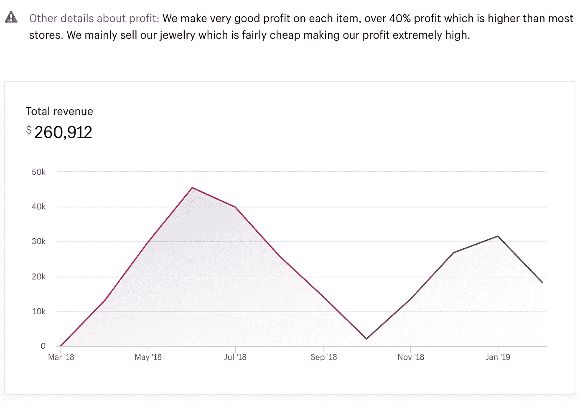

我发现同一个 API 又泄漏了另一家商店的收入数据。该商店不久前被出售，并从市场上删除，但由于某种原因，数据仍被返回。

此时，我几乎可以肯定端点容易受到不安全的直接对象引用(IDOR)安全漏洞的攻击，该漏洞在$storeName 上迭代。

接下来，我建立了一个新商店，并在同一个易受攻击的 API 端点上使用$storeName 来检查我们是否会获得我们新商店的销售数据，以最终验证漏洞的合法性并将其报告给 Shopify

```
$ curl -I [https://exchangemarketplace.com/shops/$newStore/revenue_data.json](https://exchangemarketplace.com/shops/$newStore/revenue_data.json)**HTTP/2 404**
server: nginx/1.15.9
date: Fri, 29 Mar 2019 20:28:18 GMT
content-type: application/json
vary: Accept-Encoding
vary: Accept-Encoding
x-request-id: 106906213c97052838ccaaaa54d8e438
```

404?


> 好的。这不会像预期的那么容易！

在这一点上，很明显我们还没有概念的工作证明，所以没有什么可以向 Shopify 报告的。；我必须仔细考虑所有可能的情况，以便弄清楚情况并彻底调查这种行为。

我想到的第一个想法是最终对所有现有的商店进行大规模检查，看看我们是否能从任何商店中获得任何客户数据。第一次挑战？我们需要获得商店名称的单词列表；

**攻击过程如下:**

*   建立商店名称的单词列表(来自 storename . myshopify . com)；
*   迭代单词表对抗 ***几乎不堪一击*** 端点:

```
/shops/$storeName/revenue_data.json
```

*   过滤掉易受攻击的域；
*   分析受影响的商店，找出观察到的行为或最终漏洞的根本原因。

# 3.获取 da 单词表

我们拥有的第一种方法是检查反向 IP，以找到与该 IP 相关联的' **A** '类型的所有 DNS 记录；

该商店位于$storeName.myshopify.com 上，快速 DNS 查询会产生以下结果:

```
; <<>> DiG 9.10.6 <<>> **REDACTED**.myshopify.com<...>**REDACTED**.myshopify.com. 3352 IN CNAME **shops.myshopify.com**.shops.myshopify.com. 1091 IN A 23.227.38.64
```

所以**编选的** .myshopify.com 有一个**指向 shops.myshopify.com 的**CNAME，它本身又指向***23.227.38.64***。幸运是，它背后没有反向代理 WAF，所以我们可以使用该 IP 来获取托管在同一 IP 空间上的域的有效' **A** ' DNS 记录。

为此，我使用了我的一个脚本(在[https://gist . github . com/ayoubfathi/57 C3 fef 7d 4 eada 575 A8 b 080 cc 3c 4a 562](https://gist.github.com/ayoubfathi/57c3fef7d4eada575a8b080cc3c4a562)找到它)

我们将对 shops.myshopify.com 运行它，看看我们可以获得多少记录，运行它会产生以下输出:

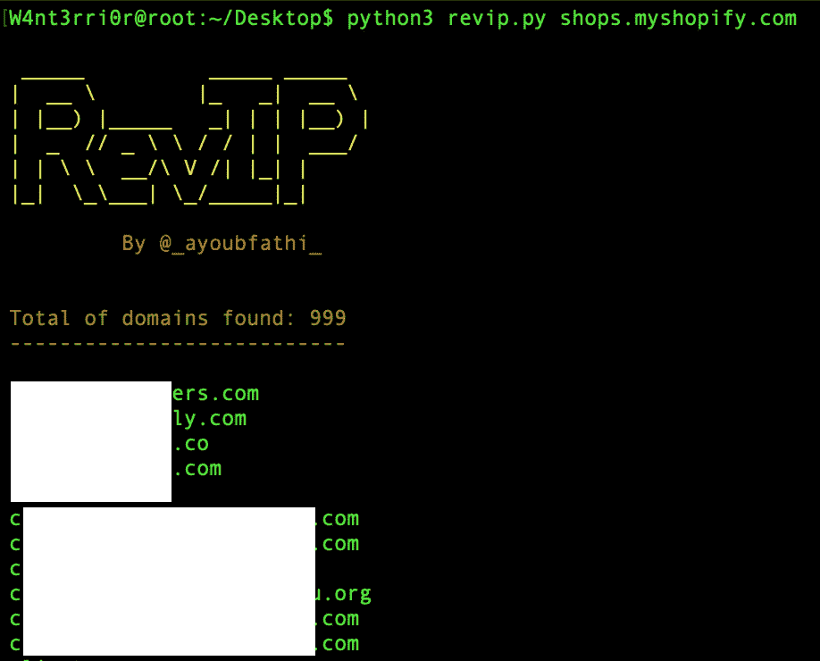

因此，我们能够使用反向 IP 获得近 1000 家商店的网址。

现在，我们需要获得与每个域相关的商店链接(即 gadgetstore.com→storename . myshopify . com ),去掉＄storename 并构建一个商店名称的单词列表，将其输入到我们的测试请求中

.

# 4.失败

因此，我构建了一个脚本来执行上述攻击流，并利用我们(我称之为) ***几乎易受攻击的*** 端点；它的基本功能如下:

1.  使用上一个脚本(revIP.py)的输出，并将其提供给当前脚本。
2.  删除每个域的 HTML 源代码，专门寻找. myshopify.com 链接。
3.  从废弃的链接中提取商店名称。
4.  自动应用 ***中的商店名称几乎易受攻击*** 请求为:

```
/shops/$storeName/revenue_data.json
```

5.过滤出易受攻击的域并将其输出到标准输出

我们已经准备好运行脚本，运行它将产生以下结果！

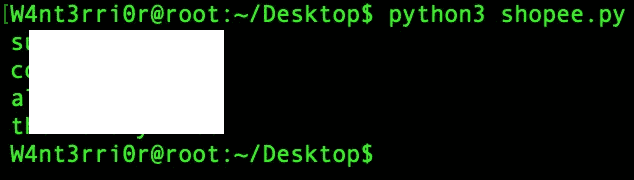

只有四个结果？


所以在 1000 家商店中，我只能确定四家易受攻击的商店，其中三家在 exchange marketplace 上上市，所以他们应该公开他们的销售数据，一家商店被停用(*幸运，是吧？*)

因此，我还没有看到这被认为是一个安全漏洞的任何安全影响。因此，我停止了几个星期的测试(忙碌的生活？)并决定以后再回来探索进一步的可能性，继续挖掘。


几个星期后，我又回到了前面提到的那个 API 请求，并开始研究它。我无法从中获得任何有用的信息，所以我决定采用不同的方法来解决这个问题。

为了获得更多的数据进行分析，我们将从对 1000 家商店进行测试转向更大的样本(根据结果，可能是数千家、数百万家)。我们怎样才能成功呢？下一节将介绍新方法的细节。

# 5.新方法

找到所有现有 Shopify 商店而不遗漏任何商店的最佳方法是什么🤔

我首先想到的是扫描互联网，但是当我们有其他人的数据时，我们为什么要这样做呢？

在这个特别的研究中，我将使用 FDNS。使用这种方法，我们不需要从给定的域列表中生成商店名称。相反，我们将使用 FDNS 来获得 shops.myshopify.com 的反向 CNAME 记录(所有商店都指向它)

我使用了一个非常规范的实例，并克隆了这项研究所需的数据

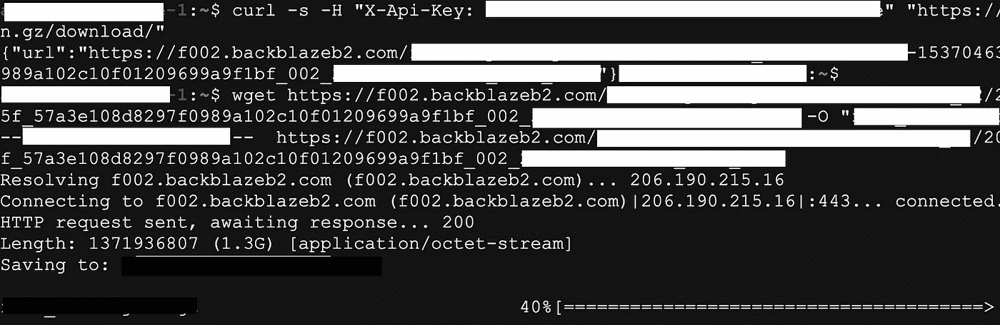

现在，我们将寻找与 Shopify 商家托管其商店的 shops.myshopify.com 相匹配的 CNAME 记录。

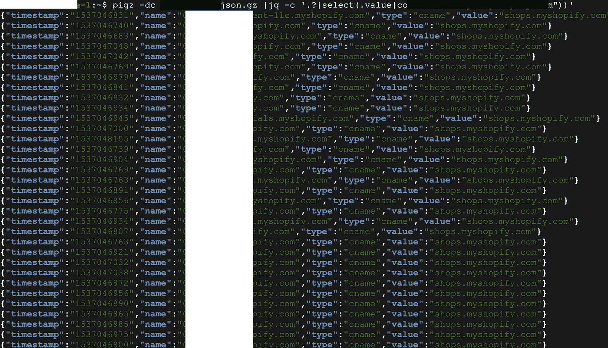

在检查有多少商店可用时，我发现:

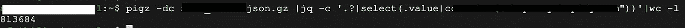

耶！最后，我们有相当多的商店进行测试，而不是 1000 家商店的有限样本。

接下来，让我们根据新的结果构建我们的商店名称新单词列表。它应该产生 813684 个条目。

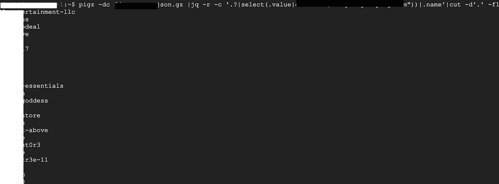

至此，我们已经完成了单词列表，可以继续进行利用部分了。

# 6.利用

那是一个很晚的晚上，我编辑了前面提到的 exploit.py 脚本，以使用由 813K 个商店名称组成的新单词列表。

然后 SSH 到我的盒子，因为单词表很大，我不会考虑等待结果，所以我必须在后台运行脚本，去睡一会儿。

试着睡了大约一个小时…


我放弃了睡觉的想法，立即打开我的机器，登录到我的远程机器，我看到的是成千上万的 403 错误

我很快向同一个子域提出了一个请求，要求再次检查这是否是由于达到了速率限制，或者他们是否将该页面更改为禁止页面，以及…

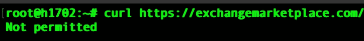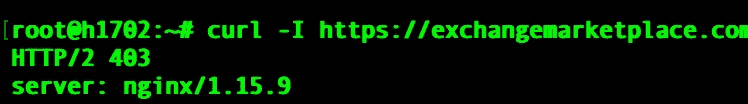

不允许？是的，我称之为“你得到了

*让它见鬼去吧，这是漫长的一天，我今天需要好好睡一觉…*

*后来，我回来寻找绕过 WAF 的方法，我意识到 bash 脚本几乎每秒发出一个请求，对我来说这是一个不错的测试速度，所以我很快编写了另一个脚本来检查我们这次是否会通过(希望他们不会实现一个[平均阈值](https://community.akamai.com/customers/s/question/0D50f00005RtrAoCAJ/rate-control-in-security-monitor-need-to-understand-the-math?language=en_SG)收紧到这个数字)*

**

*它基本上将 80 万个商店名称作为输入(stores-exchange.txt)，发送一个 curl 请求来检索销售数据，然后在将数据打印到 stdout 之前，使用 DAP 库将商店名称插入到同一个 JSON 响应条目中。*

*这一次我们的脚本将会非常慢，正如你所知道的 bash 是单线程的，这是我们能够绕过速率限制策略的唯一方法，我运行了脚本并从我的实例中注销…*

*几天后，我重新登录到我的实例来检查结果。*

*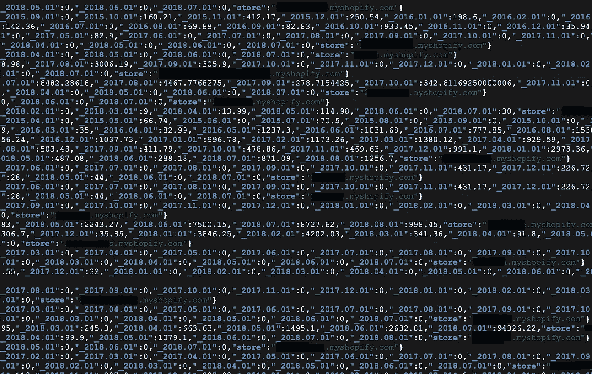***

*我们正在获取 Shopify 商家的销售数据，其中包括从 2015 年到今天的数千家商店的每月美元收入明细**。***

*我们有一个易受攻击商店的列表，因此如果我们查询其中任何一家，我们将获得当前商店在其**生命周期**内的**美元**月收入数据的明细:*

*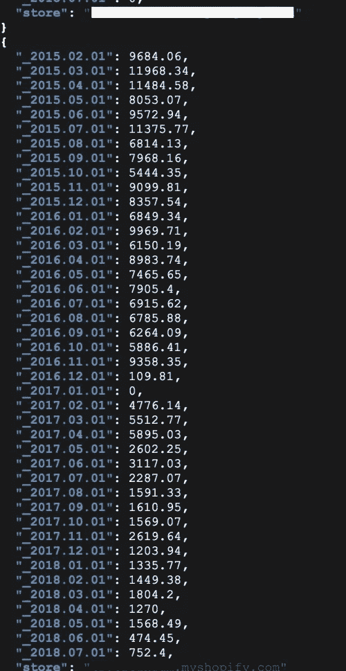*

*这是一个 Shopify 商家**从 2015 年至今**的销售数据示例。*

**

## *影响*

*根据 CVSS 3.0，这一特定发现的得分为 **7.5 —高**，这反映了漏洞的重要性，客户流量和收入数据被暴露，无需特权或用户交互即可访问信息。*

*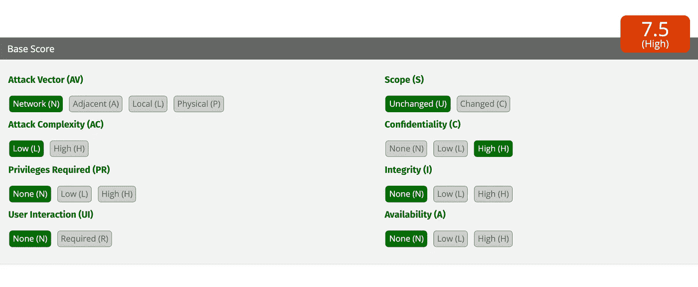*

*我们在 800，000 家商户商店中进行了测试，其中+12，100 家被曝光，+8700 家是易受攻击的商店，我们能够获得他们的销售和流量数据，他们不应公开，3400 家预计将公开他们的销售数据，总结如下:*

*   *这是在+800，000 家商店中测试的*
*   *+12，100 人被暴露*
*   *+8700 家商店易受攻击，其数据被设置为私有。*
*   *只有+3400 家商店的数据应该是公开的。*

**

## *根本原因分析*

*综合以上数据和多几天的研究，我得出的结论是，这是由这个漏洞前几个月才推出的 [Shopify Exchange App](http://apps.shopify.com/exchange) (现在商家在积极使用)造成的。任何安装了 Exchange 应用程序的商家都容易受到攻击。*

*之后，我迅速将所有的信息和数据整理成一份报告，提交给 Shopifybug bounty 项目。*

# *7.时间表*

*   *2018 年 10 月 13 日:首次向 Shopify 披露*
*   *2018 年 10 月 16 日:审判*
*   *2018 年 10 月 16 日:已修复(分流后 1 小时)*
*   *2018 年 10 月 17 日:需要更多信息*
*   *2018 年 11 月 1 日:报告没有资格获得奖金(违反政策)*

*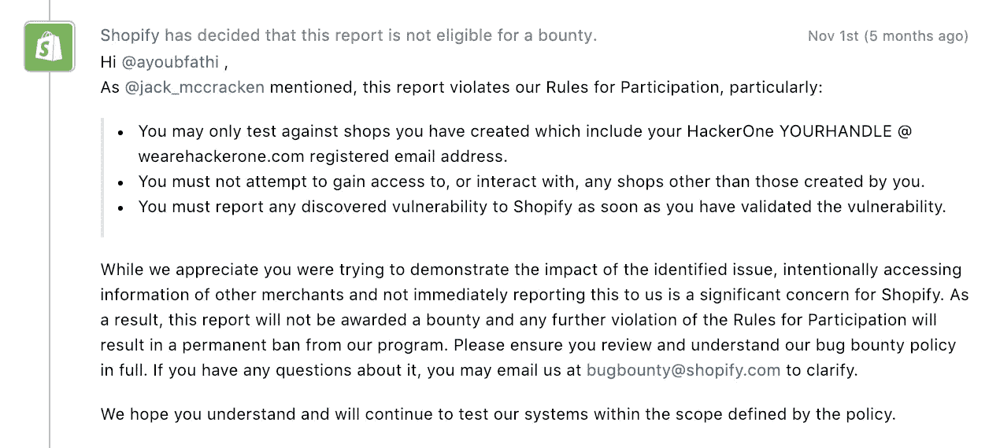***

## *购物决策之我见*

*尽管我不同意针对我的第三次违反，但我还不能适当地确认上述漏洞的存在和合法性。此外，我不能持续地研究这种行为，所以我每周只有几个小时。*

*然而，关于第二次违反，我同意他们的意见，尽管有几点:*

*   *我测试的目的是为了展示影响，避免在没有任何概念工作证据的情况下发送理论报告。*
*   *我相信，如果我没有按照我的方式进行，我没有其他方法来证明这个特定安全漏洞的存在。*

*坦白地说，甚至这份报告的结果也不尽如人意，但最终都是我的错。他们在政策页面上提到**“禁止与非您创建的店铺互动”**。*

*因此，我无意中违反了上述政策，尽管我的意图是好的。因此，我完全承担后果，尊重他们的决定。*

# *8.外卖食品*

## *请务必仔细阅读政策，一旦发现问题，立即联系相关团队，即使您不确定这是一个漏洞。*

> *最后，不管结果如何，我很高兴至少这份报告让 Shopify 免遭潜在的破坏。最后，除了随之而来的金钱补偿之外，这也是驱使我工作并让我满足的任务之一。为每个人提供更安全的互联网！*

*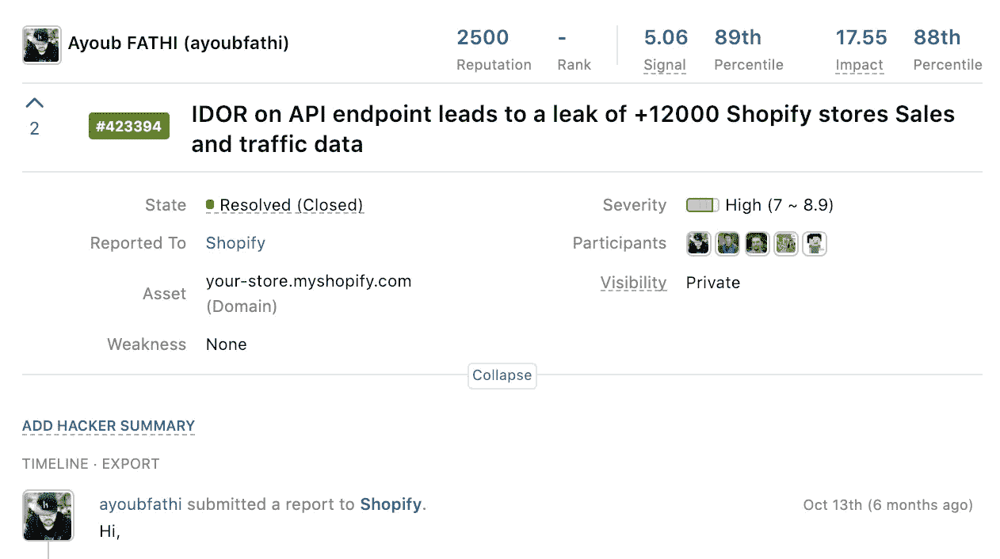*

*M 感谢 Shopify 团队，特别是 [Peter Yaworski](https://twitter.com/yaworsk) 的大力帮助。我仍然强烈建议入侵他们的程序，因为他们可以快速处理收到的报告。*

*大声喊出来 [Yassine Aboukir](https://twitter.com/Yassineaboukir) 校对这篇文章。谢谢大家阅读它。欢迎在 Twitter 上关注我: [@_ayoubfathi_](https://twitter.com/_ayoubfathi_) 或 Linkedin: [阿尤布·法蒂](https://www.linkedin.com/in/ayoubfathi/)*

**在此公开披露之前，Shopify 已给予撰写博客文章的许可**