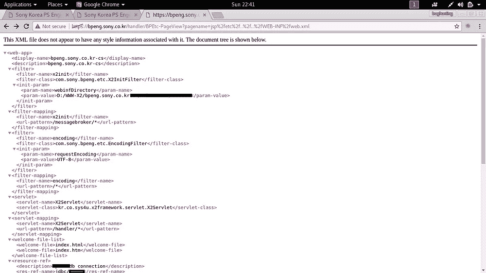
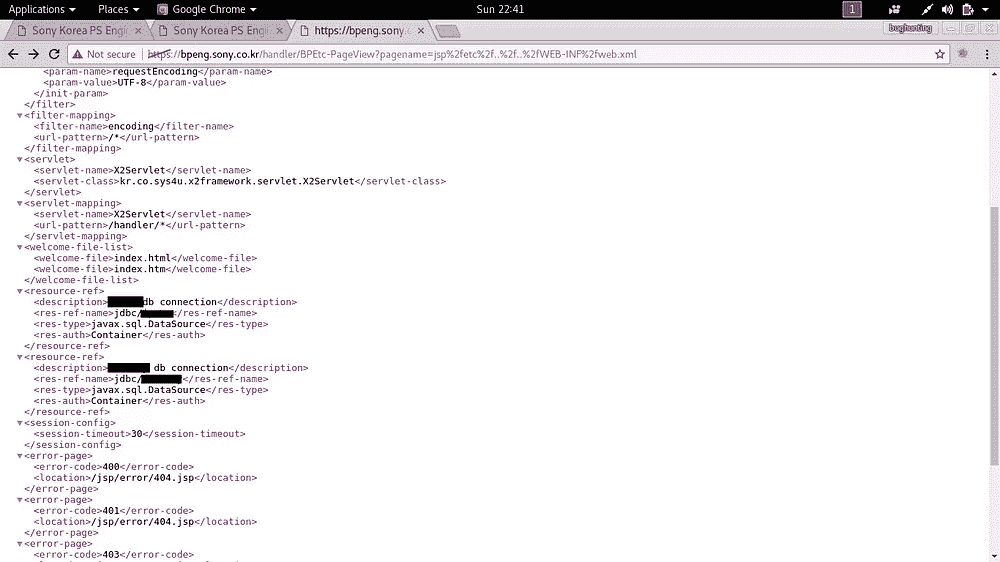

# 我是如何进入索尼的数据库的

> 原文：<https://infosecwriteups.com/how-i-gained-access-to-sonys-database-f3ba08d0e035?source=collection_archive---------0----------------------->

这是我在 2017 年发现的一个 bug。这开始于我的一个朋友(又名 1337)给我看了一件他从索尼买的 t 恤。所以我想为什么我不能得到一个，所以我开始在目标上做侦查索尼有广泛的领域和子域。我花了两天时间在索尼的主域上寻找一个 bug，但是一无所获

所以接下来的事情[收购](https://www.crunchbase.com/search/acquisitions)同样的结果。所以我想我应该做些别的事情，所以开始呆呆的

***地点:* .索尼. ****

我登陆**sony.co.kr**并找到一个子域[**bpeng.sony.co.kr**](https://bpeng.sony.co.kr/handler/BPEtc-PageView?pagename=jsp%2fetc%2f..%2f..%2fWEB-INF%2fweb.xml)由于理解韩语有困难，我不知道页面上的任何选项。

然后有趣的事情发生了[https://bpeng.sony.co.kr/handler/BPEtc-PageView?pagename=](https://bpeng.sony.co.kr/handler/BPEtc-PageView?pagename=jsp%2fetc%2f..%2f..%2fWEB-INF%2fweb.xml)一些页面等等等等

因此，我将 pagename 的值改为其他值，boom 将其重定向到该页面，所以让我们尝试使用 etc/passwd，但什么也没发生..

但是为什么呢..？

因为服务器是微软 IIS 你哑了

因此，根据我的经验，我从来没有机会利用 IIS 服务器，所以让我们搜索资源，发现该网站使用 jsp，并有一个称为 WEB-INF 的东西，其中包含配置

PayLoadAllThings 给了我完美的有效载荷

jsp/etc/../../WEB-INF/web.xml

[**https://bpeng.sony.co.kr/handler/BPEtc-PageView?pagename=**](https://bpeng.sony.co.kr/handler/BPEtc-PageView?pagename=jsp%2fetc%2f..%2f..%2fWEB-INF%2fweb.xml)**JSP/etc/../../WEB-INF/web.xml**

我得到了这个作为回应

数据库配置文件

我把这件事报告给了索尼，并把我的名字列在了他们的主页上，他们给了我一件 t 恤。

保持创新和快乐的黑客生涯