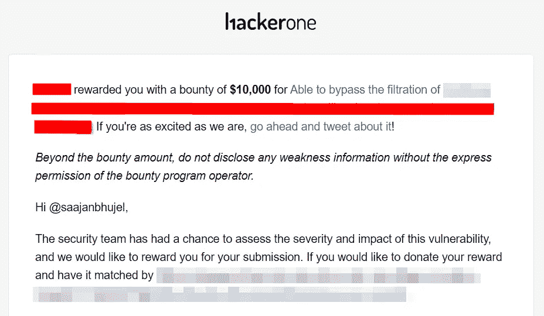
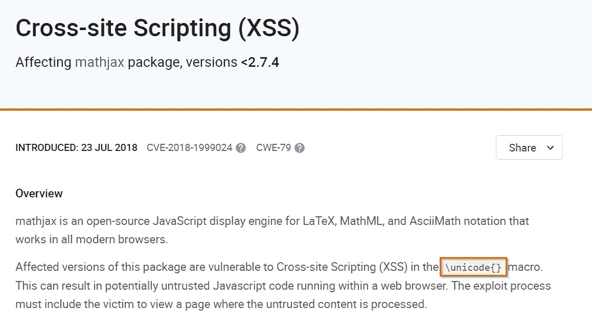
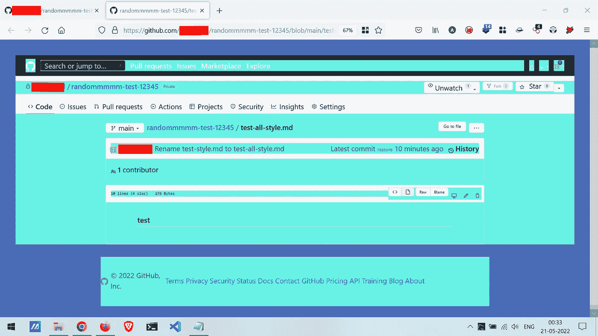
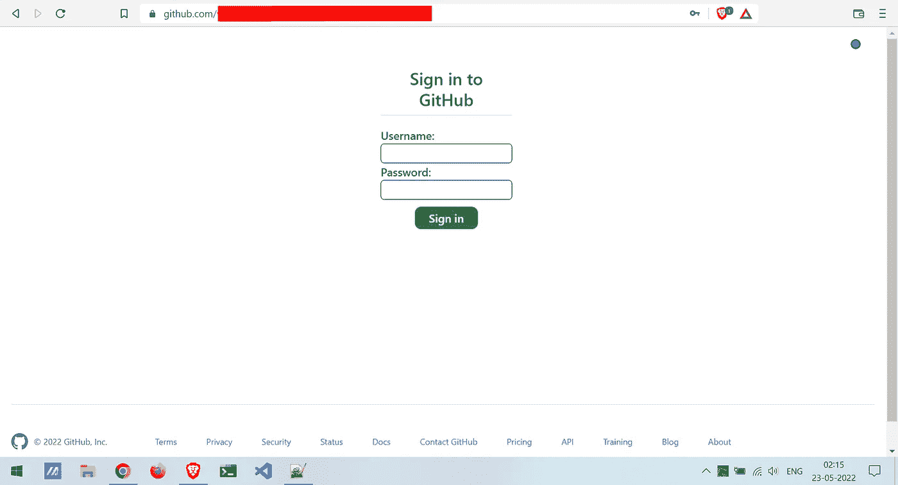
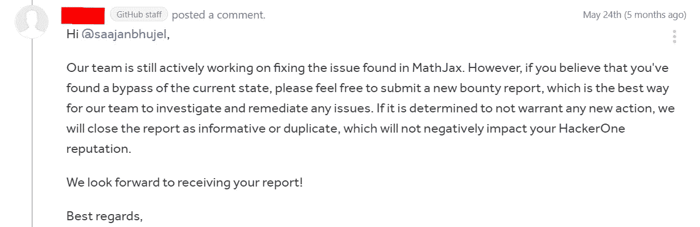
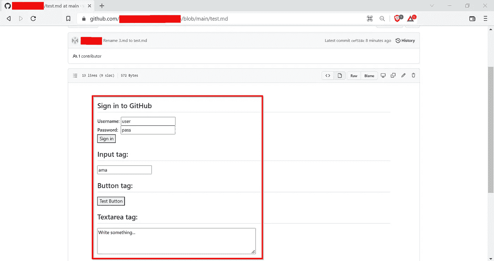

# 我是如何从 GitHub 获得 10，000 美元绕过 HTML 标签过滤的

> 原文：<https://infosecwriteups.com/how-i-got-10-000-from-github-for-bypassing-filtration-of-html-tags-db31173c8b37?source=collection_archive---------0----------------------->

嘿大家好👋

我希望你有一个 A+的星期🚀！

在今天的博客中，我将告诉你，“*我是如何绕过过滤 HTML 标签*从 GitHub 获得 1 万美元的。”



几个月前，有一天我正在滚动 Twitter feed。然后，突然一条来自 [@github](https://twitter.com/github) 的推文进入了我的视线。基本上，这条推文是关于 GitHub 的新功能，该功能提供了通过[**MathJax**](https://www.mathjax.org)**库在 Markdown 中渲染或显示数学表达式(TeX 和 LaTeX 样式语法)的能力。**

## **什么是 [**MathJax**](https://www.mathjax.org) ？**

**MathJax 是用于 LaTeX、MathML 和 AsciiMath 符号的开源 JavaScript 显示引擎，可在所有现代浏览器中工作，内置了对屏幕阅读器等辅助技术的支持。**

**看了推文才知道，“ *GitHub 现在正在使用 MathJax 库显示 Markdown 文件*中的数学表达式”。所以，我尝试的第一件事就是在[**MathJax**](https://www.mathjax.org)**库中找到任何以前的或者已知的 bug。主要是，我在寻找任何以前的 XSS 或 HTML 注射简历。****

****幸运的是，**我在 MathJax 库中找到了已知的影响版本< *2.7.4*** *的 XSS 问题。*而且，有效载荷应该以 Unicode 形式工作。****

> ****\unicode{}****

********

****MathJax 库中已知的影响版本的 CVE<2.7.4****

****Then, I created a markdown file in my test repository. And, I started my testing. So, I entered 👇 this payload in a file:****

> ****Payload:- 【 or 【 , etc.****
> 
> *******注:`*$$...$$*` *为数学分隔符。*****

****但是，没有什么对我有用。而且，我知道原因是“*CVE 只在版本< 2.7.4 中易受攻击，同时 GitHub 正在使用更新的版本*”。****

****因此，我认为“*我必须自己找到一个旁路来成功地利用攻击和* *如果我能够以某种方式呈现基本的 HTML 标签，如:* `***<b>****,****<i>****,****<u>***` *。*“而且，你可能会奇怪为什么我只说了**基本 HTML 标签**？因为，大多数时候网站使用 WAFs，不同种类的过滤器和限制来阻止使用**高级标签**但是他们不会对基本和普通标签做同样的事情。所以我才说！。****

****有一次，我发现了一种绕过或者使用数学表达式来呈现**基本标签的方法。那么只有在这种情况下，“ ***我会通过尝试高级标签*** 来尝试升级影响”。******

## **剥削的第一种方式或方法:**

**所以，我“*做的第一件事就是找到任何有趣的行为，这些行为对我使用数学表达式渲染基本标签非常有用。为此，我尝试了不同类型的方法(如 Unicode、URL 编码等)。同样，这对我也不起作用。***

**但是，不知何故，我能够找到一种非常有助于使用数学表达式呈现基本标签的方法。我**注意到**“当我在 `***\***` ***之后使用基本标签时，只有那个时候标签才会被渲染****”而没有任何错误或过滤。并且，有效载荷是`$$\<u>HELLO</u>{}$$`***

***于是，我赶紧把`<u>`标签换成了其他的高级标签(像<脚本>、< iframe >、< style >)，以便了解“*网站是不是用了更多的过滤器来防止高级标签的使用？*”。答案是***yes SSSS***，GitHub markdown 文件使用了更多的过滤器，其中的 ***他们只是过滤了除*** `**<style>**` ***标签*** 之外的任何高级标签。***

***然后在测试了这个 mathjax 集成之后，我发现可以在它前面使用一个反斜杠(`\`)来添加`<style>`标签(比如:`\<style>{property:value}</style>`)。所以为了定制 CSS，我在我的`test.md`文件中使用了下面的**有效载荷**:***

```
*$$\<style>*{display:none}</style>{}$$$$\<style>div{background-color:#66f3e6}</style>{}$$$$\<style>*{font-size:23px;}</style>{}$$$$\<style>body{padding: 50px;background-color: #4b6bb7;}</style>{}$$*
```

***因此，我注意到现在我能够改变整个页面的 CSS。***

******

***能够使用这个方法改变页面的 CSS***

***并且，我创建并向 GitHub 的 HackerOne 程序提交了我的第一份报告。但是，你知道我的报告“ ***报告在 5 分钟内被 bot*** *关闭，并说这是以前发现的问题，正在内部跟踪*”会发生什么。在那几分钟里，我非常困惑，心想“*这个机器人真的是一个机器人，或者这个机器人背后有一个人*”。***

***所以，我问程序，“*这种快速反应是来自机器人还是来自真人？*”。然后，GitHub 的 traiger 确认并回复，“*是的，请放心，你的报告是经过真人审核的。谢谢你检查我的人性！****

***我能说的就是“*我第一次给 GitHub 的 bug 报告被当做副本*关闭了”。***

## ***剥削的第二种方式或方法:***

***GitHub 在 24 小时内修复了这个问题。***

***所以，我想用我以前的方法和有效载荷重新测试这个问题。而且，我发现“*我不能再用以前的方法和有效负载*来使用高级标签了”。***

***不知何故，我设法找到了一种新的方法来呈现标签。但这一次，我只能在数学表达式中使用普通标签(如: *< div >、< span >、< section >、< input >、< label >、< button >* )而不能使用< *style* >和< *script* >)。***

```
*$$<div>Test</div>{}$$$$<input type=text>{}$$$$<button>Click Here</button>{}$$*
```

***虽然，我们也可以在 markdown 文件中使用一些没有数学表达式的标签，如 *" < div >，< span >和< section > "* 。但是通常情况下，我们是不可能渲染出“ *<输入>**<按钮>* ”这样的标签的。所以，这对我来说是一个很大的胜利，因为我已经**找到了一个方法**，在这里“我能够使用标签，比如 *<输入>和<按钮>使用 markdown 文件*中的数学表达式”。***

***尽管如此，我还是没有向 GitHub 报告这一点，因为*“除了使用受限标签，我在这里没有看到任何影响”。*所以，我试着找到类似于上面****第一种方式*** 的东西，也许我可以在那里修改页面的 CSS。但是正如我已经说过的那样*“在修复之后，我不再能够使用<风格>标签”。*所以，剩下的唯一选择就是使用 ***样式属性*** 来修改 CSS，但是又一个问题来了*“GitHub 限制属性的使用”*。****

> ********* *注********
> 
> *****正如我们所知，我们可以在 markdown(.md)文件，而不是*“style”*属性，因为它可能会导致页面的 CSS 发生变化。*****

****但是你知道一件事吗？令人惊讶的是，我能够在数学表达式中使用*“style”*属性。同时，如果不使用数学表达式，在 markdown 文件中使用*【style】*属性是不可能的。****

******有效载荷** :- `$$<tag style="property:value" acceptedAttribute="True"></tag>{}$$`****

****因此，我简单地创建了一个有效负载，使我的 markdown 文件页面像一个**登录页面**。****

```
**$$<div style="position:fixed;padding:10%;padding-right:100%;left:-9%;top:-20%;background:white;padding-bottom:100%;"><section style="margin-left:500px;padding:30px;"><h2 style="text-align:center;">Sign in to GitHub</h2><div><label>Username: </label><input type=text style="border-radius:5px;border:1px solid;">
<label>Password:  </label><input type=password style="border-radius:5px;border:1px solid;"><div style="text-align:center;"><button style="background:#2da44e;color:white;margin:10px;border-radius:9px;border:none;font-weight:500;padding:4px;padding-right:20px;padding-left:20px;" type=submit>Sign in</button></div></section></div></div><!--{}$$**
```

********

****绕过固定的，这一次我能够使用标签和改变 CSS****

****但是这一次，我没有创建新的报告，因为*“我在第二天发现了旁路，而且在上次的报告中，团队还声明他们正在内部解决这个问题”*。因为，我想*“如果团队还在开发这个功能，那么他们可能会再次关闭重复的报告”*。****

****所以，我只评论了一下*“我只是发现了一个可以再次改变整个页面的 CSS 的旁路。所以请告诉我，内部团队是否解决了这个问题？因为我不能用最后一种方法复制它！如果是(问题已解决)，那么我很乐意创建一个新报告作为旁路…。”*上一次报告。****

****GitHub 的工作人员回复了下面的声明，你可以在下面的图片中看到😁。****

********

****第二天当我醒来时，我注意到 GitHub 团队再次修复了这个问题**，因为新的有效载荷不再工作了**😶。因此，这表明*“他们是对的，他们确实在 MathJax 上内部工作”*。****

## ****剥削的第三种方式或方法:****

****尽管如此，我还是没有阻止自己在 MathJax 特性中发现一些不寻常的东西。****

****我注意到，在第二次修复后，我无法使用以前的有效载荷渲染任何高级标签。****

****如果你看到了我上面的两个不同方法的有效载荷，那么你可以清楚地看到*“我在数学表达式中使用任何标签之前使用了反斜杠(* `\` *)，比如:*`*\<tagName>{}*`****

*****同样，我也注意到了这件事，并在数学表达式中将我的有效载荷位置从`$$\<tagName>{}$$`改为`$$\{<tagName>}$$`。然而，标签被过滤了。但是在花了更多的时间后，我终于找到了一个方法，用 MathJax 渲染几个像`<input>,<svg>,<button>,<textarea>`这样的标签。*****

*******有效载荷** : `$$\<script>{&lt;renderTag&gt;}$$`*****

*******有效载荷如何工作:(详细阅读)*******

*   *****在反斜杠(`\`)之后的第一个位置，标签应该是从有效负载中过滤掉的恶意标签，如`\<script>`或`\<style>`*****
*   *****我们想要渲染的主标签应该在花括号`{&lt;renderTag&gt;}`之间。大于号和小于号应该是 HTML 实体的形式。*****

*****因此，我们的最终有效载荷将看起来像:`$$\<script>{&lt;renderTag&gt;}$$`。由此，`<script>`或写在花括号之前的任何标签都将被过滤掉。Mathjax 将只呈现花括号中的标签。*****

*****我在 POC 的`test.md`文件中使用了下面的**有效负载**。*****

```
***$$\<script>{&lt;div&gt;&lt;section&gt;&lt;h2&gt;Sign in to GitHub&lt;/h2&gt;&lt;label&gt;Username: &lt;/label&gt;&lt;input&gt;&lt;br&gt;&lt;label&gt;Password: &nbsp;&lt;/label&gt;&lt;input&gt;&lt;br&gt;&lt;button&gt;Sign in&lt;/button&gt;&lt;/section&gt;&lt;/div&gt;<!--}$$## Input tag:
$$\<script>{&lt;input&gt;<!--}$$## Button tag:
$$\<script>{&lt;button&gt;Test Button&lt;/button&gt;<!--}$$## Textarea tag:
$$\<script>{&lt;textarea&gt;Write something...&lt;/textarea&gt;<!--}$$***
```

**********

*****能够在数学表达式中使用一些高级标签*****

*****虽然，我试图增加这个问题的影响，但失败了。*****

*****因此，我向 GitHub 报告了这个低严重性的问题。而这一次， **GitHub 以中等严重程度接受了这个问题，并免费支付了带有 SWAG 和 GitHub Pro** 的 10000 美元赏金。*****

**********

*****GitHub 承认这个问题的严重性为中等，并支付了 10，000 美元的奖金*****

*****我能说的就是*“这个新的* ***MathJax 特性*** *带来了一些误配置”*。*****

## ****有效负载汇总:****

******(I)** 我在**第一种方法**或方式`$$\<style>{property:value}</style>{}$$`
**(II)**我在**第二种方法**或方式
`$$<tag style="property:value" acceptedAttribute="True"></tag>{}$$`
**(III)** 我在**第三种方法**或方式
`$$\<script>{&lt;renderTag&gt;}$$`中使用的有效载荷****

## ****报告的时间表:****

*   ****5 月 21 日——向 GitHub 提交了第一份报告****
*   ****5 月 21 日-报告因重复而关闭****
*   ****5 月 24 日-再次报告了 GitHub 的新旁路问题****
*   ****5 月 25 日 GitHub 审理的报告****
*   ****8 月 20 日- GitHub 解决了这个问题****
*   ****8 月 20 日——GitHub 奖励我 10，000 美元奖金、一份奖品和 GitHub Pro。****

****如果你喜欢这个博客，那么给我一个[关注](https://twitter.com/saajanbhujel) ✨****

## ****来自 Infosec 的报道:Infosec 每天都有很多内容，很难跟上。[加入我们的每周简讯](https://weekly.infosecwriteups.com/)以 5 篇文章、4 个线程、3 个视频、2 个 GitHub Repos 和工具以及 1 个工作提醒的形式免费获取所有最新的 Infosec 趋势！****