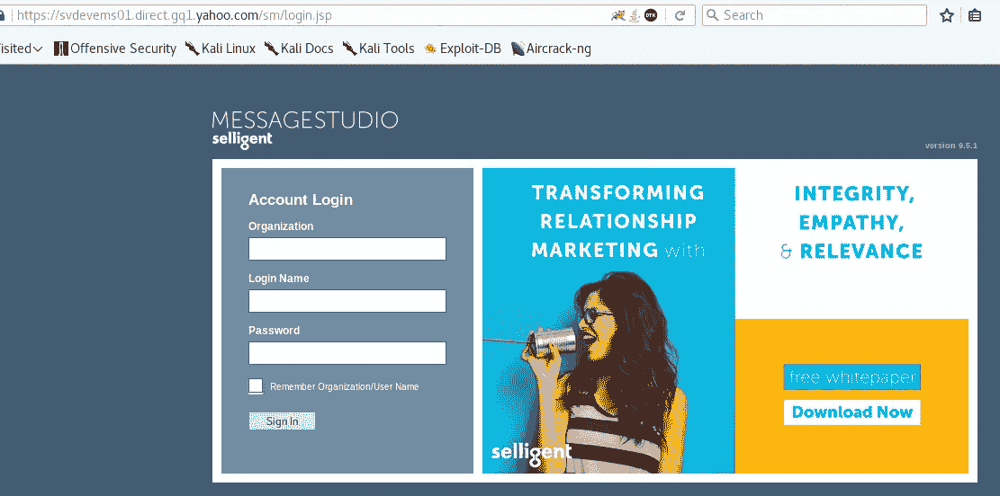
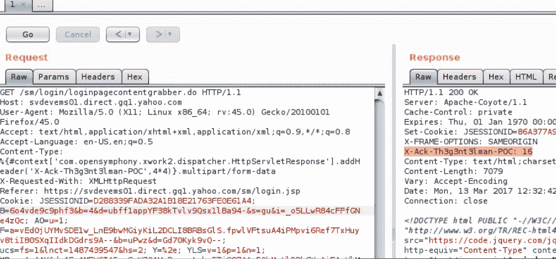

# 我如何从雅虎为 RCE 获得 5500 美元

> 原文：<https://infosecwriteups.com/how-i-got-5500-from-yahoo-for-rce-92fffb7145e6?source=collection_archive---------0----------------------->

嗨伙计们，

我一直认为分享是关爱，我一直在向 bug bounty 领域的多位安全研究人员学习，所以我决定与您分享我的一些发现，因为它可能会帮助其他开始 Bug Bounty 之旅的人。

正如你几个月前已经知道的，在 Apache struts 2(CVE-2017–5638)中发现了一个关键的漏洞，该漏洞会导致远程代码执行，这种容易利用的漏洞已经公布，许多 web 应用程序正在被大规模利用。

在 Struts2 漏洞发布近 3 周后，在我的侦察过程中，我发现了这个链接:https://svdevems01.direct.gq1.yahoo.com/sm/login.jsp，这是雅虎使用的 selligent Messages studio 解决方案的登录页面。

试图在那里找到漏洞，但我失败了，直到我找到这个端点:[https://svdevems 01 . direct . gq1 . Yahoo . com/sm/log in/loginpagecontentgrabber . do](https://hackerone.com/redirect?signature=81be6731e8225a2511c4680d9af714c9874d1c22&url=https%3A%2F%2Fsvdevems01.direct.gq1.yahoo.com%2Fsm%2Flogin%2Floginpagecontentgrabber.do)，对于那些不知道您是否使用。行动，。做，。go 意味着运行 struts2 的 web 应用程序。

因此，正如我所说的漏洞已被公布，易于使用，但它对这个目标不起作用，即使它被证实是脆弱的，这意味着有 WAF 或其他东西阻止我的攻击。

我不能就此停止，因为它很容易受到攻击，为了报告它，我必须提供一个有效的 POC，经过一些搜索后，我发现了一个 twitter 帖子，其有效载荷可以绕过 WAF 来利用此漏洞。

我发现的检测方法利用内容类型的 HTTP 报头来发送特制的数据包。标题如下所示:

内容类型:% { # context[' com . open symphony . xwork 2 . dispatcher . http servlet response ']。add header(' X-Ack-th 3g 3 nt 3 lman-POC '，4*4)}。多部分/表单数据

新请求要求 web 服务器将两个数字相乘，并可用于请求 web 服务器执行任何其他操作。在上例中，这两个数字是 ***4*** 和 ***4*** 。web 服务器的回答是 ***16*** ，这表明服务器存在漏洞。

下图所示的响应将包含新的报头***X-Ack-th 3g 3 nt 3 lman-POC:16***

这足够公平地通过 hackerone 为雅虎报告了错误，雅虎在 30 分钟内对报告进行了分类，使应用程序离线以修复问题，之后我确认了修复，在一周内，我因这一发现获得了 5500 美元。

希望你喜欢这个发现，如果这篇文章中有任何错误，我为我薄弱的英语道歉。