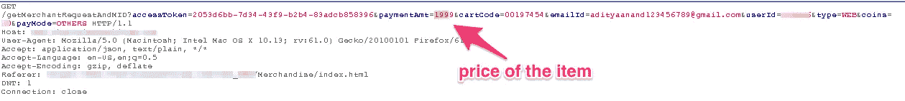
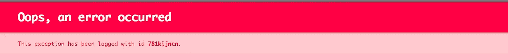
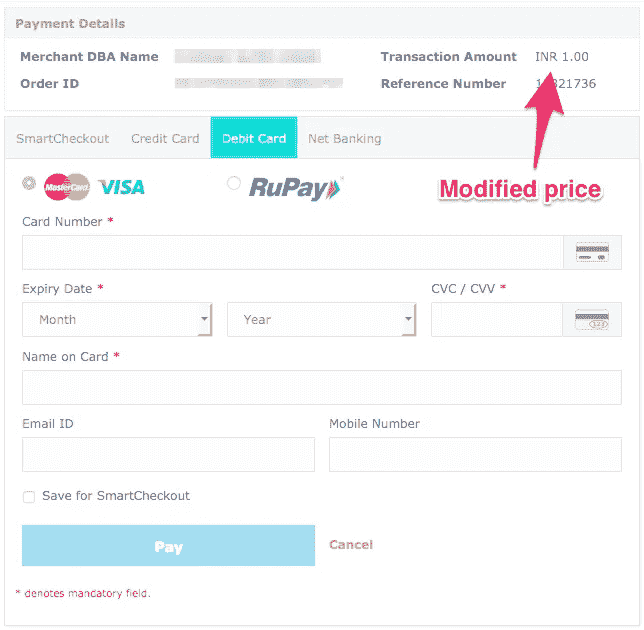

# 我是如何为 1₹搞到一件 1999₹沃斯球衣的？

> 原文：<https://infosecwriteups.com/how-i-got-a-1-999-worth-jersey-for-1-eb60e5887f7a?source=collection_archive---------1----------------------->

如果你了解我，那么你一定知道我是印度板球球队 CSK(钦奈超级国王)的超级粉丝，现在他们已经获得了季后赛资格，我必须买下他们的球衣，尽我所能支持他们。嗯，我期末考试考得很糟糕，这也让我很沮丧，所以我不得不做些事情。

# 让我们开始吃吧

我开始在网上搜索出售 CSK 球衣的零售商，我找到了一个网站，比如说 example.com，它出售 2000 年₹.的原版球衣我很高兴他们卖了这件球衣，但对我来说，它太贵了，所以我必须想办法操纵 t 恤的价格，让它便宜一些。我知道只有一种方法可以让我玩价格参数，那就是 BurpSuite。

# 打嗝模式开启

我马上打开 BurpSuite，在我的火狐浏览器上浏览 example.com。我以前执行过一次这个过程，在这里检查一下。

> [我是如何以 0.01 美元的价格获得 149 美元的电视订阅的](https://medium.com/bugbountywriteup/how-i-got-a-149-t-v-subscription-for-0-01-7fac32ec388a)——一篇描述我如何操纵在线电视订阅网站的价格并为自己获得近乎免费的电视连接的博客。

我决定一头扎进去，但我不确定，因为如今大多数支付网关都很难破解和进入。我满怀希望，首先我用正常的方式创建了用户档案，然后一直到支付完成的最后一部分，然后在 BurpSuite 中打开代理来拦截流量。我开始仔细查看网站上展示的包裹细节，结果这个被划掉了。

一看到这个，我就搜索可能导致整个攻击无效的散列标签(可能有一种方法，但我不知道，如果你知道，请评论下来)，令我惊讶和高兴的是，这是缺失的，所以我开始工作。

# 玩还是付出代价

在那之后，我做的第一件事就是把产品的价值从 1999 年改为-1999 年，只是为了检查这是否可行。这将是伟大的，如果它的工作，相信我，它曾经这样做，然后他们会把钱存入我的帐户，从他们那里购买球衣。不幸的是，它对我不起作用，并给出了这个错误，当我试图将交易值改为 0 时，得到了一个类似的错误。

我有点期待它，因为同样的事情发生在我最后一次尝试改变在线电视订阅价格的时候。因此，没有问题，我重复了整个过程，并以 1 印度卢比的价格成交，这是我所期望的。

我一做了更改就关闭了拦截，因为大多数网站会让你的会话超时，所以即使你实际上做了正确的更改，但仍然无法执行。

从那里，它将我重定向到支付网关，在那里新的价格标签被更新，这是 1 印度卢比。

我进行了正常的支付，只有 1 印度卢比，这有点太不现实了，因为我真的以为他们会在整个过程中阻止我，但他们没有。订单已经确认，球衣将在几天后到货。

# 道德的

我发现这是一个严重的错误，支付网关中的错误会给托管服务的公司造成巨大的损失。我阻止黑客改变球衣价格的方法是在过去的请求消息中发送一个哈希码，这样即使攻击者改变了 post 请求中的纯文本价格标签，他也无法对哈希码进行所需的更改，从而使攻击无效，并保护网站免受此类诈骗。

如果你喜欢，请鼓掌让我们合作吧。获取、设置、破解！

网址:【aditya12anand.com】T2|捐赠:【paypal.me/aditya12anand】T4

电报:[https://t.me/aditya12anand](https://t.me/aditya12anand)

推特:[twitter.com/aditya12anand](https://twitter.com/aditya12anand?source=post_page---------------------------)

领英:[linkedin.com/in/aditya12anand/](https://www.linkedin.com/in/aditya12anand/?source=post_page---------------------------)

电子邮件:aditya12anand@protonmail.com