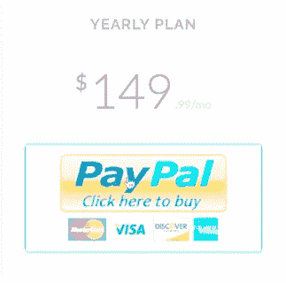
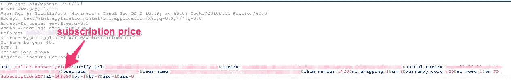
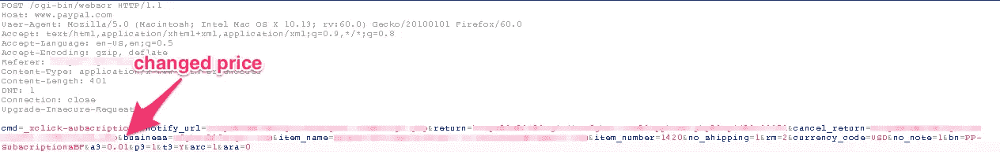
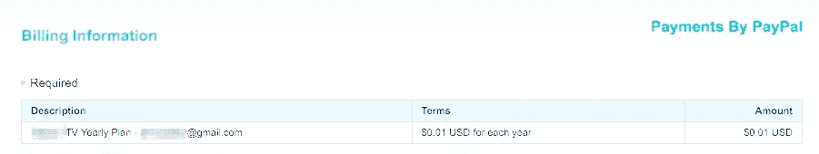

# 我如何以 0.01 美元订购 149 美元的电视节目？

> 原文：<https://infosecwriteups.com/how-i-got-a-149-t-v-subscription-for-0-01-7fac32ec388a?source=collection_archive---------0----------------------->

现在是 IPL 的时间，作为 CSK 的超级粉丝，我疯狂地渴望观看他们的比赛。我当然可以看那些在线的免费视频流，但是大部分不是没有提供高质量的视频流，就是比现场比赛滞后 5-6 分钟，这两种情况我都不能忍受。所以在需要的时候，我的黑客技能来保护我。

我开始搜索在线电视订阅，提供直播，但没有任何时间延迟的现场比赛。我找到了很多网站，但都是付费的。作为一名破产的大学生，我确实缺钱，所以我需要一种不花一分钱就能订阅的方式(好吧，我错了，我确实花了一分钱)。

# 开始入侵！

我打开了[www.example.com](http://www.example.com)，它为我提供了比赛直播，但它要求我支付 149 美元的年费，这对我来说是不可能的。因此，我打开了 Burp Suite 并打开了 intercept，看看我究竟如何操纵交易金额，这样我就可以不用支付任何费用，也可以获得订阅。

所以，我截获的第一个信息包包含了优惠券和已被选中的计划。我转发了数据包，下一个数据包包含订购价格。

对于初学者，我尝试将价格从“149.99”改为“0”，但数据包被拒绝，因为 a3、p3 和 t3 参数是错误的。我进行了搜索，并了解到小数位数不能更改，即在这种情况下是 2 位小数，也不能更改为“0.00”，因此最少可能是“0.01”。它看起来像这样。

我转发了被操纵的数据包，然后关闭了拦截。页面转到支付页面，瞧！

整个年度计划的付款改为 0.01 美元。我继续进行支付过程，直到过程的最后一刻我才停下来。

所以，这就是我如何想出一个办法来观看 IPL 的微薄 0.01 美元，我甚至没有计算其他频道，也是整个包的一部分。

**如果你喜欢，请鼓掌&让我们合作吧。获取、设置、破解！**

网址:【aditya12anand.com】T4|捐赠:[paypal.me/aditya12anand](https://paypal.me/aditya12anand)

电报:[https://t.me/aditya12anand](https://t.me/aditya12anand)

推特:[twitter.com/aditya12anand](https://twitter.com/aditya12anand?source=post_page---------------------------)

领英:[linkedin.com/in/aditya12anand/](https://www.linkedin.com/in/aditya12anand/?source=post_page---------------------------)

电子邮件:aditya12anand@protonmail.com