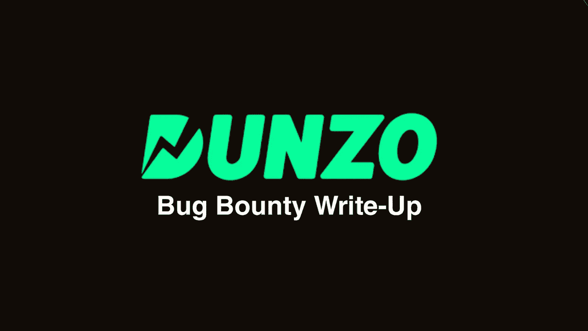
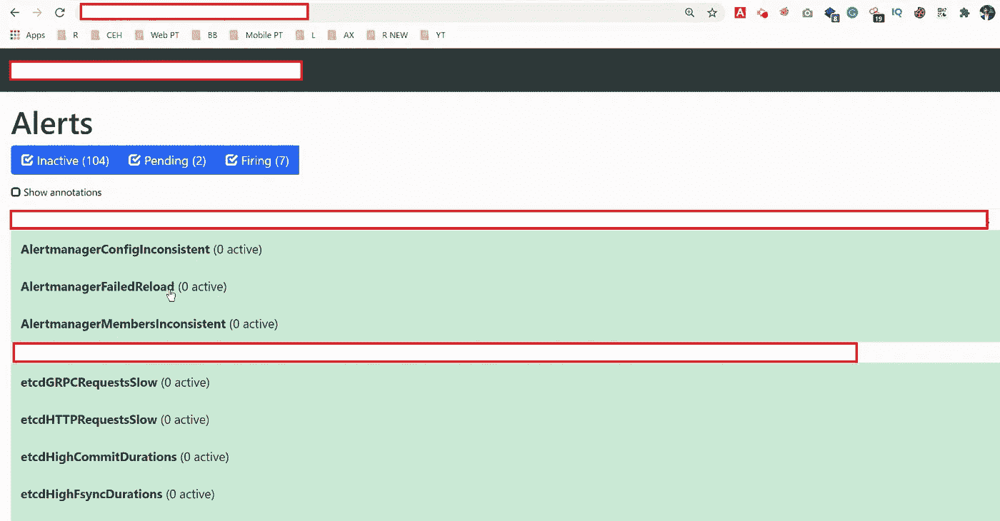
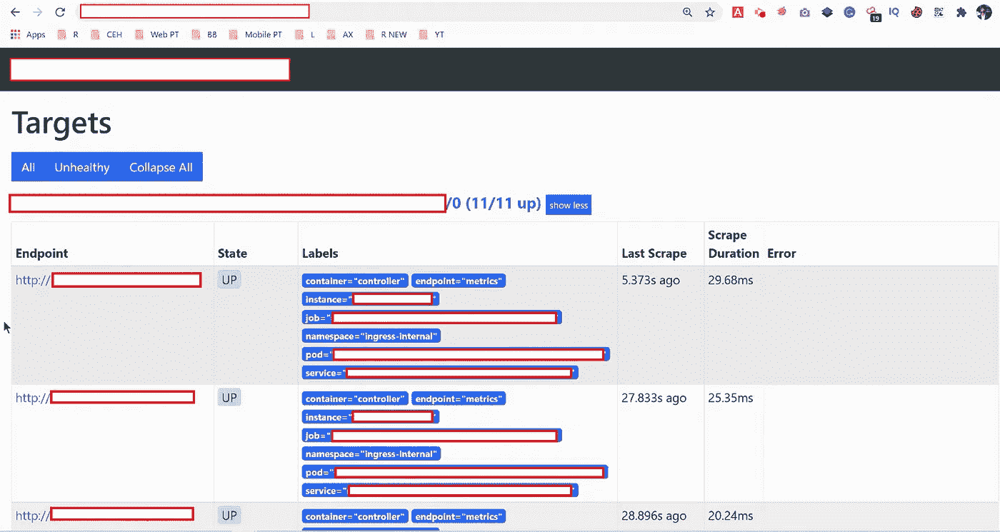
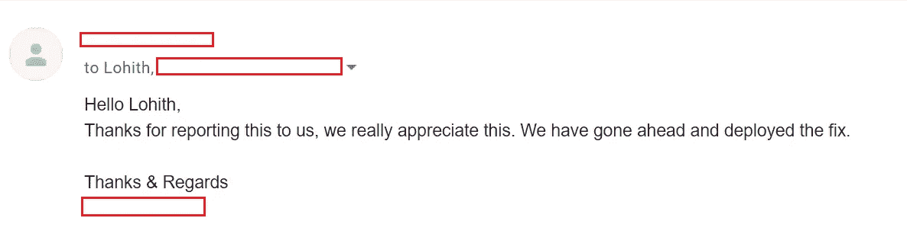

# 我如何访问 Dunzo 内部仪表板

> 原文：<https://infosecwriteups.com/how-i-got-access-dunzo-internal-dashboard-177104e2786f?source=collection_archive---------3----------------------->

**大家好！**

这篇关于**邓佐敏感信息泄露**漏洞的报道。

该漏洞可能允许攻击者访问 [**Dunzo**](https://www.dunzo.com/order) **的内部监控仪表板。**

进入第一部分…

## 子域枚举:

我从子域枚举开始。对于子域枚举，我用了 [**crt.sh**](http://crt.sh/) **。**

## **什么是 crt.sh:**

这是一个网络界面。这使您可以搜索由 CT 记录的证书。

在这种情况下，我只有几个子域。所以我手动检查了每个子域。如果你发现了大量的子域名，你可以使用项目发现中的 [**Httpx**](https://github.com/projectdiscovery/httpx) 工具。

# 剥削:

其中一个域无需身份验证即可访问内部控制面板。这里我得到了内部 ip，日志明细(生产服务器)。

> ***小忠告:*** *在任何 bug 赏金计划或任何其他组织上狩猎如果发现任何内部 ip 其他细节，不要多利用。因为在这些服务器上运行的整个生产环境。因此，请创建一份详细的 POC，并将其报告给各自的团队。*

我的调查结果的概念验证…

内部仪表板

私有 IP 信息

**邓佐的赞赏**

欣赏

> ***报表详细信息:***
> 
> *2021 年 1 月 11 日星期一—向 Dunzo 安全团队报告。*
> 
> *2021 年 1 月 11 日，星期一——立即得到了团队的回应*
> 
> *2021 年 1 月 12 日星期二-问题已修复*
> 
> *2021 年 1 月 12 日星期二—重新测试并确认修复*
> 
> 2021 年 1 月 12 日星期二——这次没有赏金，只有感谢！(因为邓佐没有 bug 赏金计划)

**感谢阅读！….黑客快乐！**

> *Linkedin:*[*Lohith Gowda M*](https://www.linkedin.com/in/lohigowda/)
> 
> *推特:*[*lohigowda _ in*](https://twitter.com/lohigowda_in)
> 
> *insta gram:*[*lohigowda . in*](https://www.instagram.com/lohigowda.in/)
> 
> *作品集:*[*【https://www.lohigowda.in/】*](https://www.lohigowda.in/)