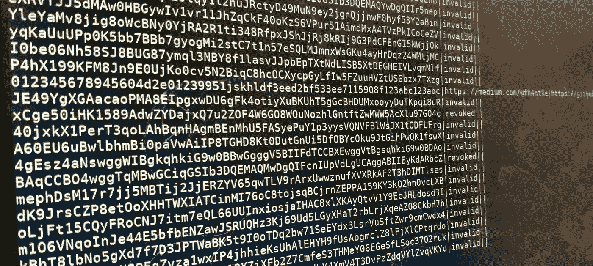

# 我是如何进入其他人的媒体账户的

> 原文：<https://infosecwriteups.com/how-i-got-access-to-other-peoples-medium-accounts-122d49b7f721?source=collection_archive---------1----------------------->

## GitHub 搜索、API 键和自动化的魔力



作者照片

几天前，我发现 Medium 提供了一个 API，每个人都可以请求认证密钥。在等待我的密钥请求被批准时，我在 GitHub 上搜索是否可以找到意外上传的密钥。令我惊讶的是，我在公共存储库中发现了数百个文件，这些文件包含的数据看起来就像中等认证密钥。事实上，我试的第二把钥匙已经可以用了。在本文中，我描述了恶意用户可以对这些密钥做什么，以及我如何自动完成寻找有效密钥的过程。


一个简单的 GitHub 是找到有效 API 密钥的第一步(作者供图)。

# 介质的 API

有人能用灵媒 API 的密钥做什么？和往常一样，最好的信息可以在 API 文档中找到，所以让我们看看 [Medium 的 API 文档](https://github.com/Medium/medium-api-docs)。

正如我们所看到的，这个文档非常短，并且只提供了一些方法。每个请求都发送到`api.medium.com`并包含 HTTP 报头`Authorization: Bearer <auth key>`。第一个请求显然是发送给`/v1/me`，响应将包含用户的 id、姓名和一个到概要文件的链接。这有助于我识别并通知发现钥匙背后的人。

一个更关键的方法是请求创建和发布新的帖子或将它们发送到出版物。因为发布文章是 Medium 的核心功能，拥有另一个人的认证密钥意味着拥有他或她的帐户。

API 没有提供的一些东西是更改设置或查看私有和敏感信息的选项。我也没有发现查看某人草稿的可能性。当然，我只用自己的账户测试了所有选项。

# 自动执行关键字搜索

考虑到 GitHub 向我展示了数百个可能包含有效认证密钥的文件，我认为这可能是一个有趣的小型夜间项目，可以自动搜索有效密钥，识别易受攻击的帐户，并引起所有者的注意。此外，这对我来说是第一次尝试 GitHub API 的好机会。

我的方法很简单:首先，我使用 GitHub API 列出所有包含术语`api.medium.com`和`Bearer`的文件。后来我自动化工作的时候，只搜索`api.medium.com`，导致大量误报。

```
curl -H "Authorization: token <my token> \
  https://api.github.com/search/code?q="api.medium.com"+%2B+"Bearer"
```

接下来，我对发现的文件使用 regex 来查找密钥。因为键有标准格式，65 个字符长，所以正则表达式规则非常简单:`\w{65}`。当然，这会导致更多的误报，但是，在下一步中，所有无效的键都会被过滤掉。

每次，regex 发现一个潜在的结果，我就把它发送给`api.medium.com/v1/me`,以便验证或反证密钥。如果请求返回时没有错误，我知道密钥是有效的，并且有用户名和到易受攻击帐户的链接。所有这些信息我都存储在 SQLite 数据库中。

我的最终代码如下所示:

# 结果

尽管 GitHub 列出了数百个文件，但大多数都是误报，因为没有包含认证密钥。此外，即使我的脚本找到了一个密钥，它们几乎都已经被撤销了。API 返回的错误消息可以区分无效或被撤销的密钥。

总而言之，我只找到了六个功能认证密钥，这比我预期的要少，因为我手动尝试的第二个密钥已经工作正常。然而，这总比通过公开可用的密钥找到数百个易受攻击的帐户要好。此外，我还发现了 56 把已经作废的钥匙。

这项研究于 6 月 27 日进行。同一天，我联系了所有功能键的所有者，希望他们将它从 GitHub 中移除或撤销 Medium 上的键。

# 我们能从中学到什么？

正如我们所看到的，自动化搜索和测试 API 键的过程很容易，只需要一个晚上。就我而言，我本可以访问用户账户，并以他们的名义在媒体上发帖。

您应该从本文中吸取的教训是，永远不要将您的 API 密钥或凭证推送给公共 git。虽然在某些情况下，例如，谷歌地图 API，危害很小，但也有一些情况下，有人可以接管你的帐户，并通过使用你的 API 密钥来窃取它。因此，我建议将所有敏感数据放在添加到`.gitignore`的配置文件中，这样就不会提交给 git。这样，就不会有人拿到你的钥匙。

感谢阅读，保管好自己的钥匙！