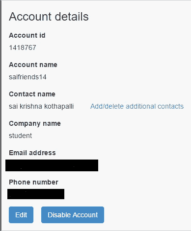
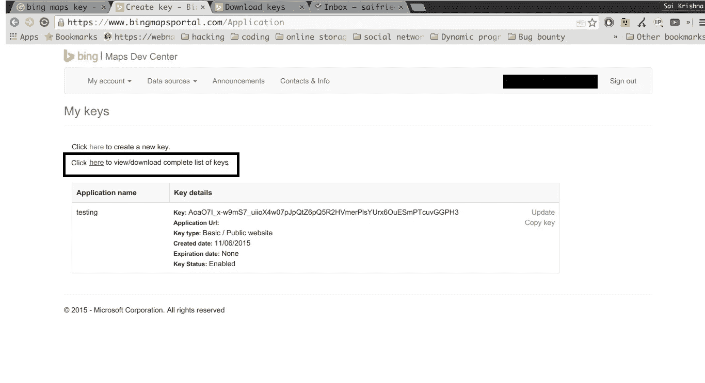
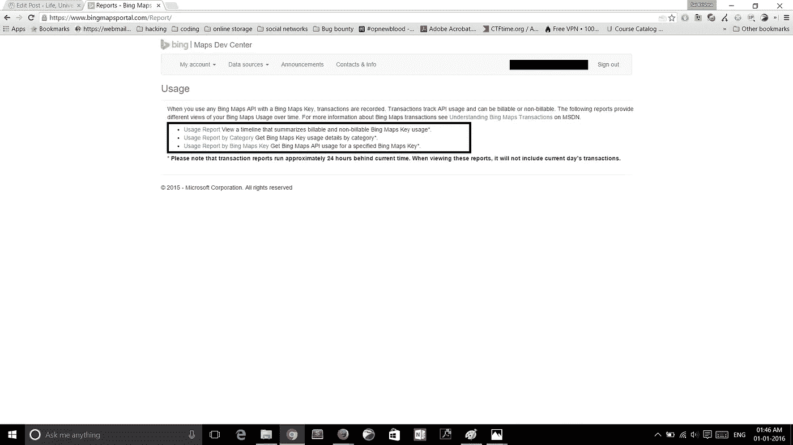
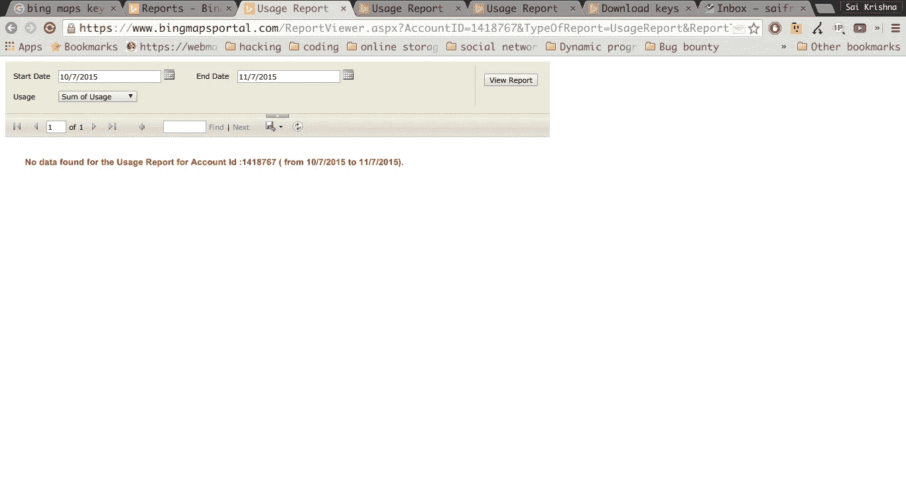
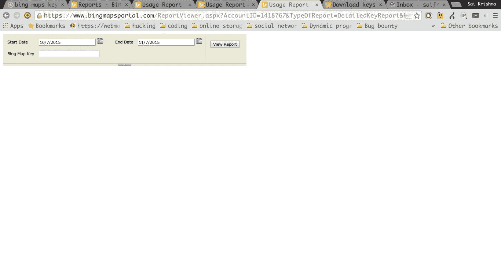
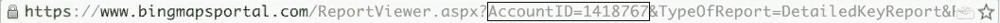
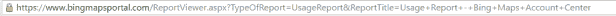
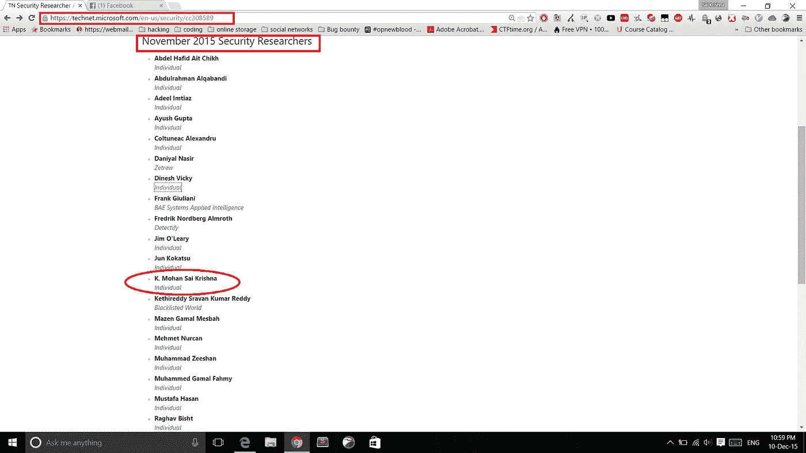

# Bing 地图门户中的 API 密钥泄漏

> 原文：<https://infosecwriteups.com/how-i-got-listed-in-microsoft-hall-of-fame-8f96ca4535c2?source=collection_archive---------0----------------------->

因为我答应写我是如何被列入微软名人堂的。终于来了。

一些背景信息

*   这是我第一次向大公司报告安全漏洞。
*   是的，我对网络安全有一点了解。

每年微软都会在一些 IIT 举办名为 code.fun.do 的黑客马拉松。黑客马拉松的主题是使用微软的一种技术构建一个 web 或移动应用程序。

我们决定参与，我们的想法涉及必应地图。为了使用任何 API，你需要一个 API 密匙。必应地图也是如此。您可以在[https://www.bingmapsportal.com/](https://www.bingmapsportal.com/)管理 Bing 地图的应用程序及其密钥。所以我也注册了

我让自己熟悉这个网站，并尝试创建新的 API 键并使用它们。

(别担心，我已经删除了那个应用程序和密钥:P)

然后在这个页面上你可以看到所有 API 键的使用细节

因为我还没有使用钥匙，所以没有统计数据，但是你注意到什么了吗？

统一资源定位器

看网址。在发出 get 请求时，它将帐户 ID 作为参数发送。所以我接下来做的就是把账号 id 改成 1418766(我的是 1418765)然后回车然后嘣！！我得到了那个用户的 API 密钥。

想象一下！！我可以获得 API 密钥、应用程序名称、使用细节以及你能想象到的每个注册用户的统计数据。

甚至还有企业级 API 密钥。

如果我没有报告这个错误，也许有一天你会看到一些黑客攻击了微软，并在 pastebin 或其他东西上发布了 API 密钥和其他一些细节😛

很复杂吗？不对。任何人都可以更改帐户 ID。但在这种情况下，我是唯一😛。如果你想知道我为什么这么做，答案是我习惯了，虽然我从来没有参加过任何 Bug 奖励，但我在我们研究所的网站和服务器以及许多其他在线网站上练习了很多。

我在这方面的知识增长了，因为我在很多 CTF(夺旗比赛)中练习，一旦你做了这么多比赛，你就会有检查一切的本能，你知道在哪里寻找漏洞。

这并不是一种特殊的天赋，任何有奉献精神的人都可以掌握这门艺术。

微软的人修复了这个错误，网址现在看起来像这样

而且漏洞已经打了补丁。

这就是我如何进入[微软名人堂](https://technet.microsoft.com/en-us/security/cc308589)参加 11 月份的活动。

暂时就这样了。

# 时间线:-

2015 年 10 月 11 日—发送错误报告。

2015 年 11 月 11 日——收到一封邮件，说他们正在分析漏洞。

2015 年 12 月 11 日-他们修好了(我检查过了)。

2015 年 11 月 17 日—收到一封官方邮件，询问我的详细信息。

最后，当我不找虫子的时候，我开始用虫子奖金。

我们没有赢得黑客马拉松，但它仍然是一个胜利。

感谢您的阅读。

和平。:D

同一个月，我报告了同一网站的另一个漏洞

*原载于 2015 年 12 月 31 日*[*【kmskrishna.wordpress.com】*](https://kmskrishna.wordpress.com/2016/01/01/how-i-got-listed-in-microsoft-hall-of-fame/)*。*