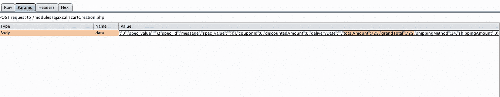
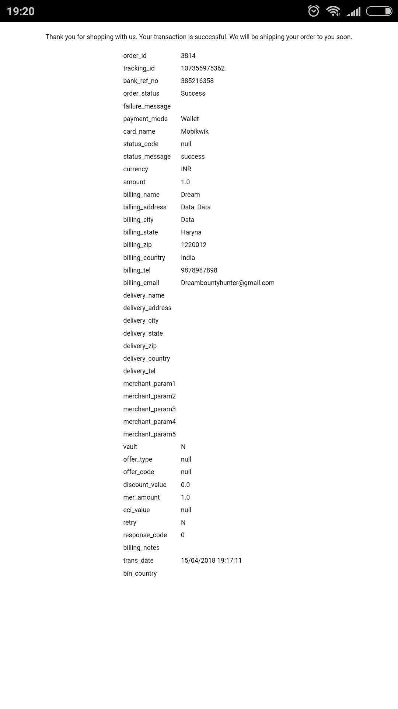

# 我是如何从印度最大的在线礼物门户网站——昆虫赏金计划中获得 0 美元报酬的

> 原文：<https://infosecwriteups.com/how-i-got-paid-0-from-the-indias-largest-online-gifting-portal-bug-bounty-program-fd9e14f9ca20?source=collection_archive---------0----------------------->

> “你能给自己的最好礼物就是一点点你自己的关注。”~安东尼·j·德安杰洛

# 嘿大家好！

这一切都是从这句很棒的话开始的，像往常一样，10-15 分钟后，我失去了视力，登陆了一个礼品购物网站，开始像小孩子一样浏览..嗯，我想要这个，我想要那个，哦！我都想要。但是在浏览过程中，我无意中打开了我的控制台，开始搜索 XHR 调用和源代码，回忆起我过去学习 bootstrap 和 css 的美好时光。我像一个孩子一样打开和分析一切，试图理解网络应用程序流，我的头脑正在连接每一个点，以形成一个完整的 API 流，或者我可以说是一个产品购买流。我在 notepad++上记下了所有的东西，哇，我看到了一些奇怪的东西。我对安全结账方法有疑问。好奇心驱使我进行 MITM(中间人)测试。哦，我忘了告诉你，我用移动应用程序(android 应用程序)购物，虽然我用我的笔记本电脑来传递我的渗透测试工具的流量。我得到了陷入不确定性的纯文本 product_amount。

我不确定改变这个会有什么影响。所以，我决定试一试，因为我必须知道原因。我更改了它，并将我的请求转发给服务器。我的请求未经任何验证就被成功处理。嗯，我认为他们把验证层后支付(对那些成功和失败的网络挂钩，每个程序员在支付模块配置)。我付了 1Rs。而且改前原价是 725(截图可以看到)最后发现了一个严重的漏洞~价格操纵

此易受攻击的移动应用程序的网站不存在此漏洞。

这是我如何幸运的简短解释！

正如你所看到的，大多数人都在对目标进行基本的侦察，寻找反射的 XSS、打开的重定向或暴露的目录。你需要非常幸运才能找到那种唾手可得的水果，但试试也无妨。

至于这个发现，我提交了我的报告，等待答复！

时间线:

2018 年 4 月 15 日:提交报告并分类