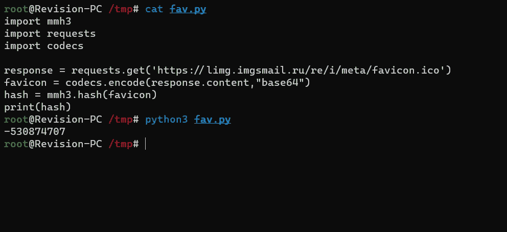
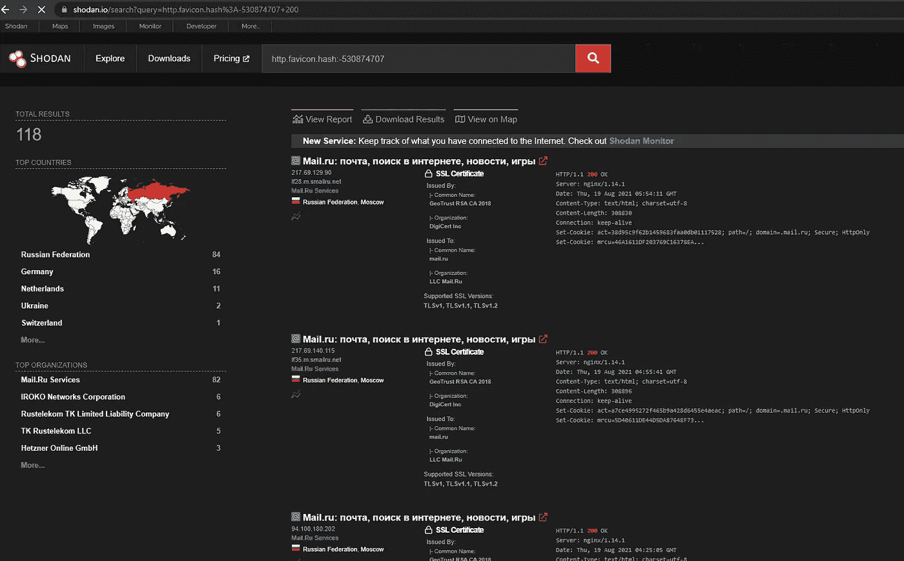
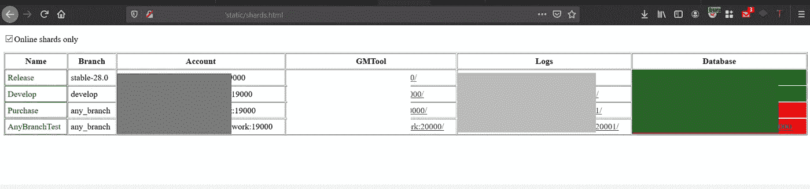
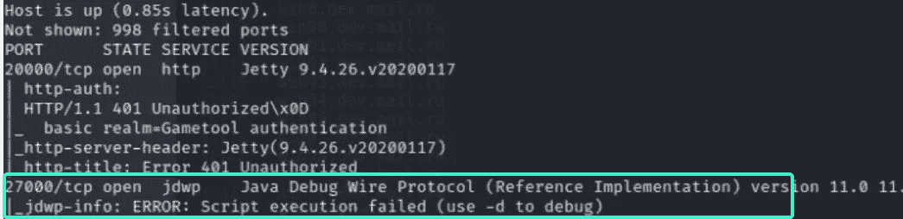
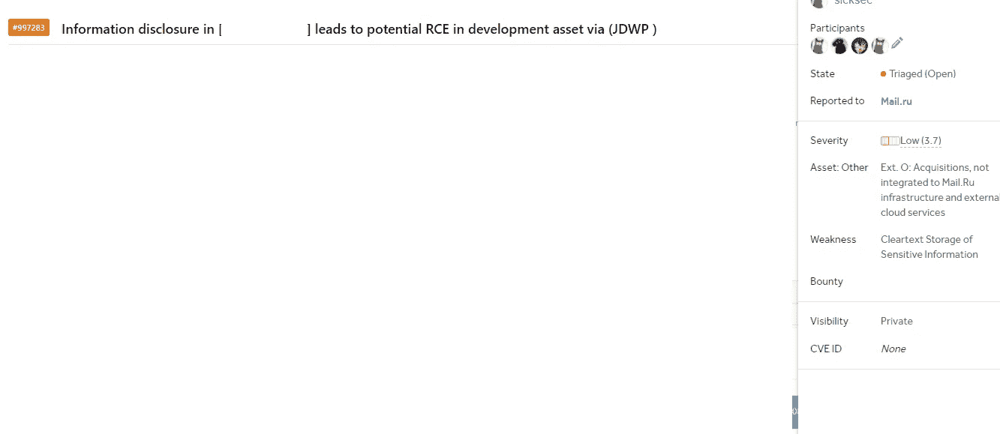

# 我如何让 RCE 进入世界上最大的俄罗斯公司

> 原文：<https://infosecwriteups.com/how-i-got-rce-in-the-world-largest-russian-company-8e6e8288bc4e?source=collection_archive---------1----------------------->

## 跳出框框思考

照片由[克里斯蒂安·威迪格](https://unsplash.com/@christianw?utm_source=medium&utm_medium=referral)在 [Unsplash](https://unsplash.com?utm_source=medium&utm_medium=referral) 上拍摄

你好，安全研究人员和黑客

在这篇文章中，我将解释我是如何在被认为是世界上最大的互联网公司,
mail . ru 中找到 RCE 的。在开始黑客攻击之前，我想知道我应该如何接近目标，以及大多数人在这个项目中会错过什么，他们有一个巨大的范围，这意味着它应该在那里等待我找到 XD

我开始使用[这个](https://gist.github.com/yehgdotnet/b9dfc618108d2f05845c4d8e28c5fc6a)来查找 Favicon，在这里我用 Mail.ru favicon 替换链接，一旦生成，我就去 shodan.io 搜索它

现在我们用 **http.favicon.hash** 语法在 shodan.io 上搜索这个 hash

现在，我一页一页地查看，寻找具有不寻常端口号的可疑内容，所以我继续前进，直到我找到一个端口为 8080
的主机，它有一个**欢迎使用 Nginx 页面**
一旦找到，我想进一步了解发生了什么，所以我开始模糊目录，我发现`/static/shards/html`可以公开访问，看起来很有趣

从这里我猜想这些主机中的大多数是内部主机，很难到达它们，我决定 [Nmap](https://nmap.org/) 所有这些主机
只找到一个有 JDWP 代表(Java 调试线协议)的主机

所以我开始研究这个服务/端口，通过阅读这篇[文章](https://ioactive.com/hacking-java-debug-wire-protocol-or-how/)
，我发现它可能容易受到 RCE 的攻击。在这个[回购](https://github.com/IOActive/jdwp-shellifier)的帮助下，我能够向 RCE 和团队展示，由于服务器属于他们的基础设施，而不是主要资产，所以他们进行了筛选并支付了$$$的费用

希望你喜欢阅读这篇文章，并在下一次冒险中与你相遇
保持对❤的好奇