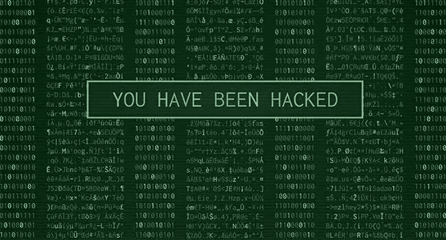
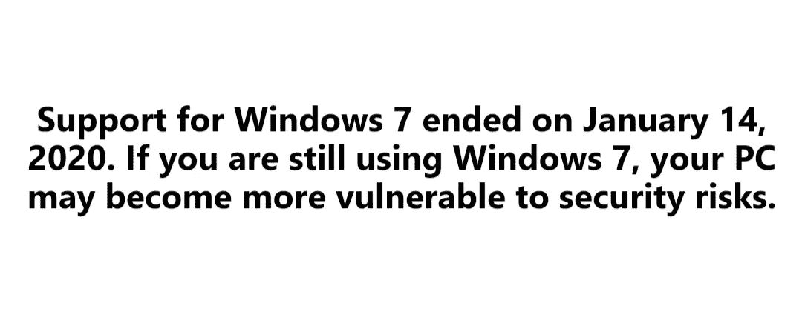
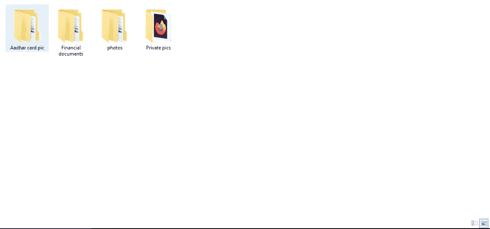
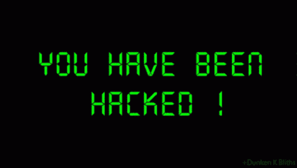

# 我如何黑了一家网吧来教他们网络安全

> 原文：<https://infosecwriteups.com/how-i-hacked-a-cybercafe-to-teach-them-about-cyber-security-f5b1dd460c9f?source=collection_archive---------2----------------------->

来源:google.com

大家好，今天我要告诉大家我是如何黑掉一家网吧来教他们网络安全的。众所周知，安全性对于保护我们的数据非常重要。我们中的许多人去网吧工作，但我们是否注意到，许多网吧并不把安全作为一个严重的问题，这对去网吧的人来说是危险的，因为保护人们的数据应该是他们的首要任务。

这件事发生在几天前，为了工作，我去了网吧，但我看到他们的安全措施非常薄弱。我看到他们运行的是 windows 7，我们都知道微软不再支持 windows 7，所以他们不会为 windows 7 用户提供补丁。

他们没有使用杀毒软件，所以如果安装了任何恶意软件，他们也不会知道自己被黑客攻击了，而且网络密码很弱，不到 1 分钟就能被黑客攻击。作为一个白帽黑客，我告诉他们升级他们的安全，他们听了我的话，但他们没有认真对待。

然后我想到教他们安全性对于数据保护的重要性。我制作了一个木马程序，并把它注入到一个 PDF 文件中，然后我去网吧，告诉他们我想要一份 PDF 文件的打印件，当他们打开 PDF 文件时。木马被执行了，现在我可以访问他们的电脑，也可以完全访问他们的网络。我告诉过你密码很弱，不到 1 分钟就能被黑掉，密码是“Turu lob”。看到这个密码后，我忍不住笑了。现在我可以进入他们的系统，所以我告诉他们我黑了他们。第一次听到他们被黑，他们笑着说不要和我们开玩笑，所以我给他们看了证据。

这是一个非常敏感的数据，它存储在没有任何加密的系统中，任何人都可以窃取数据并将其用于恶意目的，并且系统中有更多的用户数据。看到这一幕后，他们震惊了。

来源:tenor.com

我告诉他们我是一个黑客，并且早些时候告诉过你要更新你的安全系统，但是你没有认真对待。所以为了告诉你安全是重要的，我做了这个。网吧的老板也很好。他理解并感谢我告诉他们关于安全的事情。作为一名黑客，我很自豪我做了一些伟大的事情来教导人们网络安全。

伙计们，作为一名黑客，让人们了解网络安全是我们的职责。以便他们能够保护自己免受网络威胁。我这样做只是出于法律目的，因为我们黑客是互联网的守护者。

谢谢大家，祝大家有美好的一天

(注:本文仅出于教育目的)