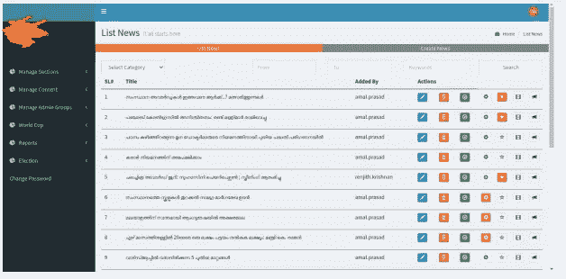
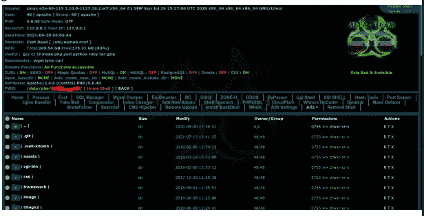

# 我如何黑了一个新闻网站？

> 原文：<https://infosecwriteups.com/how-i-hacked-a-news-website-f753fe2f80f9?source=collection_archive---------1----------------------->

嘿，伙计们，又是我，克里希纳德夫·P·梅勒维拉！！我是一个白手起家的网络爱好者和 Web 应用程序测试者。

在这里，现在我正在写一个当地新闻网站，我是通过一个社交媒体影响者的 Instagram 故事知道这个网站的，我看到他的文章被发布在那个网站上，所以突然从某个地方我想到了一个想法！——*让我们自己动手把我的文章添加到网站上。*

所以我就打开了网站，检查漏洞，我一检查，就发现了一个登录页面。但我 100%确定这不是一个管理员登录面板，它只是一个前端登录。

但是前端登录容易受到 SQL 注入的攻击，我只是打开了 burp 套件，复制了 POST 请求，并在 sqlmap 中利用了它。雅虎！！我得到了完整的数据库。

但是所有的密码都是散列的！我不喜欢解密哈希！

但是等等！！！！我发现了一件有趣的事。那里的许多散列是相同的。这意味着，有两种可能性，1。所有的用户证书都是由同一个人使用相同的密码创建的。有一些共同的密码，所以不止一个用户使用同一个密码

所以现在对我来说会容易些。我刚刚打开了一个在线 MD5 解密器，输入了其中一个哈希值。几秒钟内，我得到了解密后的密码 12345

胜利！！！

现在的问题是，我不知道管理面板的网址。别担心，只要打开 robots.txt，就有了...

快速进入管理面板，输入用户名 admin 和密码 12345

耶！！现在我在新闻管理面板上！！！！

但这并没有结束！我开始了解新闻门户网站上的图片上传功能。是的，只需检查远程代码执行！我尝试在服务器上上传一个 shell，它没有经过任何验证就成功上传了。

在这里我们可以完全访问服务器。现在我可以摧毁整个网站了。但是，作为一个关心网络安全的爱好者，我总是喜欢呆在道德边界内，所以我向网站管理员报告了所有事件和漏洞，他们验证了报告，并在 2 天内修补了报告。

我的 Instagram 手柄:【https://instagram.com/krishnadev_p_melevila】T2

我的推特账号:【https://twitter.com/Krishnadev_P_M T5

我的 LinkedIn 账号:[https://www.linkedin.com/in/krishnadevpmelevila/](https://www.linkedin.com/in/krishnadevpmelevila/)

我的网络安全课程售卖网站:[https://learn.nodeista.com/](https://learn.nodeista.com/)

我的人事网站:[http://krishnadevpmelevila.com/](http://krishnadevpmelevila.com/)