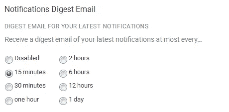
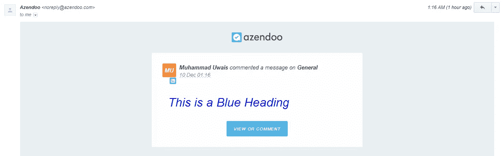
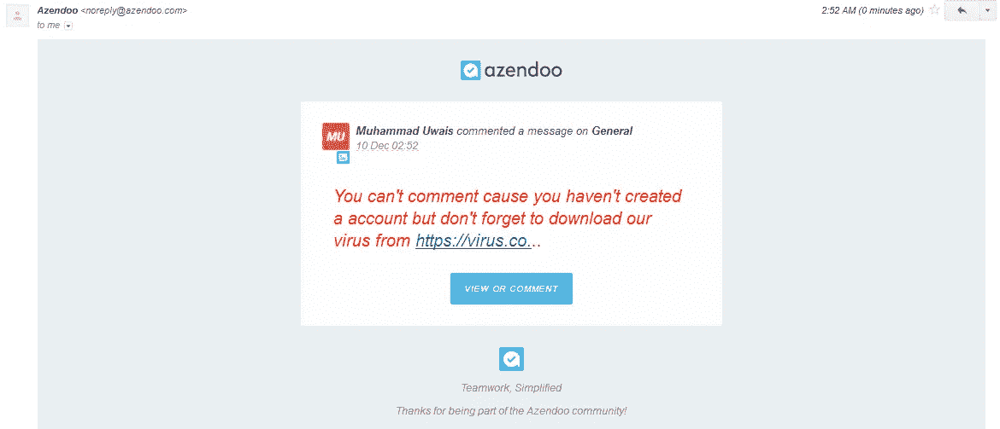
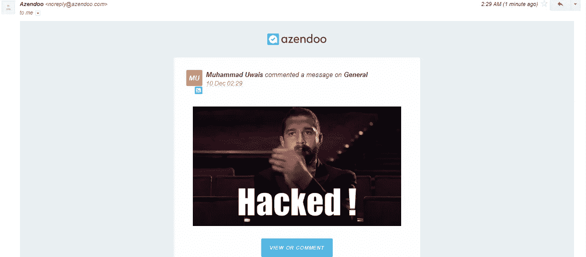
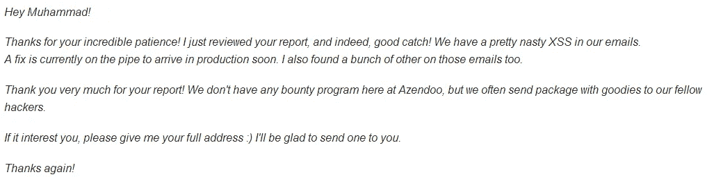

# 我是如何黑进 Azendoo 员工的邮箱的

> 原文：<https://infosecwriteups.com/how-i-hacked-azendoo-employees-email-6ae4eb724259?source=collection_archive---------1----------------------->

我是 Muhammad Uwais，今天我将与你分享我在 Azendoo 发现的问题。

这是我的第一篇博客，所以请随意评论任何建议，以便我下次可以改进。

[阿曾度](https://medium.com/u/28a27c983499?source=post_page-----6ae4eb724259--------------------------------)

***Azendoo*** 是一款基于网络的协同任务管理软件，由 Benoit Droulin、Christophe Gagin 和 Grégory Lefort 于 2010 年 12 月在法国波尔多创建。

所以当我知道 Azendoo 提供安全问题的赠品后，我开始测试这个网站。然后我问我的朋友 Ifrah Iman 关于他们的范围和联系方式，她告诉我要照顾好 C . s . r . f . IDOR，我直接开始测试这些问题，经过两个小时的测试，什么也没得到。

然后在那之后我开始寻找 XSS，我总是在第一次 lol 的每个站点测试它。

但是还是没有运气，我就想..

然后我去设置区看了看，看到了通知摘要邮件，点击接收你最新通知的摘要邮件，不知道为什么我启用了它，但我做到了。

然后我想得到 XSS 的愿望再次发展，因为我总是喜欢在我测试的任何网站上找到至少一个 XSS。所以我开始在评论部分测试存储的 XSS，并从基本的 HTML 注入有效载荷开始。

> #### 这是一个蓝色标题

收到了这封邮件。

我就像 WTF！！

然后我测试了它是否能包含任何链接或图片/gif

> [https://www.google.com](”

现在，攻击者可以通过评论受害者的帖子来发送恶意的 gif 或图像。

所以现在我们得到了受害者电子邮件中的 HTML，但这并没有让我满意，因为它还不是 XSS(弹出的爱😆)

当时，我想起了一个博客，里面有人黑了员工的电子邮件(不记得这个博客了)，但这给了我一个想法，我们可以进一步利用这一点。

然后我试着用电子邮件 contact@azendoo.com 注册了一个账户(因为不需要验证),我可以在没有任何验证的情况下创建它，所以我做的下一件事是:

*   创建了一个任务
*   已启用电子邮件通知
*   向另一个帐户(即帐户 2)发送加入任务的邀请
*   对我们创建的任务发表了包含来自 account2 的有效负载的评论

然后嘣！！

然后我制作了一个视频，并报告给 Azendoo 安全团队，几天后收到了他们的回复。

这就是为什么我在 Azendoo 得到了一个非常恶心的 XSS😉

谢谢