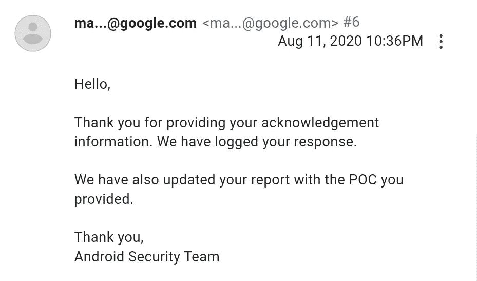
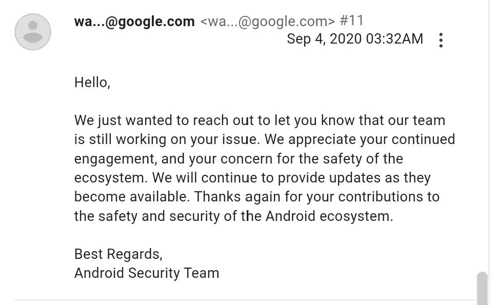
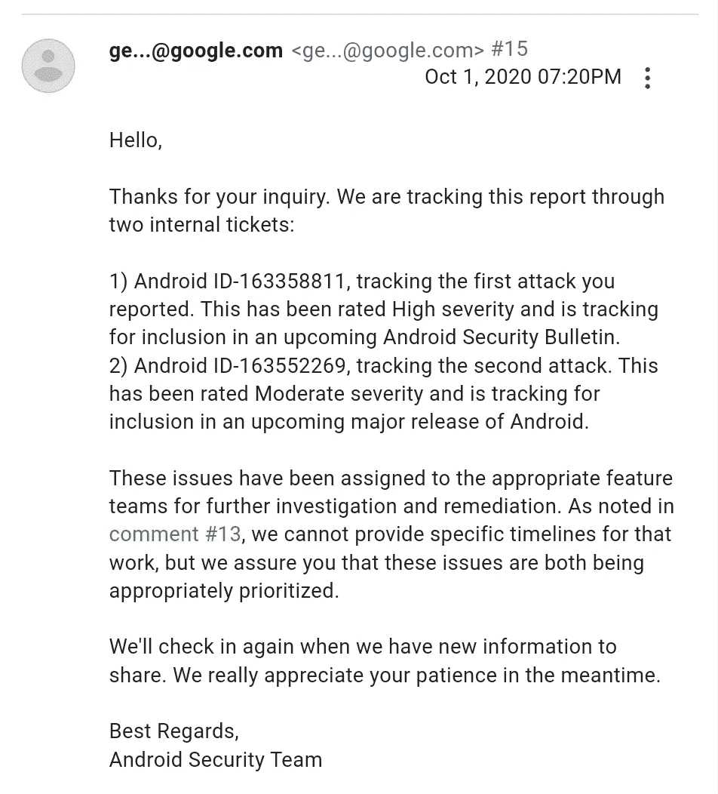
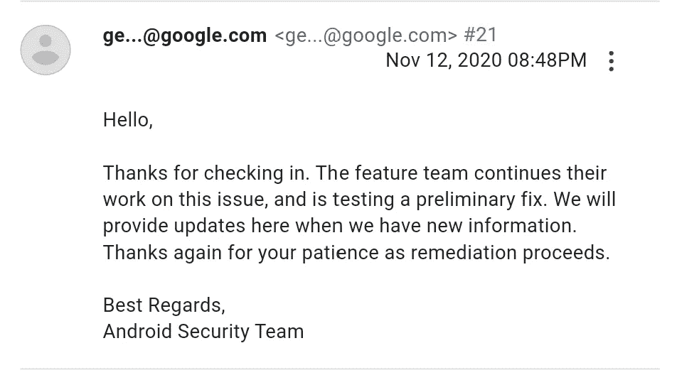
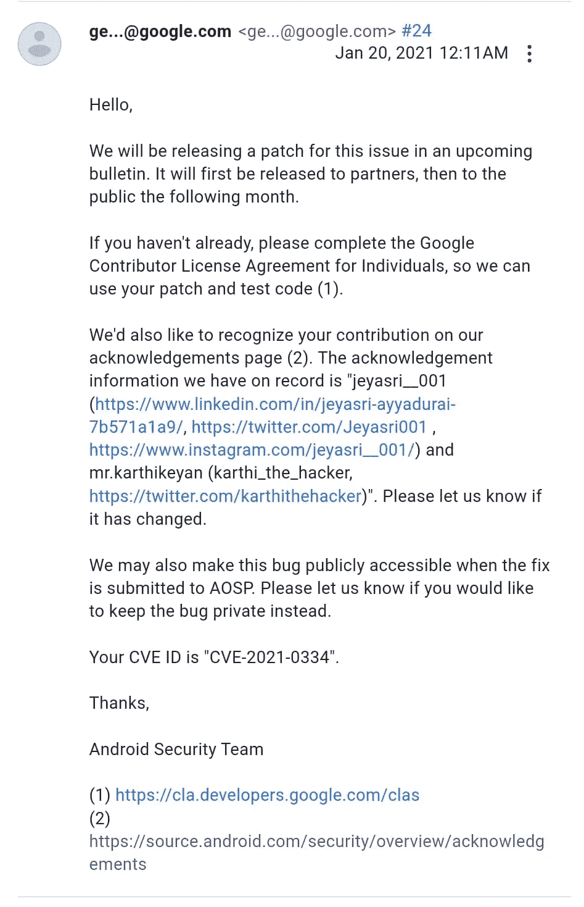
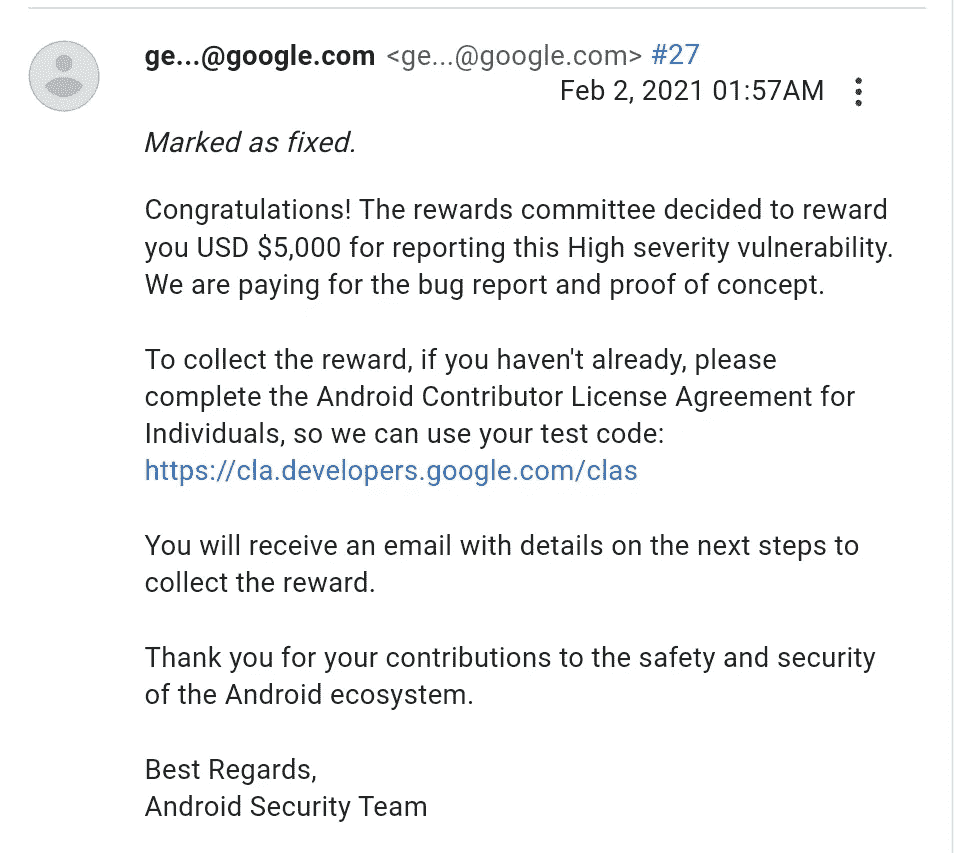
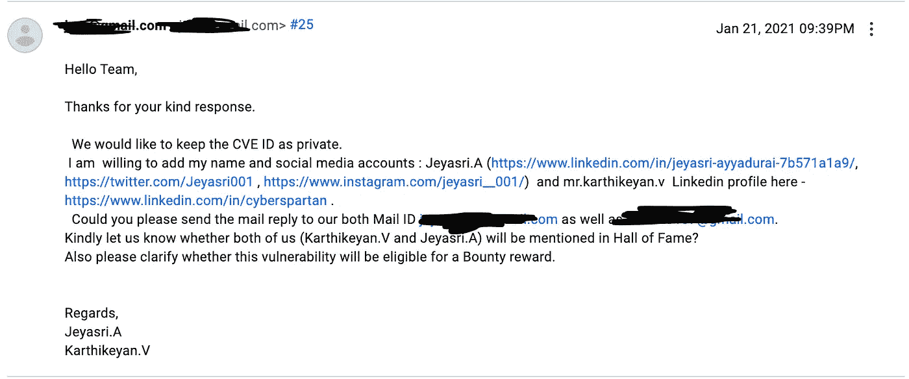

# 我如何黑掉 10 亿安卓用户的社交和第三方账户|一个关于 5000 美元漏洞的故事

> 原文：<https://infosecwriteups.com/how-i-hacked-billion-android-users-social-and-3rd-party-account-a-story-about-5000-bug-c422ca43bd2?source=collection_archive---------0----------------------->

在这篇博客中，我将解释我发现一个漏洞的过程，这个漏洞触发了移动应用程序，从而允许我接管多个帐户。

## **深度链接**

***深度链接是一种将用户直接发送到应用程序而不是网站或商店的链接类型。它们用于将用户直接发送到特定的应用内位置，节省用户自己定位特定页面的时间和精力，从而显著改善用户体验。***

***深度链接通过指定一个自定义 URL 方案(iOS 通用链接)或一个意向 URL(在 Android 设备上)来打开你的应用程序(如果已经安装的话)。还可以设置深层链接，将用户引导至特定的事件或页面，这些链接可能与您想要开展的活动相关联。***

## 攻击

Android 有一个名为 app link 的组件，确切地说，它叫做 deep link，是专门为触发任何移动应用程序而开发的。如前所述，即使应用程序被更新，也有可能被劫持。研究人员如何利用它…当攻击者开发一个应用程序时，他会开发一个深度链接，其次，这个深度链接会触发邪恶的网站。例如，如果今天发布了一个更新，第二天就会发布第二个更新，一群用户会安装并更新它。无论你在这里给什么，它都会被加载到深度链接应用程序中。你知道，如果你重置密码，链接将被发送给攻击者，他可以窃取令牌，他可以做任何他想做的事情，所以这是一个场景。

研究人员开发了带有深度链接劫持有效载荷的恶意软件，以利用任何深度链接集成的 android 应用程序。

**步骤:**

1.  研究人员用自己的深度链接劫持有效载荷开发恶意软件。在这种情况下，他然后在他自己的深层链接上测试它(深层链接:[https://cappriciosec.com)](https://cappriciosec.com))。

2.每当用户单击此链接时，都会出现一个提示，要求选择其中一个。其中一个选项选择“*只是一次* ”或者另一个选项“*总是*”。

3.当用户点击选项“ *ALWAYS* ”时，恶意软件打开，每当他/她点击链接时，它就会自动触发。这是基本机制。

4.研究人员修改了恶意软件，在第一个案例中，他编程的方式是只触发 cappriciosec.com，然后他添加了一个额外的有效载荷，可以触发任何应用程序链接

5.现在，研究人员在 google play 商店发布了一个更新，用户将获得一个更新，用户将更新它

6.更新后，应用程序恶意软件功能将发生变化，因为研究人员更新了恶意软件中的新有效载荷。正如我们已经知道的，用户已经允许访问，这反过来触发了恶意软件。每当用户单击 Cappriciosec 链接时。

现在，如果用户打开任何链接，它将自动触发恶意软件，弹出窗口将永远不会要求选择“只一次”或“总是”。

**为什么它易受攻击？**

前面提到用户允许打开 cappriciosec.com，但是更新后，任何链接都可以处理，没有弹出窗口出现。这一切都是在用户不知情的情况下发生的，因此这是易受攻击的部分。

**冲击**

没有更新，就有可能注入有效载荷。最大的影响是，它很容易绕过验证，如双因素认证，电子邮件验证码或令牌，密码重置链接或令牌，帐户凭证，等等..任何与网络相关的东西都很容易被劫持。但要做到这一点，它不需要用户认证，只需一个代码就可以做到这一点，任何 HTTP 相关的东西都可以很容易地被这种类型的漏洞劫持

> **被**发现的漏洞:——karthithehacker([Karthikeyan。V](https://medium.com/u/a14784d94f2c?source=post_page-----c422ca43bd2--------------------------------)
> 
> **合作完成&报告撰写:-**[**jeyasri**](https://www.linkedin.com/in/jeyasri-a-7b571a1a9/)**。答(耶亚斯里** __001)

**时间线**

> **向 android 操作系统安全团队报告:**日期:2020 年 8 月 7 日 12:11PM
> 
> **创作期**:2020 年 8 月 10 日晚上 11:37
> 
> **指定日期**:2020 年 8 月 11 日上午 10:42

> 更新更多

> **固定日期**:2021 年 2 月 2 日凌晨 1:57
> 
> 致谢:-[https://source.android.com/s/results/?q=jeyasri](https://source.android.com/s/results/?q=jeyasri)
> 
> **奖励日期**:2021 年 2 月 2 日凌晨 1 点 57 分
> 
> **奖励**:5000 美元

## 注意:-

我们已经要求 android 安全团队对该 CVE 进行保密，因此我们不能公开有效载荷、恶意软件源代码和概念验证视频

**-谢谢**

作者:- [艾格尼丝·鲁莎莉娅](https://www.linkedin.com/in/agnes-rusaliya-3b18481b7/)