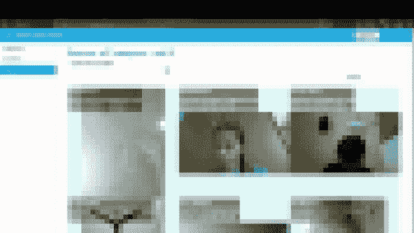
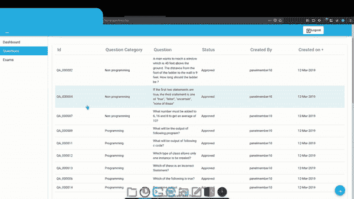

# 我是如何入侵一个考试门户网站，并获得包括网络摄像头在内的 10K+用户数据的

> 原文：<https://infosecwriteups.com/how-i-hacked-exam-portal-and-got-access-to-10k-users-data-including-webcams-ec2262b43df7?source=collection_archive---------0----------------------->

> 大家好，我是 Faique，一名安全研究员和一名 bug 赏金猎人，我欢迎你们来看我几个月前写的一个黑客故事，起初我想不分享它，因为这很容易找到，我也没有从他们那里得到赏金，但后来又想分享它，因为 infosec 社区教会了我这么多，现在我有责任回馈社区。所以，请务必跟随我，享受这篇文章

我开始在目标上狩猎，是因为我哥哥开玩笑地让我黑它，因为他想通过考试。我不能透露目标的名字，所以我称之为**redacted.com。**

我做了基本的侦查，比如收集子域，但我什么也没找到。所以我想到了关注主域而不是子域。

redacted.com 的**有登录功能，这样学生就可以登录并进行考试。**

我没有任何可以用来测试漏洞的凭证。所以在浏览目标时，我看到了 https://redacted.com/login 的登录网址，

我将 url 的结尾从登录改为注册[https://redacted.com/register](https://redacted.com/login)并发送请求，猜猜发生了什么，我被重定向到管理注册页面。

然后，我将自己注册为管理员，然后登录。我看到了学生登录信息等敏感数据，包括电子邮件、电话号码和网络摄像头图像。我没想到网络摄像头的图像，学生的图像被点击每 5 分钟。

不仅如此，我还能看到问题的正确答案，并能编辑它

这是一个容易的发现，但影响是至关重要的。我报告了他们，他们确实修好了，但没有承认。

## 谢谢你读到这里，我希望你喜欢并学到了新的东西。如果你喜欢，一定要鼓掌，并检查我以前的文章。如果你有任何疑问，请随时给我发短信

## 跟我来

## 推特:[https://twitter.com/imfaiqu3](https://twitter.com/imfaiqu3)

## insta gram:[https://www.instagram.com/faique.exe/](https://www.instagram.com/faique.exe/)

## 领英:[https://www.linkedin.com/in/faiqu3/](https://www.linkedin.com/in/faiqu3/)

## 来自 Infosec 的报道:Infosec 每天都有很多内容，很难跟上。[加入我们的每周简讯](https://weekly.infosecwriteups.com/)以 5 篇文章、4 个线程、3 个视频、2 个 Github Repos 和工具以及 1 个工作提醒的形式免费获取所有最新的 Infosec 趋势！