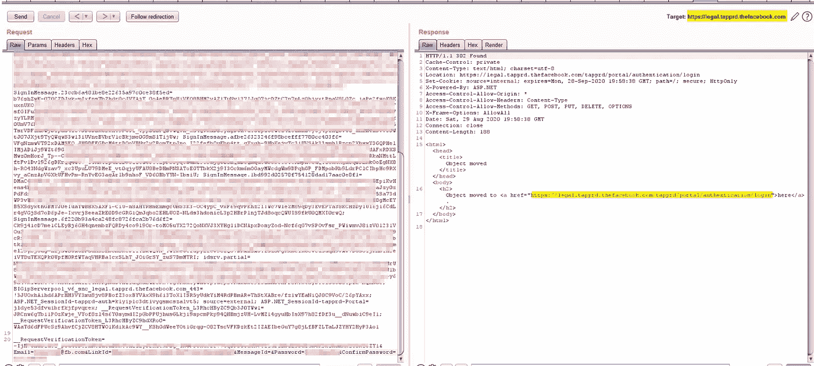
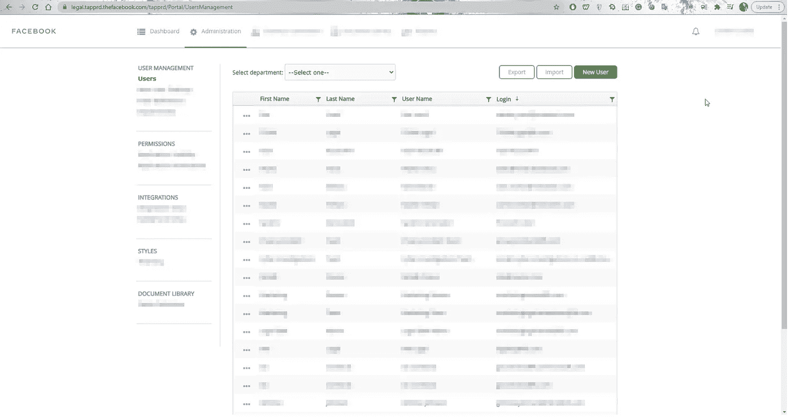
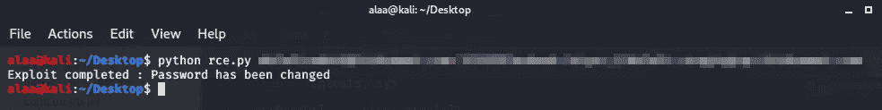
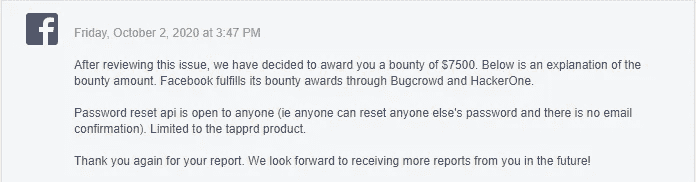

# 我如何黑脸书:第一部分

> 原文：<https://infosecwriteups.com/how-i-hacked-facebook-part-one-282bbb125a5d?source=collection_archive---------0----------------------->

我们从三月份开始就在疫情了，一旦疫情开始，我就有了大量的空闲时间，我需要明智地利用这些时间，所以我决定参加 OSWE 认证，并在 8 月 8 日完成了考试，之后，我花了几周时间从 OSWE 考试中恢复过来，然后在 9 月的地中海，我说你知道吗？我没有像每年一样在 2020 年的脸书名人堂登记我的名字。好吧，我们开始吧。

我从来没有在脸书的子域名中发现漏洞，我看了一些文章，我在脸书的一个子域名中看到一篇文章，这引起了我的注意，这是一篇很棒的文章，你可以去看看[【HTML 到 PDF 转换器的错误导致了脸书服务器中的 RCE。]](https://ysamm.com/?p=280)

所以在读完这篇文章后，我有了一个好主意，我可以在这样一个巨大的 web 应用程序中找到多少漏洞。

所以我的主要目标是 https://legal.tapprd.thefacebook.com 的[](https://legal.tapprd.thefacebook.com)**，我的目标是 RCE 或者类似的地方。**

**我运行了一些模糊工具，只是为了获得这个 web 应用程序的完整端点，我睡了 2 个小时，看了一部电影，然后我回来看结果，好的，我得到了一些好的结果。**

****发现带有 403 响应的 Dirs:****

```
Dirs found with a 403 response:/tapprd/
/tapprd/content/
/tapprd/services/
/tapprd/Content/
/tapprd/api/
/tapprd/Services/
/tapprd/temp/
/tapprd/logs/
/tapprd/logs/portal/
/tapprd/logs/api/
/tapprd/certificates/
/tapprd/logs/auth/
/tapprd/logs/Portal/
/tapprd/API/
/tapprd/webroot/
/tapprd/logs/API/
/tapprd/certificates/sso/
/tapprd/callback/
/tapprd/logs/callback/
/tapprd/Webroot/
/tapprd/certificates/dkim/
/tapprd/SERVICES/
```

**好的，我认为这个结果足以支持我之前关于这个应用程序有多大的理论，然后我开始阅读 javascript 文件，看看这个网站是如何工作的，它使用了什么方法..等等**

**我注意到了一种绕过重定向进入登录 SSO 的方法，[https://legal . tap prd . the face book . com/tap prd/portal/authentic ation/log in](https://legal.tapprd.thefacebook.com/tapprd/portal/authentication/login)在分析登录页面后，我注意到了这个端点**

****/tap prd/auth/identity/user/forgot password****

**在对用户端点做了一些模糊处理之后，我注意到了另一个端点，它的 **/savepassword** ，它正在等待一个 POST 请求，然后在阅读了 javascript 文件之后，我知道了页面是如何工作的，应该有一个生成的令牌和 xsrf 令牌..等等，我第一次想到的想法好吧，让我们测试一下，看看它是否可行。我试图使用 burp suite 手动更改，但我得到了一个错误，错误*是执行此操作失败*。**

**我说好吧，这可能是因为邮件错了什么的？让我们得到一个管理电子邮件，然后我开始把随机的电子邮件放在一个列表中来制作一个单词表，之后，我使用入侵者，我说让我们看看会发生什么。**

**我回来几个小时后，我发现同样的错误结果加上一个其他的结果，这是 302 重定向到登录页面，我说哇，我会被诅咒，如果这工作哈哈。**

**让我们回头看看我在这里做了什么，我使用带有 CSRF 令牌的入侵者和带有新密码的随机电子邮件向该端点 ***/savepassword*** 发送随机请求**

**结果之一是 302 重定向。**

****

****现在，我进入登录页面，输入登录电子邮件和新密码，然后我成功登录到应用程序中，我可以进入管理面板:)****

****

**我读了在使用 PDF 之前发现 RCE 的黑客报告，他们给了他 1000 美元的奖励，所以我说好吧，让我们在这里产生良好的影响和完美的利用。**

**我用 python 写了一个快速简单的脚本来利用这个漏洞。你输入电子邮件和新密码，脚本就会改变密码。**

****

****此处的影响如此之大，因为脸书的员工过去常常使用他们的工作场所帐户登录，这意味着他们使用他们的脸书帐户访问令牌，如果另一个攻击者想要利用这一点，他就有可能获得访问一些脸书员工帐户的权限..etc****

**然后我报告了漏洞，报告进行了分类。**

**10 月 2 日，我收到了 7500 美元的赏金**

****

**我非常喜欢利用这个漏洞，所以我说这还不够，这是一个脆弱的脚本！让我们越挖越多。**

**我在同一个应用程序上又发现了两个漏洞，但是我们将在第二部分的文章中讨论其他漏洞:)**

**你可以在我的网站上看到这篇文章:[https://alaa.blog/2020/12/how-i-hacked-facebook-part-one/](https://alaa.blog/2020/12/how-i-hacked-facebook-part-one/)**

**你可以在推特上关注我:[https://twitter.com/alaa0x2](https://twitter.com/alaa0x2)**

**干杯。**