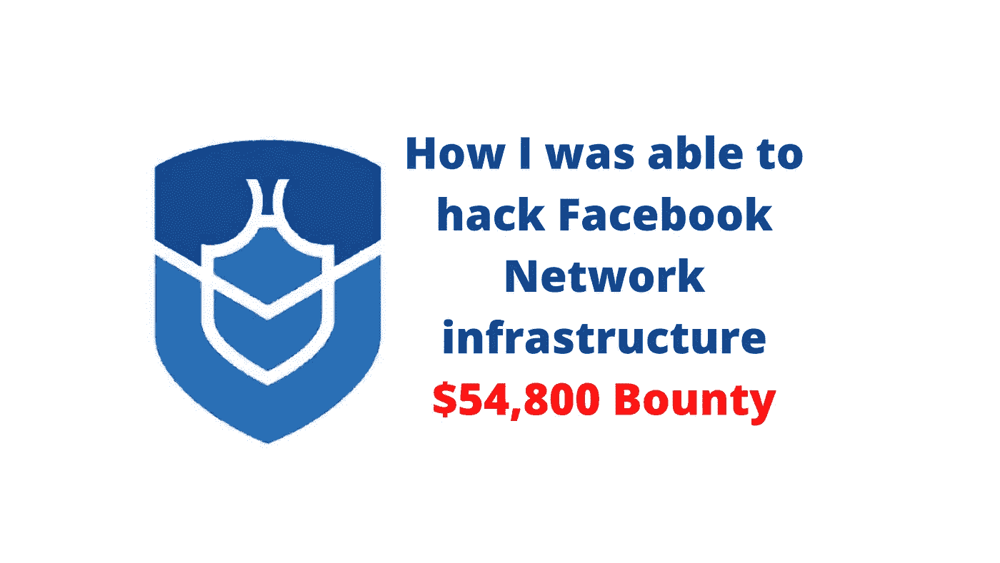
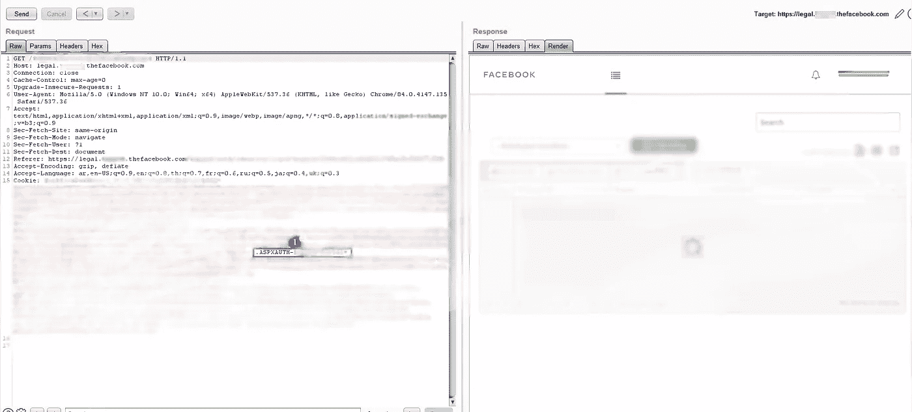
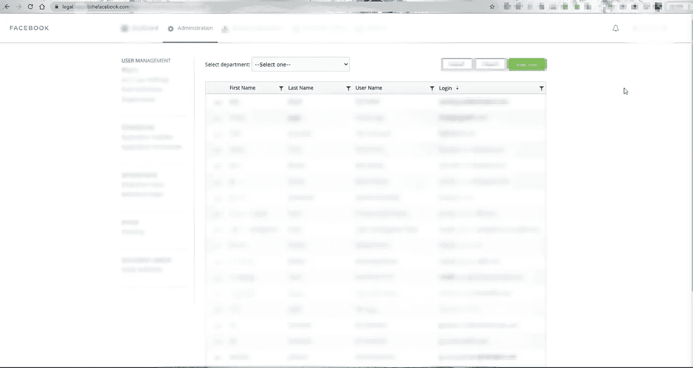
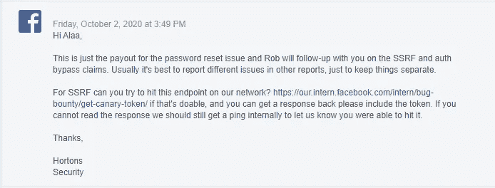
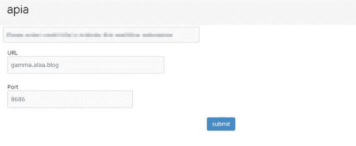
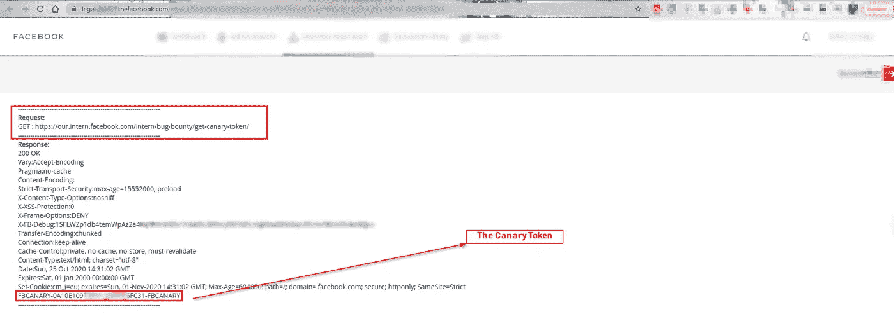
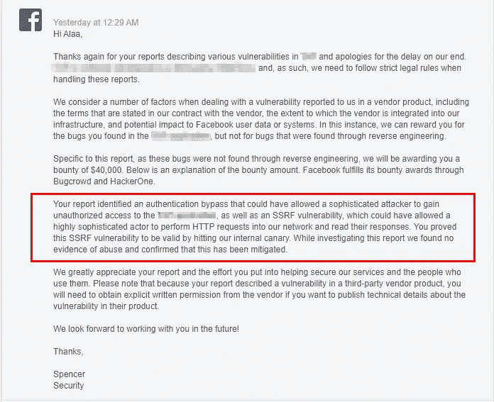
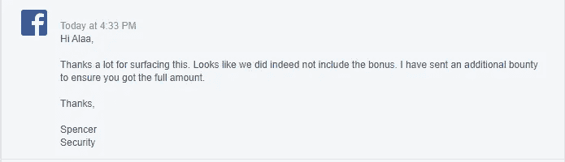
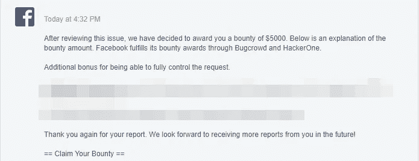

# 我如何黑脸书:第二部分

> 原文：<https://infosecwriteups.com/how-i-hacked-facebook-part-two-ffab96d57b19?source=collection_archive---------0----------------------->

**描述:**这是**我如何黑掉脸书**的第二部分也是最后一部分你可以在这里找到第一部分[我如何黑掉脸书:第一部分](/how-i-hacked-facebook-part-one-282bbb125a5d)。

我强烈推荐阅读**第一部**来理解故事情节。

在第一部分中，我发现帐户被不安全的 API 接管，它允许我在没有用户交互的情况下更改任何管理员帐户的密码，我得到了脸书安全团队的奖励 **7500 美元**，在第二部分中，我发现了使用 cookies 操纵的帐户接管，并将其与内部的 [**SSRF**](https://portswigger.net/web-security/ssrf) 链接起来，我得到了奖励 **$xxxxx** 是 5 位数的奖金..我们开始吧。

> 这篇文章在发布之前已经被多方修改过，我也必须得到书面许可才能发布，所以一些名字和信息可能会根据脸书及其合作伙伴的要求进行修改。

因此，当我发现第一部分中的第一个漏洞时，脸书在报告了一天之后就缓解了它..然后，我不得不回去阅读打嗝组曲的历史，看看事情是如何运作的。

正如你在截图中看到的，蓝色的数字 1，这个 cookies 是它的 **ASPXAUTH，**绝对是的！。

你明白我的意思吗？— **ASPXAUTH** 表示 80%的漏洞，但首先，您需要几样东西:

*   `**validationKey**`(字符串):用于签名验证的十六进制编码的密钥。
*   `**decryptionMethod**`(字符串):(默认为“AES”)。
*   `**decryptionIV**`(字符串):十六进制编码的初始化向量(默认为零的向量)。
*   `**decryptionKey**`(字符串):用于解密的十六进制编码的密钥。

你可以在这里读到更多的内容: [**MachineKey 类**](https://docs.microsoft.com/en-us/dotnet/api/system.web.security.machinekey?view=netframework-4.8)

好吧，我没有这四样东西，所以我怎么能假设它是易受攻击的呢？好吧。实际上，我没有，但是大多数使用 ASPXAUTH 的应用程序只使用电子邮件或用户在加密的 cookies 中的加密密钥和过期时间。我以前在其他赏金项目网站上用同样的方法开发过很多次，而且很有效。

所以在这里，我必须找到一种方法来绕过这一点，我相信尝试不会有什么损失，之后，我继续到谷歌搜索其他利用相同应用程序的网站——我在这里假设我会很幸运，找到一个利用相同应用程序和相同加密密钥的网站，我只需要使用正确的管理员用户名。

我这样做了，我发现另一个网站使用相同的应用程序，注册是活跃的，我使用脸书管理员使用的用户名注册，我拦截了请求，并使用了 **ASPXAUTH** 并替换为脸书过期的 **ASPXAUTH** ，你猜怎么着？

我有段时间很想念这个面板:)..但是没错。我又回到了这个话题，现在让我们来谈谈 ASP.net**的错误，大多数开发者在构建他们的应用程序时必须小心，根据这几点来保护它……**

*   ASPXAUTH 必须存储在数据库中，应用程序必须检查它是否有效。
*   **ASPXAUTH** 有时必须包含不止用户名作为进一步验证。
*   不同站点的加密和解密密钥必须不同(必须更改默认密钥)。

**结论 1** :只要知道用户名，我就可以使用任何管理员帐户登录，我认为这个漏洞的复杂性很低**，影响很大**，**如果我只报告这个漏洞，我将获得第一部分的 **$7500** ，但我想要更多。**

**所以我刚刚注意到面板中有一个选项是制作表单，还有一个选项是 **API 触发器**。因此，我怀疑一些事情，主要是这里有一个**没有任何限制，据此我给脸书安全团队写了一封邮件，向他们解释了我的怀疑，在应用程序中几乎肯定有关键的**，如果我能得到许可来测试它，他们回答我:******

************

******在这一点上，我仍然在第一部分(帐户接管)的报告中与他们联系，因为这些漏洞是在第一个漏洞后一周报告的。正如你所见，脸书安全团队仍然认为我声称我有另一个认证旁路和 SSRF，即使我用证据向他们解释了漏洞。根据这一点，这意味着他们给我开了绿灯来测试 [**SSRF。**](https://portswigger.net/web-security/ssrf)******

****过了一会儿，我写了一个小脚本，并上传到他们的编辑器，脚本允许我发送任何请求，我想要任何数据( **GET，POST，PUT，PATCH，HEAD，OPTIONS** )到任何 URL — **内部**或/和**外部**。****

********

****从脚本后端，我能够改变请求方法和发送的数据等****

****在这一点上，我能够将这个漏洞升级到 LFI RCE**如果我再深入一点，也许(*我对这一点真的不是 100%确定，我后来请求脸书允许我对应用程序进行反向工程，但他们没有接受，他们认为我不能升级它*)。******

******我试着打脸书金丝雀脚本:)，再猜猜是什么？******

************

******我得到了我的幸运金丝雀令牌，接下来呢？—我必须做一份新的报告，包括他们之前提到的脚本和概念验证的全部细节。******

********结论 2:** 通过编写一个发送定制请求的脚本，我能够获得一个内部**SSRF，并获得对脸书内部网络的访问权，这里的复杂性我认为很低，影响是**关键的**。********

> *****这次 SSRF 的全面冲击:*****
> 
> *****成功的 SSRF 攻击通常会导致对脸书内部网络中的数据进行未经授权的操作或访问，可能是在易受攻击的应用程序本身中，也可能是在该应用程序可以与之通信的其他后端系统上。在某些情况下，SSRF 漏洞可能允许攻击者执行* [*任意命令执行*](https://portswigger.net/web-security/os-command-injection) *。*****
> 
> *****导致连接到外部第三方系统的 SSRF 漏洞可能会导致看似来自托管易受攻击应用程序的组织的恶意后续攻击，从而导致潜在的法律责任和声誉损害。*****

****。有关 SSRF 漏洞的更多信息，请查看来自 [portswigger 的这篇文章。](https://portswigger.net/web-security/ssrf)****

******最终结论:**我将两个漏洞链接到一个点，这个点正在访问脸书内部网络( [SSRF](https://portswigger.net/web-security/ssrf) )，通过使用账户接管来访问我在应用程序中上传的脚本，它将根据我的需要发送定制的请求。****

****让我们来谈谈通过使用我到目前为止发现的漏洞链，我能够实现什么:****

*   ******我可以在法律部门面板中访问任何脸书员工的账户。******
*   ****我不需要解释攻击者在登录后会发现什么样的有趣信息。****
*   ******我可以使用 SSRF 访问脸书内部网络(intern.our.facebook.com)。******
*   ******再努力一点，我相信我能够升级这个漏洞，并利用它来扫描内部网络/服务器。******

****我们都知道[**【SSRF】**](https://portswigger.net/web-security/ssrf)有多关键，尤其是它没有速率限制，我可以很容易地编辑 [**内容类型**](https://www.geeksforgeeks.org/http-headers-content-type/) 和请求方法，正如脸书 [**支付指南**](https://www.facebook.com/whitehat/payout_guidelines/ssrf) 所说，如果我能够编辑请求[，这个漏洞应该得到奖金 **$40，000****$ 5000**](https://www.geeksforgeeks.org/http-headers-content-type/)****

****经过长时间的等待，我刚刚从脸书得到这个消息:****

********

****获得脸书**奖励 4 万美元**外加**2000 美元**奖金(应该是**7000 美元** lol)****

****所以我问他们为什么我没有得到完全控制奖金( **$5000** )，答案是:****

****************

****第一个漏洞的总金额为 **$54，800******

****我在第一部分的漏洞几天后报告了这个漏洞。****

****报告时间线:****

*   ******2020 年 9 月 9 日，星期三—漏洞报告。******
*   ******2020 年 10 月 26 日星期一**——**脸书让我打开一份新报告。~应用缓解。******
*   ******2020 年 10 月 26 日，星期一——报道开庭。******
*   ******2021 年 2 月 25 日，星期四——固定奖励。** ~ ***6 个月我认识 lol。*******
*   ******2021 年 3 月 5 日星期五——奖励 5300 美元奖金。******

****我想给 bug 猎人一个**黄金**提示，总是当你看到 **ASPXAUTH** 试图从另一个使用相同应用程序的网站获取 cookies，并测试我使用的相同方法时:****

*   ****从其他网站创建新的**aspx auth**cookie。****
*   ****测试 cookies 是否能在您的目标网站上运行。****

****我很喜欢这样，但等待了 6 个月，因为不合理的原因关闭了报告，我非常感激，但所有这些都很努力，这不是我发现的唯一的 SSRF，实际上，我发现了更多有趣的，但脸书关闭了它们，因为脸书与供应商签署了一份协议，这是在报告被分类后几周签署的，这实际上不是我的问题，所以无论如何我不会称之为最好的体验。****

****这是最后一部分，如果有任何不清楚的地方，我很抱歉。如前所述，我推迟了提供第二部分的时间，我等待了一段时间的书面许可，报告得到了修改，所以很多东西被删除或模糊，以保持其他各方的隐私。****

****你可以在推特上关注我，了解更多的文章和建议:[https://twitter.com/alaa0x2](https://twitter.com/alaa0x2)****

****你可以在我的个人博客上查看评论:****

****[https://alaa.blog/2021/02/how-i-hacked-facebook-part-two/](https://alaa.blog/2021/02/how-i-hacked-facebook-part-two/)****

******干杯。******