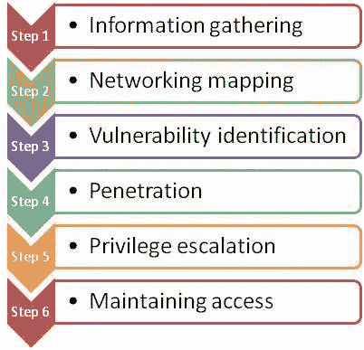
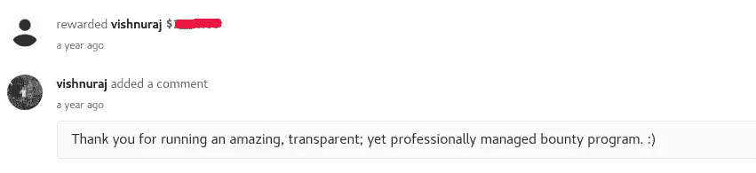

# 我是如何黑进人群的？公共程序

> 原文：<https://infosecwriteups.com/how-i-hacked-into-a-bugcrowd-public-program-fcfdd4fb1b69?source=collection_archive---------1----------------------->

向所有读者问好，

这篇文章是关于一个远程代码执行的，我是在 bugcrowd 上一个收费最高的公共程序中发现的。当然，出于隐私的考虑，我们不会透露这个项目的名字，所以我们称它为 site.com

网络安全先锋强调，如果你想黑掉一个目标，无论是网站、移动应用还是物联网设备，你都应该遵循六步法。

这是大多数研究人员和虫子赏金猎人没能遵循的。每一次黑客攻击都必须通过这种方法来执行，否则成功的几率会大大降低。这篇文章讲述了我遵循这个简单的方法

**第一步:信息收集**

首先，我参观了 Bugcrowd 项目

我看到他们的范围很广*.site.com

**第二步:网络映射**

接下来，我使用 [knockpy](https://github.com/guelfoweb/knock) 工具在这台主机上寻找子域

从这个工具中发现了一些未使用的子域名，这让我缩小了搜索范围，特别是 utils.site.com

**第三步:漏洞识别**

我在上面做了一个简单的端口扫描，显示使用 JBoss 作为版本 4

我发现该版本中存在一个远程代码执行漏洞

**第 4 步:穿透**

接下来，我使用 [jexboss](https://github.com/joaomatosf/jexboss) 工具来测试漏洞是否有效

和

我从 exploit-db 下载了可执行的漏洞利用文件，并执行了被利用的:)

这些年来我学到的一件事是，如果一个应用程序经过了彻底的测试，并且完全专注于某个方面，那么总会有一些东西可以找到，我们只需要愿意更深入地研究它

感谢[沙米尔](https://www.facebook.com/Shahmeer.1994):)