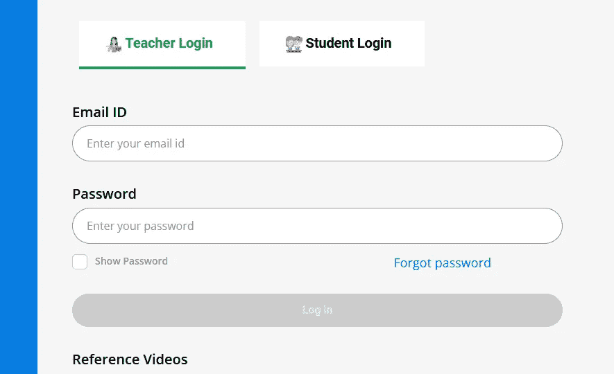
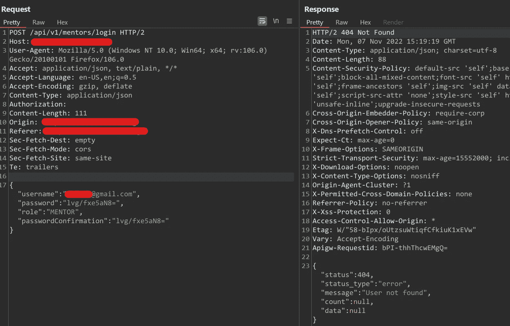
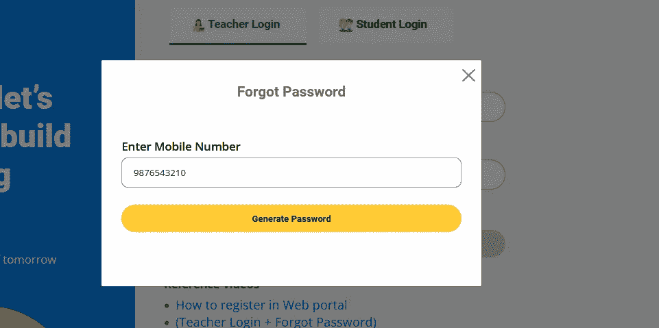
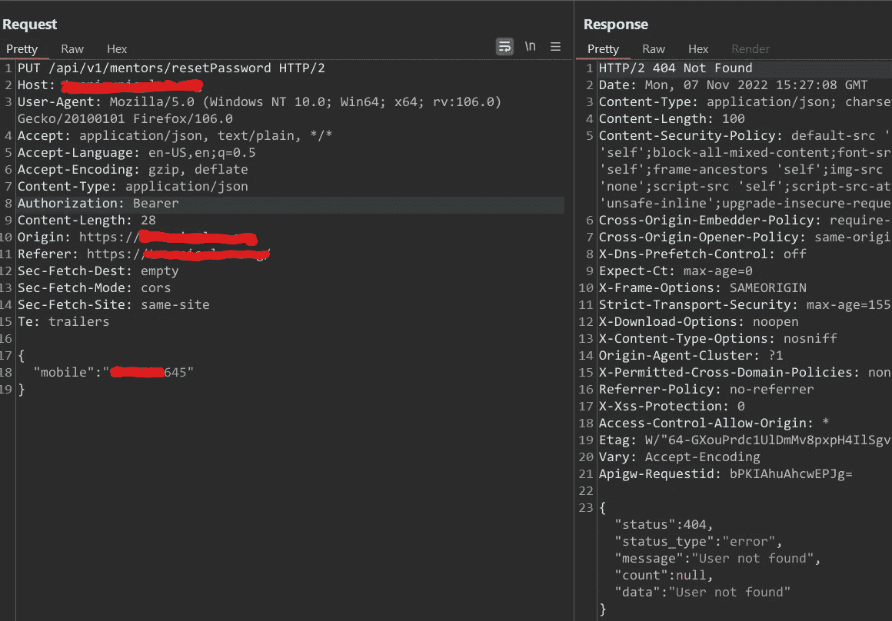
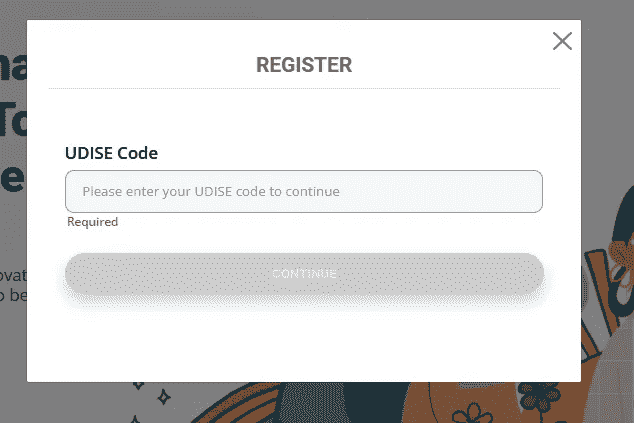
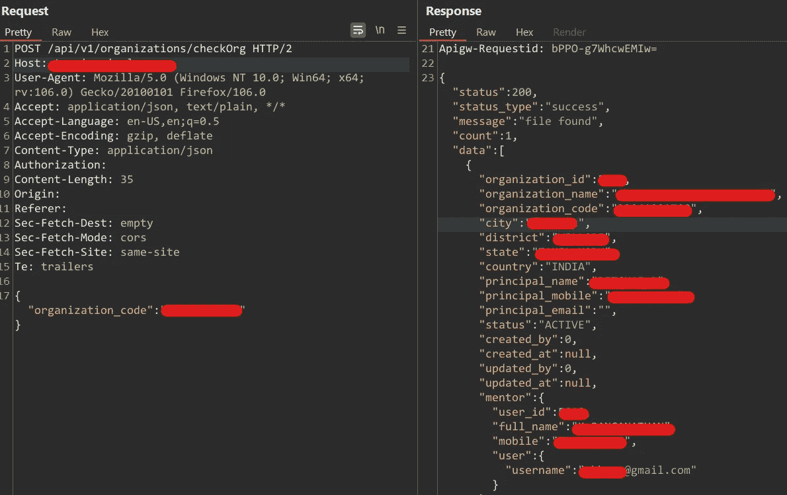
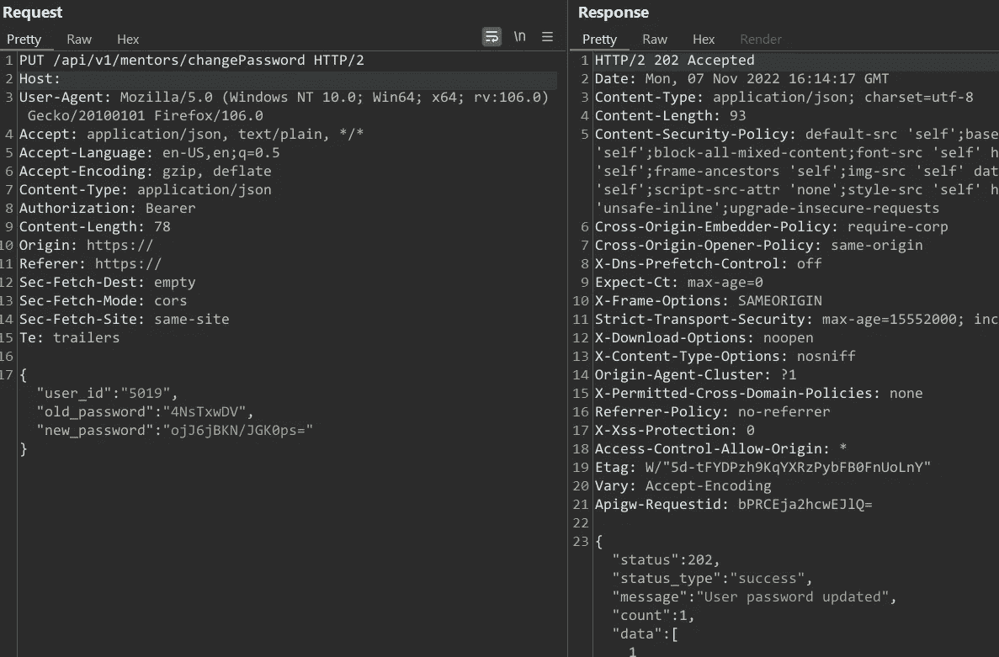

# 我是如何侵入一个政府电子学习网站的

> 原文：<https://infosecwriteups.com/how-i-hacked-into-a-government-e-learning-website-ce8da8fb4ccc?source=collection_archive---------2----------------------->

## 日期:2022 年 7 月 11 日

## **WHOAMI**

我叫 Ganesh Kumar AKA iamgk808，是一名网络安全爱好者和 bug 猎人。手柄— [推特](https://twitter.com/iamgk808)、 [Linkedin](https://www.linkedin.com/in/iamgk808/)

## **让故事开始**

一天，我父亲让我登录一个政府电子学习网站，完成一些要求所有教师在两天内完成的任务，于是我登录了父亲的账户&完成了这些任务。

后来，我父亲的朋友也想完成任务，所以他给了我电子邮件 ID 和密码，我试图用凭据登录，但它显示“输入正确的凭据”，然后我问他凭据是否正确，他告诉我，他没有创建帐户，其他人用错误的信息为他创建了帐户。

所以我得想办法登陆账号！！！

## 目标:登录政府电子学习网站，完成任务

> **父亲的朋友给出的详细信息:**
> 邮箱 id-######@gmail.com
> 密码- #######(错误)
> 手机号- ########(错误)
> 密码- ########

# 尝试-1

## 注册

用给定的邮箱 id 和密码尝试登录，UI 显示“**输入正确的凭证**

burp suite 响应显示“找不到用户”，我认为电子邮件 id 和密码都不正确，所以这次尝试失败

# 尝试-2

## 密码重置

所以我试图重置密码，但它要求的是手机号码，而不是电子邮件 id，然后我输入手机号码，用户界面显示“哎呀，出错了”。

burp suite 响应显示“未找到用户”，因此手机号码也不正确，因此这一尝试也失败了

# 尝试-3

## 注册

要求输入 UDISE 代码(为学校注册帐户提供的代码)，输入代码后，UI 显示“另一名教师已在给定学校注册”。

幸运的是，他们给出了正确的代码。burp suite 响应显示完整的详细信息，如电子邮件、用户 id、手机号码等...

从这次尝试 3 中，我们获得了有用的信息，如电子邮件、手机号码和用户 id。

用这个手机号码，我尝试了尝试 2(密码重置)，并且 OTP 已经发送成功，我问我父亲的朋友他是否得到了 OTP，他说他没有得到 OTP，所以我问这个手机号码是不是你的，他说这是别人的号码，不是他的号码。

所以这里唯一的方法是打电话给未知号码，并要求一次性密码，但这实际上是不可能的。

# 尝试-4

我想到了一个主意，于是我用我父亲的有效凭证登录，并检查任何功能或更改密码的请求。

幸运的是，我发现了一个密码重置请求，只需要一个有效的用户 id，不检查旧密码，从尝试 3 我已经得到了用户 id，所以我成功地更改了密码。

**注**:如果有人知道用什么加密法对下面的密码评论进行编码。

# 已达到目标:)

最后登录了账号，完成了任务。

## 在此过程中发现的错误:

1.  IDOR —能够更改任何人的密码(关键)
2.  IDOR —能够通过简单地更改 id 值来查看其他教师的 P1 信息(关键)
3.  IDOR —能够通过简单地更改 id 值来查看其他学生的 P1 信息(关键)

## 来自 Infosec 的报道:Infosec 每天都有很多内容，很难跟上。[加入我们的每周简讯](https://weekly.infosecwriteups.com/)以 5 篇文章、4 个线程、3 个视频、2 个 GitHub Repos 和工具以及 1 个工作提醒的形式免费获取所有最新的 Infosec 趋势！