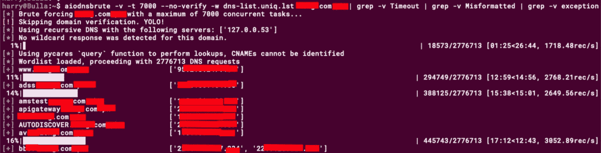
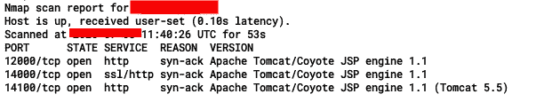
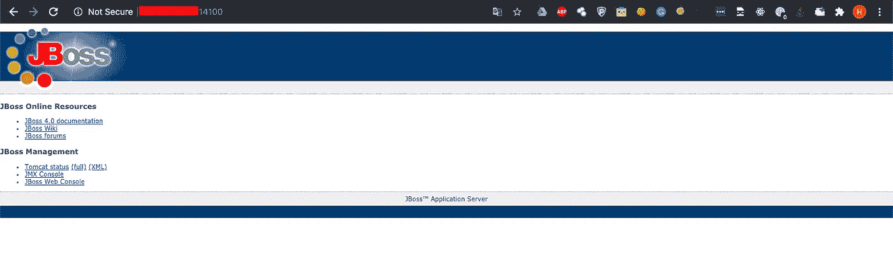
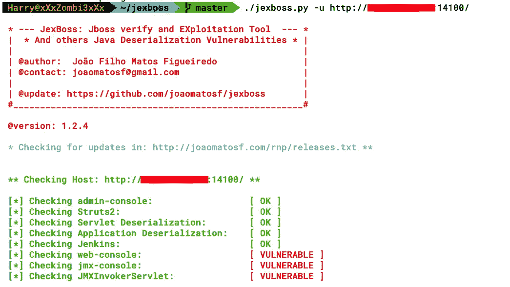
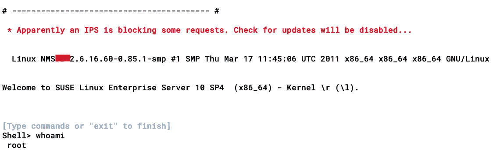
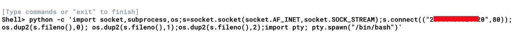
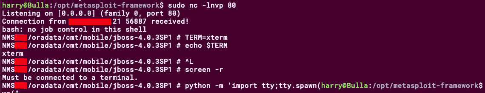

# 我是如何侵入电信网络的——第一部分(获得 RCE)

> 原文：<https://infosecwriteups.com/how-i-hacked-into-a-telecom-network-part-1-getting-the-rce-167c2bb320e6?source=collection_archive---------0----------------------->

> *TLDR；一家电信公司的红队项目。在公司的网络监控系统(NMS)上获得了立足点。通过 HTTP 隧道传输 SSH 的反向外壳问题已排序。当通过 HTTP 获得 SSH 时变成了完全忍者。在网络内部代理以获取内部网络扫描。使用 SS7 应用程序访问 CDRs 和 VLR。*

大家好，这是我在 Medium 上的第一篇帖子，我希望你们喜欢看！由于这些信息的敏感性，我不得不编辑很多信息。(我提前道歉😅)

有关详细信息，您可以查看以下链接:
[***第 2 部分—玩隧道:TCP 隧道***](https://medium.com/bugbountywriteup/how-i-hacked-into-a-telecom-network-part-2-playing-with-tunnels-tcp-tunneling-b4cef2837938) [***第 3 部分—玩隧道:隐形 SSH &动态 SSH 隧道***](https://medium.com/bugbountywriteup/how-i-hacked-into-a-telecom-network-part-3-playing-with-tunnels-stealthy-ssh-dynamic-tunnels-5ac26557d0eb) [***第 4 部分—访问 CDRs、SS7 应用程序& VLRs***](https://medium.com/@TheCyb3rAlpha/how-i-hacked-into-a-telecom-network-part-4-getting-access-to-cdrs-ss7-applications-vlrs-9a8cf95e2648)

# 介绍

不久前，我在为一个客户做红队项目。我被要求进入网络内部，查看电信网络的通话数据记录(cdr)。不知道 CDR 是什么的人，这里有一个很好的解释(无耻地抄袭维基百科)—

> **呼叫详细记录(CDR)** 是由电话交换机或其他电信设备生成的数据记录，记录了通过该设施或设备的电话呼叫或其他电信交易(例如，文本消息)的详细信息。该记录包含呼叫的各种属性，如时间、持续时间、完成状态、源号码和目的号码。

在我所有的其他约定中，这占有特殊的位置。获得最初的立足点太容易了(简单的网络服务开发获得 RCE)，但问题是稳定的外壳。

在这篇博文(不是教程)中，我想分享我如何在几分钟内从**远程代码执行(RCE)** 到代理内部网络扫描的经历。

# 侦察

每个有道德的黑客/渗透测试员/bug 赏金猎人/红队队员都知道侦察的重要性。“给我六个小时砍树，我会用前四个小时磨斧子”这句话用在这里再合适不过了。侦察做得越广泛，开发的机会就越大。

所以对于 RTE，recon 的明显选择是: *DNS 枚举，ASN & BGP 查找，来自多个搜索引擎的一些被动 recon，检查源代码库，如 GitHub、BitBucket、GitLab 等。对于一些有趣的事情，做一些关于员工的鱼叉式网络钓鱼，以防没有发现 RCE。*(相信我的话，欺骗员工下载&执行恶意文件很容易，但前提是你能克服障碍——**AVs&垃圾邮件过滤器**

你可以从很多来源为某个特定的组织进行侦查。在我的例子中，我从 DNS 枚举本身开始。

*aiodnsbrute-v-t 7000—no-verify-w DNS-list . uniq . lst * * * * * * . com . * * | grep -v 超时| grep -v 格式错误| grep-v 异常*

> 有趣的事实:我使用的单词表有 277 万个唯一的 DNS 记录。

大多数赏金猎人会为找到的所有子域寻找端口 80 或 443。问题是，为了安全起见，有时最好执行全端口扫描。在我的例子中，我发现了一个子域 **e【编辑】——NMS。经过全面的端口扫描，我得到了一些有趣的结果。**

端口 12000/tcp 和 14000/tcp 除了 14100/tcp 没什么特别的，只能说这是我的幸运日！！

**J-Fuggin-Boss！！**

# 远程代码执行

从这里开始，每个以前利用过臭名昭著的 JBoss 漏洞的人都知道事情将如何发展。对于新手来说，如果你没有 JBoss 漏洞利用的经验，你可以查看下面的链接来帮助你解决这个问题:

[**JBoss-弥合企业与您之间的差距**](https://www.redteam-pentesting.de/publications/2010-04-21-JBoss-Bridging-the-Gap-Between-the-Enterprise-and-You_Ruhr-Universitaet-Bochum_RedTeam-Pentesting.pdf)

[**黑客 _ 和 _ 安全 _jboss**](https://doc.lagout.org/Others/hacking_and_securing_jboss.pdf)

对于 JBoss 剥削，可以用 [Jexboss](https://github.com/joaomatosf/jexboss) 。该工具包含许多方法和开发技术，还涵盖了应用程序和 Servlet 反序列化以及 Struct2。您也可以使用 Metasploit 来利用 JBoss，尽管我更喜欢 Jexboss。

继续参与，一旦我发现 JBoss，我很快就激发了 Jexboss 的开发。这个工具很容易使用。

*。/jex boss . py-u*[*http://【编校】:14100/*](http://[REDACTED]:14100/)

从上面的截图中我们可以看到，服务器很容易受到攻击。使用 **JMXInvokerServlet** 方法，我可以在服务器上远程执行代码。相当直接的剥削！对吗？

> 你一定在想，这不是什么高级的东西，那么这篇文章有什么不同呢？

耐心点伙计们！

现在我有了立足点，实际问题出现了。当然，像往常一样，一旦我有了 RCE，我试图得到一个反向壳。

我甚至得到了一个反向连接！

然而，shell 并不稳定，几秒钟后 python 进程就被终止了。我甚至尝试使用其他反向 shell 一行程序负载、不同的公共端口，甚至 UDP，但结果都是一样的。我还尝试了不同形式的 reverse _ TCP/http/https Metasploit 有效负载来获得 meterpreter 连接，但几秒钟后 meterpreter 外壳就断开了。

我以前经历过类似的情况，我总是问如果我不能得到一个反向 shell，我将如何继续？

通过 HTTP 隧道进入**绑定外壳连接！**

[**未完待续第二部分……**](https://medium.com/@TheCyb3rAlpha/how-i-hacked-into-a-telecom-network-part-2-playing-with-tunnels-tcp-tunneling-b4cef2837938)

# 推广时间！

如果你们想了解更多关于我使用的技术及其背后的基本概念，可以阅读我的书(与***@ himan Shu _ hax****)*

> ***亲力亲为的红队战术***——[亚马逊](https://www.amazon.in/Hands-Penetration-Testing-Metasploit-vulnerabilities-ebook/dp/B07MT8DDBR)、 [PacktPub](https://www.packtpub.com/in/networking-and-servers/hands-red-team-tactics)

> ***使用 Metasploit*** — [亚马逊](https://www.amazon.in/Hands-Penetration-Testing-Metasploit-vulnerabilities-ebook/dp/B07MT8DDBR)、 [PacktPub](https://www.packtpub.com/in/networking-and-servers/hands-web-penetration-testing-metasploit) 进行实际操作的 Web 应用渗透测试

